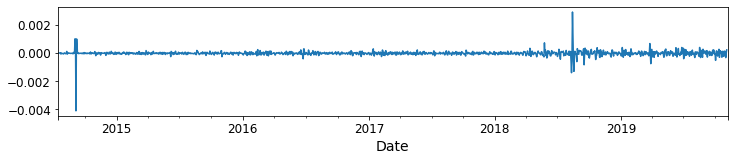
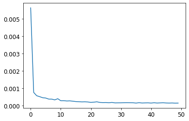

```python
import warnings
import itertools
import numpy as np
import matplotlib.pyplot as plt
warnings.filterwarnings("ignore")
import pandas as pd
import statsmodels.api as sm
import matplotlib
%matplotlib inline
matplotlib.rcParams['axes.labelsize'] = 14
matplotlib.rcParams['xtick.labelsize'] = 12
matplotlib.rcParams['ytick.labelsize'] = 12
matplotlib.rcParams['text.color'] = 'k'
```


```python
from statsmodels.tsa.arima_model import ARMA,ARMAResults,ARIMA,ARIMAResults
```

**Bazı notlar**\
**Arima durağan(Stationary) fonksiyonlara uygulanır.Durağan olmayan fonksiyonları durağan yapmak için diferansiyeli alınır.Sarima sezonluk tekrar eden veriler için kullanışlıdır**\
**Eğer verisetine AR plot uyguladığımızda ilk lagda(lag-1) pozitif veriyorsa AR plot kullanılabilir negatifse MA kullanılmalıdır.Bu bize ARIMA modeldeki kullanacağımız p,d,q değerlerine karar vermemizi sağlar**\
**p:lag sayısı,d:yeni ve eski durumun çıkarılma sayısı,q:MA sayısı**\
**AR modelde genelde PACF,MA modelde genelde ACF kullanılır.Ama bunun yerine grid search kullanmak daha etkili olur.auto_arima kullanılıp .summary kullanılırsa hangi modelin kullanılacağı söyleniyor.auto_Arima kullanmadan önce veri setine augmented-dickey Fuller test uygulayarak veri setinin durağan olup olmadığı bilinmelidir.**


```python
dt_kea=pd.read_csv('/Users/infoletsbecoolcom/Downloads/data/KEA-Table 1.csv',delimiter=';')
dt_keb=pd.read_csv('/Users/infoletsbecoolcom/Downloads/data/KEB-Table 1.csv',delimiter=';')
dt_ked=pd.read_csv('/Users/infoletsbecoolcom/Downloads/data/KED-Table 1.csv',delimiter=';')
dt_kef=pd.read_csv('/Users/infoletsbecoolcom/Downloads/data/KEF-Table 1.csv',delimiter=';')
dt_keg=pd.read_csv('/Users/infoletsbecoolcom/Downloads/data/KEG-Table 1.csv',delimiter=';')
dt_keh=pd.read_csv('/Users/infoletsbecoolcom/Downloads/data/KEH-Table 1.csv',delimiter=';')
dt_kek=pd.read_csv('/Users/infoletsbecoolcom/Downloads/data/KEK-Table 1.csv',delimiter=';')
dt_kes=pd.read_csv('/Users/infoletsbecoolcom/Downloads/data/KES-Table 1.csv',delimiter=';')
dt_kks=pd.read_csv('/Users/infoletsbecoolcom/Downloads/data/KKS-Table 1.csv',delimiter=';')
```


```python
dt_kea
```


<div>
<style scoped>
    .dataframe tbody tr th:only-of-type {
        vertical-align: middle;
    }

    .dataframe tbody tr th {
        vertical-align: top;
    }

    .dataframe thead th {
        text-align: right;
    }
</style>
<table border="1" class="dataframe">
  <thead>
    <tr style="text-align: right;">
      <th></th>
      <th>KEA</th>
    </tr>
    <tr>
      <th>Date</th>
      <th></th>
    </tr>
  </thead>
  <tbody>
    <tr>
      <th>2014-07-22</th>
      <td>0,010000</td>
    </tr>
    <tr>
      <th>2014-07-23</th>
      <td>0,010002</td>
    </tr>
    <tr>
      <th>2014-07-24</th>
      <td>0,009997</td>
    </tr>
    <tr>
      <th>2014-07-31</th>
      <td>0,010021</td>
    </tr>
    <tr>
      <th>2014-04-08</th>
      <td>0,010022</td>
    </tr>
    <tr>
      <th>2014-08-08</th>
      <td>0,010004</td>
    </tr>
    <tr>
      <th>2014-12-08</th>
      <td>0,010018</td>
    </tr>
    <tr>
      <th>2014-08-18</th>
      <td>0,010027</td>
    </tr>
    <tr>
      <th>2014-08-20</th>
      <td>0,010033</td>
    </tr>
    <tr>
      <th>2014-08-22</th>
      <td>0,010032</td>
    </tr>
    <tr>
      <th>2014-08-26</th>
      <td>0,010044</td>
    </tr>
    <tr>
      <th>2014-08-27</th>
      <td>0,010050</td>
    </tr>
    <tr>
      <th>2014-08-28</th>
      <td>0,010045</td>
    </tr>
    <tr>
      <th>2014-08-29</th>
      <td>0,010045</td>
    </tr>
    <tr>
      <th>2014-01-09</th>
      <td>0,010057</td>
    </tr>
    <tr>
      <th>2014-02-09</th>
      <td>0,010061</td>
    </tr>
    <tr>
      <th>2014-03-09</th>
      <td>0,010063</td>
    </tr>
    <tr>
      <th>2014-04-09</th>
      <td>0,010061</td>
    </tr>
    <tr>
      <th>2014-05-09</th>
      <td>0,010066</td>
    </tr>
    <tr>
      <th>2014-05-09</th>
      <td>0,000000</td>
    </tr>
    <tr>
      <th>2014-08-09</th>
      <td>0,010072</td>
    </tr>
    <tr>
      <th>2014-09-09</th>
      <td>0,010075</td>
    </tr>
    <tr>
      <th>2014-10-09</th>
      <td>0,010074</td>
    </tr>
    <tr>
      <th>2014-11-09</th>
      <td>0,010054</td>
    </tr>
    <tr>
      <th>2014-12-09</th>
      <td>0,010077</td>
    </tr>
    <tr>
      <th>2014-09-15</th>
      <td>0,010082</td>
    </tr>
    <tr>
      <th>2014-09-16</th>
      <td>0,010083</td>
    </tr>
    <tr>
      <th>2014-09-17</th>
      <td>0,010085</td>
    </tr>
    <tr>
      <th>2014-09-18</th>
      <td>0,010087</td>
    </tr>
    <tr>
      <th>2014-09-19</th>
      <td>0,010087</td>
    </tr>
    <tr>
      <th>...</th>
      <td>...</td>
    </tr>
    <tr>
      <th>2019-09-25</th>
      <td>0,017173</td>
    </tr>
    <tr>
      <th>2019-09-26</th>
      <td>0,017196</td>
    </tr>
    <tr>
      <th>2019-09-27</th>
      <td>0,017228</td>
    </tr>
    <tr>
      <th>2019-09-30</th>
      <td>0,017299</td>
    </tr>
    <tr>
      <th>2019-01-10</th>
      <td>0,017342</td>
    </tr>
    <tr>
      <th>2019-02-10</th>
      <td>0,017330</td>
    </tr>
    <tr>
      <th>2019-03-10</th>
      <td>0,017343</td>
    </tr>
    <tr>
      <th>2019-04-10</th>
      <td>0,017337</td>
    </tr>
    <tr>
      <th>2019-07-10</th>
      <td>0,017362</td>
    </tr>
    <tr>
      <th>2019-08-10</th>
      <td>0,017369</td>
    </tr>
    <tr>
      <th>2019-09-10</th>
      <td>0,017352</td>
    </tr>
    <tr>
      <th>2019-10-10</th>
      <td>0,017318</td>
    </tr>
    <tr>
      <th>2019-11-10</th>
      <td>0,017347</td>
    </tr>
    <tr>
      <th>2019-10-14</th>
      <td>0,017376</td>
    </tr>
    <tr>
      <th>2019-10-15</th>
      <td>0,017312</td>
    </tr>
    <tr>
      <th>2019-10-16</th>
      <td>0,017315</td>
    </tr>
    <tr>
      <th>2019-10-17</th>
      <td>0,017239</td>
    </tr>
    <tr>
      <th>2019-10-18</th>
      <td>0,017225</td>
    </tr>
    <tr>
      <th>2019-10-21</th>
      <td>0,017328</td>
    </tr>
    <tr>
      <th>2019-10-22</th>
      <td>0,017350</td>
    </tr>
    <tr>
      <th>2019-10-23</th>
      <td>0,017355</td>
    </tr>
    <tr>
      <th>2019-10-24</th>
      <td>0,017465</td>
    </tr>
    <tr>
      <th>2019-10-25</th>
      <td>0,017488</td>
    </tr>
    <tr>
      <th>2019-10-28</th>
      <td>0,017549</td>
    </tr>
    <tr>
      <th>2019-10-30</th>
      <td>0,017566</td>
    </tr>
    <tr>
      <th>2019-10-31</th>
      <td>0,017615</td>
    </tr>
    <tr>
      <th>2019-01-11</th>
      <td>0,017679</td>
    </tr>
    <tr>
      <th>2019-04-11</th>
      <td>0,017700</td>
    </tr>
    <tr>
      <th>2019-05-11</th>
      <td>0,017732</td>
    </tr>
    <tr>
      <th>2019-06-11</th>
      <td>0,017759</td>
    </tr>
  </tbody>
</table>
<p>1316 rows × 1 columns</p>
</div>


```python
dt_kea.info()
```

    <class 'pandas.core.frame.DataFrame'>
    DatetimeIndex: 1316 entries, 2014-07-22 to 2019-06-11
    Data columns (total 1 columns):
    KEA    1316 non-null object
    dtypes: object(1)
    memory usage: 20.6+ KB


```python
dt_kea["KEA"] = dt_kea["KEA"].apply(lambda x: x.replace(',','.'))
```


```python
dt_kea["KEA"] = dt_kea["KEA"].apply(float)
```


```python
dt_kea.info()
```

    <class 'pandas.core.frame.DataFrame'>
    DatetimeIndex: 1316 entries, 2014-07-22 to 2019-06-11
    Data columns (total 1 columns):
    KEA    1316 non-null float64
    dtypes: float64(1)
    memory usage: 20.6 KB


```python
kea= dt_kea['KEA'].resample('MS').mean()
```


```python
kea.head()
```


    Date
    2014-01-01    0.010180
    2014-02-01    0.010183
    2014-03-01    0.010195
    2014-04-01    0.010181
    2014-05-01    0.007680
    Freq: MS, Name: KEA, dtype: float64


```python
kea.plot(figsize=(15, 6))
plt.show()
```


```python
from pylab import rcParams
rcParams['figure.figsize'] = 14, 8
decomposition = sm.tsa.seasonal_decompose(kea, model='additive')
fig = decomposition.plot()
plt.show()
```


```python
p = d = q = range(0, 2)
pdq = list(itertools.product(p, d, q))
seasonal_pdq = [(x[0], x[1], x[2], 12) for x in list(itertools.product(p, d, q))]
print('Examples of parameter combinations for Seasonal ARIMA...')
print('SARIMAX: {} x {}'.format(pdq[1], seasonal_pdq[1]))
print('SARIMAX: {} x {}'.format(pdq[1], seasonal_pdq[2]))
print('SARIMAX: {} x {}'.format(pdq[2], seasonal_pdq[3]))
print('SARIMAX: {} x {}'.format(pdq[2], seasonal_pdq[4]))
```

    Examples of parameter combinations for Seasonal ARIMA...
    SARIMAX: (0, 0, 1) x (0, 0, 1, 12)
    SARIMAX: (0, 0, 1) x (0, 1, 0, 12)
    SARIMAX: (0, 1, 0) x (0, 1, 1, 12)
    SARIMAX: (0, 1, 0) x (1, 0, 0, 12)


```python
for param in pdq:
    for param_seasonal in seasonal_pdq:
        try:
            mod = sm.tsa.statespace.SARIMAX(kea,order=param,seasonal_order=param_seasonal,enforce_stationarity=False,enforce_invertibility=False)
            results = mod.fit()
            
            print('ARIMA{}x{}12 - AIC:{}'.format(param, param_seasonal, results.aic))

        except:continue    
```

    ARIMA(0, 0, 0)x(0, 0, 0, 12)12 - AIC:-416.34934932286666
    ARIMA(0, 0, 0)x(0, 0, 1, 12)12 - AIC:-334.5723633784021


    /Users/infoletsbecoolcom/anaconda3/lib/python3.7/site-packages/statsmodels/base/model.py:512: ConvergenceWarning: Maximum Likelihood optimization failed to converge. Check mle_retvals
      "Check mle_retvals", ConvergenceWarning)


    ARIMA(0, 0, 0)x(0, 1, 0, 12)12 - AIC:-608.3837802148142
    ARIMA(0, 0, 0)x(0, 1, 1, 12)12 - AIC:-455.28545788958854
    ARIMA(0, 0, 0)x(1, 0, 0, 12)12 - AIC:-724.2920781972997
    ARIMA(0, 0, 0)x(1, 0, 1, 12)12 - AIC:-708.6239559468482


    /Users/infoletsbecoolcom/anaconda3/lib/python3.7/site-packages/statsmodels/base/model.py:512: ConvergenceWarning: Maximum Likelihood optimization failed to converge. Check mle_retvals
      "Check mle_retvals", ConvergenceWarning)


    ARIMA(0, 0, 0)x(1, 1, 0, 12)12 - AIC:-563.6697679626293
    ARIMA(0, 0, 0)x(1, 1, 1, 12)12 - AIC:-526.1335141730123
    ARIMA(0, 0, 1)x(0, 0, 0, 12)12 - AIC:-499.59219183613124


    /Users/infoletsbecoolcom/anaconda3/lib/python3.7/site-packages/statsmodels/base/model.py:512: ConvergenceWarning: Maximum Likelihood optimization failed to converge. Check mle_retvals
      "Check mle_retvals", ConvergenceWarning)


    ARIMA(0, 0, 1)x(0, 0, 1, 12)12 - AIC:-391.32000894345356
    ARIMA(0, 0, 1)x(0, 1, 0, 12)12 - AIC:-637.6877831020757


    /Users/infoletsbecoolcom/anaconda3/lib/python3.7/site-packages/statsmodels/base/model.py:512: ConvergenceWarning: Maximum Likelihood optimization failed to converge. Check mle_retvals
      "Check mle_retvals", ConvergenceWarning)


    ARIMA(0, 0, 1)x(0, 1, 1, 12)12 - AIC:-482.8153676243386
    ARIMA(0, 0, 1)x(1, 0, 0, 12)12 - AIC:-709.3837485572857


    /Users/infoletsbecoolcom/anaconda3/lib/python3.7/site-packages/statsmodels/base/model.py:512: ConvergenceWarning: Maximum Likelihood optimization failed to converge. Check mle_retvals
      "Check mle_retvals", ConvergenceWarning)


    ARIMA(0, 0, 1)x(1, 0, 1, 12)12 - AIC:-689.0741617416135
    ARIMA(0, 0, 1)x(1, 1, 0, 12)12 - AIC:-563.8647599031692
    ARIMA(0, 0, 1)x(1, 1, 1, 12)12 - AIC:-508.307165916513
    ARIMA(0, 1, 0)x(0, 0, 0, 12)12 - AIC:-869.4596185627429
    ARIMA(0, 1, 0)x(0, 0, 1, 12)12 - AIC:-764.6290437098145


    /Users/infoletsbecoolcom/anaconda3/lib/python3.7/site-packages/statsmodels/base/model.py:512: ConvergenceWarning: Maximum Likelihood optimization failed to converge. Check mle_retvals
      "Check mle_retvals", ConvergenceWarning)
    /Users/infoletsbecoolcom/anaconda3/lib/python3.7/site-packages/statsmodels/base/model.py:512: ConvergenceWarning: Maximum Likelihood optimization failed to converge. Check mle_retvals
      "Check mle_retvals", ConvergenceWarning)


    ARIMA(0, 1, 0)x(0, 1, 0, 12)12 - AIC:-713.4705026996884
    ARIMA(0, 1, 0)x(0, 1, 1, 12)12 - AIC:-612.111113158176
    ARIMA(0, 1, 0)x(1, 0, 0, 12)12 - AIC:-815.7852331107784
    ARIMA(0, 1, 0)x(1, 0, 1, 12)12 - AIC:-691.6063839688641


    /Users/infoletsbecoolcom/anaconda3/lib/python3.7/site-packages/statsmodels/base/model.py:512: ConvergenceWarning: Maximum Likelihood optimization failed to converge. Check mle_retvals
      "Check mle_retvals", ConvergenceWarning)
    /Users/infoletsbecoolcom/anaconda3/lib/python3.7/site-packages/statsmodels/base/model.py:512: ConvergenceWarning: Maximum Likelihood optimization failed to converge. Check mle_retvals
      "Check mle_retvals", ConvergenceWarning)


    ARIMA(0, 1, 0)x(1, 1, 0, 12)12 - AIC:-657.194709031307
    ARIMA(0, 1, 0)x(1, 1, 1, 12)12 - AIC:-569.1434521078286
    ARIMA(0, 1, 1)x(0, 0, 0, 12)12 - AIC:-864.0017173814246


    /Users/infoletsbecoolcom/anaconda3/lib/python3.7/site-packages/statsmodels/base/model.py:512: ConvergenceWarning: Maximum Likelihood optimization failed to converge. Check mle_retvals
      "Check mle_retvals", ConvergenceWarning)
    /Users/infoletsbecoolcom/anaconda3/lib/python3.7/site-packages/statsmodels/base/model.py:512: ConvergenceWarning: Maximum Likelihood optimization failed to converge. Check mle_retvals
      "Check mle_retvals", ConvergenceWarning)


    ARIMA(0, 1, 1)x(0, 0, 1, 12)12 - AIC:-720.6932134602648
    ARIMA(0, 1, 1)x(0, 1, 0, 12)12 - AIC:-714.8428006827351
    ARIMA(0, 1, 1)x(0, 1, 1, 12)12 - AIC:-591.415848765255
    ARIMA(0, 1, 1)x(1, 0, 0, 12)12 - AIC:-791.5941984883
    ARIMA(0, 1, 1)x(1, 0, 1, 12)12 - AIC:-692.7354403844815
    ARIMA(0, 1, 1)x(1, 1, 0, 12)12 - AIC:-635.0320559800728


    /Users/infoletsbecoolcom/anaconda3/lib/python3.7/site-packages/statsmodels/base/model.py:512: ConvergenceWarning: Maximum Likelihood optimization failed to converge. Check mle_retvals
      "Check mle_retvals", ConvergenceWarning)
    /Users/infoletsbecoolcom/anaconda3/lib/python3.7/site-packages/statsmodels/base/model.py:512: ConvergenceWarning: Maximum Likelihood optimization failed to converge. Check mle_retvals
      "Check mle_retvals", ConvergenceWarning)


    ARIMA(0, 1, 1)x(1, 1, 1, 12)12 - AIC:-562.728090782096
    ARIMA(1, 0, 0)x(0, 0, 0, 12)12 - AIC:-882.6636997291536
    ARIMA(1, 0, 0)x(0, 0, 1, 12)12 - AIC:-801.3211641557253
    ARIMA(1, 0, 0)x(0, 1, 0, 12)12 - AIC:-726.2497055961123
    ARIMA(1, 0, 0)x(0, 1, 1, 12)12 - AIC:-627.1843494014415
    ARIMA(1, 0, 0)x(1, 0, 0, 12)12 - AIC:-712.3582167706885


    /Users/infoletsbecoolcom/anaconda3/lib/python3.7/site-packages/statsmodels/base/model.py:512: ConvergenceWarning: Maximum Likelihood optimization failed to converge. Check mle_retvals
      "Check mle_retvals", ConvergenceWarning)
    /Users/infoletsbecoolcom/anaconda3/lib/python3.7/site-packages/statsmodels/base/model.py:512: ConvergenceWarning: Maximum Likelihood optimization failed to converge. Check mle_retvals
      "Check mle_retvals", ConvergenceWarning)


    ARIMA(1, 0, 0)x(1, 0, 1, 12)12 - AIC:-709.2347775115544
    ARIMA(1, 0, 0)x(1, 1, 0, 12)12 - AIC:-549.8070837086319
    ARIMA(1, 0, 0)x(1, 1, 1, 12)12 - AIC:-513.2087808032992
    ARIMA(1, 0, 1)x(0, 0, 0, 12)12 - AIC:-885.1367359401739
    ARIMA(1, 0, 1)x(0, 0, 1, 12)12 - AIC:-783.8591990406815


    /Users/infoletsbecoolcom/anaconda3/lib/python3.7/site-packages/statsmodels/base/model.py:512: ConvergenceWarning: Maximum Likelihood optimization failed to converge. Check mle_retvals
      "Check mle_retvals", ConvergenceWarning)
    /Users/infoletsbecoolcom/anaconda3/lib/python3.7/site-packages/statsmodels/base/model.py:512: ConvergenceWarning: Maximum Likelihood optimization failed to converge. Check mle_retvals
      "Check mle_retvals", ConvergenceWarning)


    ARIMA(1, 0, 1)x(0, 1, 0, 12)12 - AIC:-726.3294054320585
    ARIMA(1, 0, 1)x(0, 1, 1, 12)12 - AIC:-611.9246264757144
    ARIMA(1, 0, 1)x(1, 0, 0, 12)12 - AIC:-728.1499512005296


    /Users/infoletsbecoolcom/anaconda3/lib/python3.7/site-packages/statsmodels/base/model.py:512: ConvergenceWarning: Maximum Likelihood optimization failed to converge. Check mle_retvals
      "Check mle_retvals", ConvergenceWarning)
    /Users/infoletsbecoolcom/anaconda3/lib/python3.7/site-packages/statsmodels/base/model.py:512: ConvergenceWarning: Maximum Likelihood optimization failed to converge. Check mle_retvals
      "Check mle_retvals", ConvergenceWarning)


    ARIMA(1, 0, 1)x(1, 0, 1, 12)12 - AIC:-711.905952776625


    /Users/infoletsbecoolcom/anaconda3/lib/python3.7/site-packages/statsmodels/base/model.py:512: ConvergenceWarning: Maximum Likelihood optimization failed to converge. Check mle_retvals
      "Check mle_retvals", ConvergenceWarning)


    ARIMA(1, 0, 1)x(1, 1, 0, 12)12 - AIC:-559.4085812938788
    ARIMA(1, 0, 1)x(1, 1, 1, 12)12 - AIC:-513.5055404541171
    ARIMA(1, 1, 0)x(0, 0, 0, 12)12 - AIC:-877.7017609780951


    /Users/infoletsbecoolcom/anaconda3/lib/python3.7/site-packages/statsmodels/base/model.py:512: ConvergenceWarning: Maximum Likelihood optimization failed to converge. Check mle_retvals
      "Check mle_retvals", ConvergenceWarning)
    /Users/infoletsbecoolcom/anaconda3/lib/python3.7/site-packages/statsmodels/base/model.py:512: ConvergenceWarning: Maximum Likelihood optimization failed to converge. Check mle_retvals
      "Check mle_retvals", ConvergenceWarning)
    /Users/infoletsbecoolcom/anaconda3/lib/python3.7/site-packages/statsmodels/base/model.py:512: ConvergenceWarning: Maximum Likelihood optimization failed to converge. Check mle_retvals
      "Check mle_retvals", ConvergenceWarning)


    ARIMA(1, 1, 0)x(0, 0, 1, 12)12 - AIC:-743.5113932031189
    ARIMA(1, 1, 0)x(0, 1, 0, 12)12 - AIC:-723.8347758601765


    /Users/infoletsbecoolcom/anaconda3/lib/python3.7/site-packages/statsmodels/base/model.py:512: ConvergenceWarning: Maximum Likelihood optimization failed to converge. Check mle_retvals
      "Check mle_retvals", ConvergenceWarning)


    ARIMA(1, 1, 0)x(0, 1, 1, 12)12 - AIC:-608.3505057861596
    ARIMA(1, 1, 0)x(1, 0, 0, 12)12 - AIC:-784.4329766535681


    /Users/infoletsbecoolcom/anaconda3/lib/python3.7/site-packages/statsmodels/base/model.py:512: ConvergenceWarning: Maximum Likelihood optimization failed to converge. Check mle_retvals
      "Check mle_retvals", ConvergenceWarning)


    ARIMA(1, 1, 0)x(1, 0, 1, 12)12 - AIC:-702.4020481993879
    ARIMA(1, 1, 0)x(1, 1, 0, 12)12 - AIC:-627.25485731183
    ARIMA(1, 1, 0)x(1, 1, 1, 12)12 - AIC:nan
    ARIMA(1, 1, 1)x(0, 0, 0, 12)12 - AIC:-862.6633313418829


    /Users/infoletsbecoolcom/anaconda3/lib/python3.7/site-packages/statsmodels/base/model.py:512: ConvergenceWarning: Maximum Likelihood optimization failed to converge. Check mle_retvals
      "Check mle_retvals", ConvergenceWarning)


    ARIMA(1, 1, 1)x(0, 0, 1, 12)12 - AIC:-723.0508902613848
    ARIMA(1, 1, 1)x(0, 1, 0, 12)12 - AIC:-712.8933489218521
    ARIMA(1, 1, 1)x(0, 1, 1, 12)12 - AIC:-589.4426614607207
    ARIMA(1, 1, 1)x(1, 0, 0, 12)12 - AIC:-778.0092326839687


    /Users/infoletsbecoolcom/anaconda3/lib/python3.7/site-packages/statsmodels/base/model.py:512: ConvergenceWarning: Maximum Likelihood optimization failed to converge. Check mle_retvals
      "Check mle_retvals", ConvergenceWarning)


    ARIMA(1, 1, 1)x(1, 0, 1, 12)12 - AIC:-689.836665262767
    ARIMA(1, 1, 1)x(1, 1, 0, 12)12 - AIC:-618.577347347866
    ARIMA(1, 1, 1)x(1, 1, 1, 12)12 - AIC:-560.7343073384352


```python
mod = sm.tsa.statespace.SARIMAX(kea,
                                order=(1, 0, 1),
                                seasonal_order=(0, 0, 0, 12),
                                enforce_stationarity=False,
                                enforce_invertibility=False)
results = mod.fit()
print(results.summary().tables[1])
```

    ==============================================================================
                     coef    std err          z      P>|z|      [0.025      0.975]
    ------------------------------------------------------------------------------
    ar.L1          1.0070      0.003    373.363      0.000       1.002       1.012
    ma.L1         -0.5047      0.058     -8.639      0.000      -0.619      -0.390
    sigma2      1.683e-07   1.02e-08     16.543      0.000    1.48e-07    1.88e-07
    ==============================================================================


    /Users/infoletsbecoolcom/anaconda3/lib/python3.7/site-packages/statsmodels/base/model.py:512: ConvergenceWarning: Maximum Likelihood optimization failed to converge. Check mle_retvals
      "Check mle_retvals", ConvergenceWarning)


```python
results.plot_diagnostics(figsize=(16, 8))
plt.show()
```


```python
pred = results.get_prediction(start=pd.to_datetime('2018-01-01'), dynamic=False)
pred_ci = pred.conf_int()
ax = kea['2014':].plot(label='observed')
pred.predicted_mean.plot(ax=ax, label='One-step ahead Forecast', alpha=.4, figsize=(14, 7))
ax.fill_between(pred_ci.index,
                pred_ci.iloc[:, 0],
                pred_ci.iloc[:, 1], color='k', alpha=.2)
ax.set_xlabel('Date')
ax.set_ylabel('Kea')
plt.legend()
plt.show()
```


**PROPHET LIBRARY**


```python
dt_kea2=pd.read_csv('/Users/infoletsbecoolcom/Downloads/data/KEA-Table 1.csv',delimiter=';',parse_dates=True)

```


```python
dt_kea2.info()
```

    <class 'pandas.core.frame.DataFrame'>
    RangeIndex: 1316 entries, 0 to 1315
    Data columns (total 2 columns):
    Date    1316 non-null object
    KEA     1316 non-null object
    dtypes: object(2)
    memory usage: 20.6+ KB


```python
y_forecasted = pred.predicted_mean
y_truth = kea['2018-01-01':]
mse = ((y_forecasted - y_truth) ** 2).mean()
print('The Mean Squared Error of our forecasts is {}'.format(round(mse, 2)))
```

    The Mean Squared Error of our forecasts is 0.0


```python
from fbprophet import Prophet
```

    ERROR:fbprophet:Importing plotly failed. Interactive plots will not work.


```python
dt_kea2["KEA"] = dt_kea2["KEA"].apply(lambda x: x.replace(',','.'))

dt_kea2["KEA"] = dt_kea2["KEA"].apply(float)
```


```python
dt_kea2["Date"] = dt_kea2["Date"].apply(str)
```


```python
dt_kea2['Date'] = pd.to_datetime(dt_kea2.Date, format='%d/%m/%Y')


```


```python
dt_kea2 = dt_kea2.rename(columns={'Date': 'ds', 'KEA': 'y'})

```


```python
kea_model = Prophet(interval_width=0.95)

```


```python
kea_model.fit(dt_kea2)
```

    INFO:fbprophet:Disabling daily seasonality. Run prophet with daily_seasonality=True to override this.


    <fbprophet.forecaster.Prophet at 0x1c227cf278>


```python
kea_forecast = kea_model.make_future_dataframe(periods=6, freq='MS')
kea_forecast = kea_model.predict(kea_forecast)
```


```python
kea_forecast.head()
```


<div>
<style scoped>
    .dataframe tbody tr th:only-of-type {
        vertical-align: middle;
    }

    .dataframe tbody tr th {
        vertical-align: top;
    }

    .dataframe thead th {
        text-align: right;
    }
</style>
<table border="1" class="dataframe">
  <thead>
    <tr style="text-align: right;">
      <th></th>
      <th>ds</th>
      <th>trend</th>
      <th>yhat_lower</th>
      <th>yhat_upper</th>
      <th>trend_lower</th>
      <th>trend_upper</th>
      <th>additive_terms</th>
      <th>additive_terms_lower</th>
      <th>additive_terms_upper</th>
      <th>weekly</th>
      <th>weekly_lower</th>
      <th>weekly_upper</th>
      <th>yearly</th>
      <th>yearly_lower</th>
      <th>yearly_upper</th>
      <th>multiplicative_terms</th>
      <th>multiplicative_terms_lower</th>
      <th>multiplicative_terms_upper</th>
      <th>yhat</th>
    </tr>
  </thead>
  <tbody>
    <tr>
      <th>0</th>
      <td>2014-07-22</td>
      <td>0.009742</td>
      <td>0.009085</td>
      <td>0.010196</td>
      <td>0.009742</td>
      <td>0.009742</td>
      <td>-0.000081</td>
      <td>-0.000081</td>
      <td>-0.000081</td>
      <td>-0.000044</td>
      <td>-0.000044</td>
      <td>-0.000044</td>
      <td>-0.000037</td>
      <td>-0.000037</td>
      <td>-0.000037</td>
      <td>0.0</td>
      <td>0.0</td>
      <td>0.0</td>
      <td>0.009661</td>
    </tr>
    <tr>
      <th>1</th>
      <td>2014-07-23</td>
      <td>0.009747</td>
      <td>0.009089</td>
      <td>0.010215</td>
      <td>0.009747</td>
      <td>0.009747</td>
      <td>-0.000078</td>
      <td>-0.000078</td>
      <td>-0.000078</td>
      <td>-0.000041</td>
      <td>-0.000041</td>
      <td>-0.000041</td>
      <td>-0.000036</td>
      <td>-0.000036</td>
      <td>-0.000036</td>
      <td>0.0</td>
      <td>0.0</td>
      <td>0.0</td>
      <td>0.009669</td>
    </tr>
    <tr>
      <th>2</th>
      <td>2014-07-24</td>
      <td>0.009751</td>
      <td>0.009125</td>
      <td>0.010207</td>
      <td>0.009751</td>
      <td>0.009751</td>
      <td>-0.000077</td>
      <td>-0.000077</td>
      <td>-0.000077</td>
      <td>-0.000043</td>
      <td>-0.000043</td>
      <td>-0.000043</td>
      <td>-0.000034</td>
      <td>-0.000034</td>
      <td>-0.000034</td>
      <td>0.0</td>
      <td>0.0</td>
      <td>0.0</td>
      <td>0.009674</td>
    </tr>
    <tr>
      <th>3</th>
      <td>2014-07-31</td>
      <td>0.009781</td>
      <td>0.009202</td>
      <td>0.010289</td>
      <td>0.009781</td>
      <td>0.009781</td>
      <td>-0.000047</td>
      <td>-0.000047</td>
      <td>-0.000047</td>
      <td>-0.000043</td>
      <td>-0.000043</td>
      <td>-0.000043</td>
      <td>-0.000004</td>
      <td>-0.000004</td>
      <td>-0.000004</td>
      <td>0.0</td>
      <td>0.0</td>
      <td>0.0</td>
      <td>0.009734</td>
    </tr>
    <tr>
      <th>4</th>
      <td>2014-08-04</td>
      <td>0.009799</td>
      <td>0.009229</td>
      <td>0.010344</td>
      <td>0.009799</td>
      <td>0.009799</td>
      <td>-0.000020</td>
      <td>-0.000020</td>
      <td>-0.000020</td>
      <td>-0.000042</td>
      <td>-0.000042</td>
      <td>-0.000042</td>
      <td>0.000022</td>
      <td>0.000022</td>
      <td>0.000022</td>
      <td>0.0</td>
      <td>0.0</td>
      <td>0.0</td>
      <td>0.009779</td>
    </tr>
  </tbody>
</table>
</div>


**Holt-Winters metodu ile tahmin**


```python
kef2=pd.read_csv('/Users/infoletsbecoolcom/Downloads/data/KEF-Table 1.csv',delimiter=';')
```


```python
kef2
```


<div>
<style scoped>
    .dataframe tbody tr th:only-of-type {
        vertical-align: middle;
    }

    .dataframe tbody tr th {
        vertical-align: top;
    }

    .dataframe thead th {
        text-align: right;
    }
</style>
<table border="1" class="dataframe">
  <thead>
    <tr style="text-align: right;">
      <th></th>
      <th>Date</th>
      <th>KEF</th>
    </tr>
  </thead>
  <tbody>
    <tr>
      <th>0</th>
      <td>16/07/2014</td>
      <td>0,010417</td>
    </tr>
    <tr>
      <th>1</th>
      <td>22/07/2014</td>
      <td>0,010433</td>
    </tr>
    <tr>
      <th>2</th>
      <td>23/07/2014</td>
      <td>0,010420</td>
    </tr>
    <tr>
      <th>3</th>
      <td>24/07/2014</td>
      <td>0,010274</td>
    </tr>
    <tr>
      <th>4</th>
      <td>31/07/2014</td>
      <td>0,010180</td>
    </tr>
    <tr>
      <th>5</th>
      <td>05/08/2014</td>
      <td>0,010343</td>
    </tr>
    <tr>
      <th>6</th>
      <td>11/08/2014</td>
      <td>0,010678</td>
    </tr>
    <tr>
      <th>7</th>
      <td>12/08/2014</td>
      <td>0,010531</td>
    </tr>
    <tr>
      <th>8</th>
      <td>13/08/2014</td>
      <td>0,010601</td>
    </tr>
    <tr>
      <th>9</th>
      <td>19/08/2014</td>
      <td>0,010554</td>
    </tr>
    <tr>
      <th>10</th>
      <td>20/08/2014</td>
      <td>0,010529</td>
    </tr>
    <tr>
      <th>11</th>
      <td>22/08/2014</td>
      <td>0,010441</td>
    </tr>
    <tr>
      <th>12</th>
      <td>25/08/2014</td>
      <td>0,010429</td>
    </tr>
    <tr>
      <th>13</th>
      <td>26/08/2014</td>
      <td>0,010431</td>
    </tr>
    <tr>
      <th>14</th>
      <td>27/08/2014</td>
      <td>0,010448</td>
    </tr>
    <tr>
      <th>15</th>
      <td>28/08/2014</td>
      <td>0,010398</td>
    </tr>
    <tr>
      <th>16</th>
      <td>29/08/2014</td>
      <td>0,010463</td>
    </tr>
    <tr>
      <th>17</th>
      <td>01/09/2014</td>
      <td>0,010401</td>
    </tr>
    <tr>
      <th>18</th>
      <td>02/09/2014</td>
      <td>0,010429</td>
    </tr>
    <tr>
      <th>19</th>
      <td>03/09/2014</td>
      <td>0,010372</td>
    </tr>
    <tr>
      <th>20</th>
      <td>04/09/2014</td>
      <td>0,010271</td>
    </tr>
    <tr>
      <th>21</th>
      <td>05/09/2014</td>
      <td>0,010274</td>
    </tr>
    <tr>
      <th>22</th>
      <td>05/09/2014</td>
      <td>0,000000</td>
    </tr>
    <tr>
      <th>23</th>
      <td>08/09/2014</td>
      <td>0,010265</td>
    </tr>
    <tr>
      <th>24</th>
      <td>09/09/2014</td>
      <td>0,010269</td>
    </tr>
    <tr>
      <th>25</th>
      <td>10/09/2014</td>
      <td>0,010333</td>
    </tr>
    <tr>
      <th>26</th>
      <td>11/09/2014</td>
      <td>0,010337</td>
    </tr>
    <tr>
      <th>27</th>
      <td>12/09/2014</td>
      <td>0,010240</td>
    </tr>
    <tr>
      <th>28</th>
      <td>15/09/2014</td>
      <td>0,010218</td>
    </tr>
    <tr>
      <th>29</th>
      <td>16/09/2014</td>
      <td>0,010243</td>
    </tr>
    <tr>
      <th>...</th>
      <td>...</td>
      <td>...</td>
    </tr>
    <tr>
      <th>1291</th>
      <td>25/09/2019</td>
      <td>0,030055</td>
    </tr>
    <tr>
      <th>1292</th>
      <td>26/09/2019</td>
      <td>0,030270</td>
    </tr>
    <tr>
      <th>1293</th>
      <td>27/09/2019</td>
      <td>0,029939</td>
    </tr>
    <tr>
      <th>1294</th>
      <td>30/09/2019</td>
      <td>0,029580</td>
    </tr>
    <tr>
      <th>1295</th>
      <td>01/10/2019</td>
      <td>0,029495</td>
    </tr>
    <tr>
      <th>1296</th>
      <td>02/10/2019</td>
      <td>0,029037</td>
    </tr>
    <tr>
      <th>1297</th>
      <td>03/10/2019</td>
      <td>0,029667</td>
    </tr>
    <tr>
      <th>1298</th>
      <td>04/10/2019</td>
      <td>0,029837</td>
    </tr>
    <tr>
      <th>1299</th>
      <td>07/10/2019</td>
      <td>0,029951</td>
    </tr>
    <tr>
      <th>1300</th>
      <td>08/10/2019</td>
      <td>0,029953</td>
    </tr>
    <tr>
      <th>1301</th>
      <td>09/10/2019</td>
      <td>0,030378</td>
    </tr>
    <tr>
      <th>1302</th>
      <td>10/10/2019</td>
      <td>0,030580</td>
    </tr>
    <tr>
      <th>1303</th>
      <td>11/10/2019</td>
      <td>0,030798</td>
    </tr>
    <tr>
      <th>1304</th>
      <td>14/10/2019</td>
      <td>0,030303</td>
    </tr>
    <tr>
      <th>1305</th>
      <td>15/10/2019</td>
      <td>0,030647</td>
    </tr>
    <tr>
      <th>1306</th>
      <td>16/10/2019</td>
      <td>0,030699</td>
    </tr>
    <tr>
      <th>1307</th>
      <td>17/10/2019</td>
      <td>0,030425</td>
    </tr>
    <tr>
      <th>1308</th>
      <td>18/10/2019</td>
      <td>0,030405</td>
    </tr>
    <tr>
      <th>1309</th>
      <td>21/10/2019</td>
      <td>0,029950</td>
    </tr>
    <tr>
      <th>1310</th>
      <td>22/10/2019</td>
      <td>0,030189</td>
    </tr>
    <tr>
      <th>1311</th>
      <td>23/10/2019</td>
      <td>0,030232</td>
    </tr>
    <tr>
      <th>1312</th>
      <td>24/10/2019</td>
      <td>0,030053</td>
    </tr>
    <tr>
      <th>1313</th>
      <td>25/10/2019</td>
      <td>0,029909</td>
    </tr>
    <tr>
      <th>1314</th>
      <td>28/10/2019</td>
      <td>0,030289</td>
    </tr>
    <tr>
      <th>1315</th>
      <td>30/10/2019</td>
      <td>0,030292</td>
    </tr>
    <tr>
      <th>1316</th>
      <td>31/10/2019</td>
      <td>0,029848</td>
    </tr>
    <tr>
      <th>1317</th>
      <td>01/11/2019</td>
      <td>0,030058</td>
    </tr>
    <tr>
      <th>1318</th>
      <td>04/11/2019</td>
      <td>0,030255</td>
    </tr>
    <tr>
      <th>1319</th>
      <td>05/11/2019</td>
      <td>0,029940</td>
    </tr>
    <tr>
      <th>1320</th>
      <td>06/11/2019</td>
      <td>0,030020</td>
    </tr>
  </tbody>
</table>
<p>1321 rows × 2 columns</p>
</div>


```python
kef2['Date'] =  pd.to_datetime(kef2['Date'], format='%d/%m/%Y')

```


```python
kef2=kef2.set_index('Date')
```


```python
kef2
```


<div>
<style scoped>
    .dataframe tbody tr th:only-of-type {
        vertical-align: middle;
    }

    .dataframe tbody tr th {
        vertical-align: top;
    }

    .dataframe thead th {
        text-align: right;
    }
</style>
<table border="1" class="dataframe">
  <thead>
    <tr style="text-align: right;">
      <th></th>
      <th>KEF</th>
    </tr>
    <tr>
      <th>Date</th>
      <th></th>
    </tr>
  </thead>
  <tbody>
    <tr>
      <th>2014-07-16</th>
      <td>0,010417</td>
    </tr>
    <tr>
      <th>2014-07-22</th>
      <td>0,010433</td>
    </tr>
    <tr>
      <th>2014-07-23</th>
      <td>0,010420</td>
    </tr>
    <tr>
      <th>2014-07-24</th>
      <td>0,010274</td>
    </tr>
    <tr>
      <th>2014-07-31</th>
      <td>0,010180</td>
    </tr>
    <tr>
      <th>2014-08-05</th>
      <td>0,010343</td>
    </tr>
    <tr>
      <th>2014-08-11</th>
      <td>0,010678</td>
    </tr>
    <tr>
      <th>2014-08-12</th>
      <td>0,010531</td>
    </tr>
    <tr>
      <th>2014-08-13</th>
      <td>0,010601</td>
    </tr>
    <tr>
      <th>2014-08-19</th>
      <td>0,010554</td>
    </tr>
    <tr>
      <th>2014-08-20</th>
      <td>0,010529</td>
    </tr>
    <tr>
      <th>2014-08-22</th>
      <td>0,010441</td>
    </tr>
    <tr>
      <th>2014-08-25</th>
      <td>0,010429</td>
    </tr>
    <tr>
      <th>2014-08-26</th>
      <td>0,010431</td>
    </tr>
    <tr>
      <th>2014-08-27</th>
      <td>0,010448</td>
    </tr>
    <tr>
      <th>2014-08-28</th>
      <td>0,010398</td>
    </tr>
    <tr>
      <th>2014-08-29</th>
      <td>0,010463</td>
    </tr>
    <tr>
      <th>2014-09-01</th>
      <td>0,010401</td>
    </tr>
    <tr>
      <th>2014-09-02</th>
      <td>0,010429</td>
    </tr>
    <tr>
      <th>2014-09-03</th>
      <td>0,010372</td>
    </tr>
    <tr>
      <th>2014-09-04</th>
      <td>0,010271</td>
    </tr>
    <tr>
      <th>2014-09-05</th>
      <td>0,010274</td>
    </tr>
    <tr>
      <th>2014-09-05</th>
      <td>0,000000</td>
    </tr>
    <tr>
      <th>2014-09-08</th>
      <td>0,010265</td>
    </tr>
    <tr>
      <th>2014-09-09</th>
      <td>0,010269</td>
    </tr>
    <tr>
      <th>2014-09-10</th>
      <td>0,010333</td>
    </tr>
    <tr>
      <th>2014-09-11</th>
      <td>0,010337</td>
    </tr>
    <tr>
      <th>2014-09-12</th>
      <td>0,010240</td>
    </tr>
    <tr>
      <th>2014-09-15</th>
      <td>0,010218</td>
    </tr>
    <tr>
      <th>2014-09-16</th>
      <td>0,010243</td>
    </tr>
    <tr>
      <th>...</th>
      <td>...</td>
    </tr>
    <tr>
      <th>2019-09-25</th>
      <td>0,030055</td>
    </tr>
    <tr>
      <th>2019-09-26</th>
      <td>0,030270</td>
    </tr>
    <tr>
      <th>2019-09-27</th>
      <td>0,029939</td>
    </tr>
    <tr>
      <th>2019-09-30</th>
      <td>0,029580</td>
    </tr>
    <tr>
      <th>2019-10-01</th>
      <td>0,029495</td>
    </tr>
    <tr>
      <th>2019-10-02</th>
      <td>0,029037</td>
    </tr>
    <tr>
      <th>2019-10-03</th>
      <td>0,029667</td>
    </tr>
    <tr>
      <th>2019-10-04</th>
      <td>0,029837</td>
    </tr>
    <tr>
      <th>2019-10-07</th>
      <td>0,029951</td>
    </tr>
    <tr>
      <th>2019-10-08</th>
      <td>0,029953</td>
    </tr>
    <tr>
      <th>2019-10-09</th>
      <td>0,030378</td>
    </tr>
    <tr>
      <th>2019-10-10</th>
      <td>0,030580</td>
    </tr>
    <tr>
      <th>2019-10-11</th>
      <td>0,030798</td>
    </tr>
    <tr>
      <th>2019-10-14</th>
      <td>0,030303</td>
    </tr>
    <tr>
      <th>2019-10-15</th>
      <td>0,030647</td>
    </tr>
    <tr>
      <th>2019-10-16</th>
      <td>0,030699</td>
    </tr>
    <tr>
      <th>2019-10-17</th>
      <td>0,030425</td>
    </tr>
    <tr>
      <th>2019-10-18</th>
      <td>0,030405</td>
    </tr>
    <tr>
      <th>2019-10-21</th>
      <td>0,029950</td>
    </tr>
    <tr>
      <th>2019-10-22</th>
      <td>0,030189</td>
    </tr>
    <tr>
      <th>2019-10-23</th>
      <td>0,030232</td>
    </tr>
    <tr>
      <th>2019-10-24</th>
      <td>0,030053</td>
    </tr>
    <tr>
      <th>2019-10-25</th>
      <td>0,029909</td>
    </tr>
    <tr>
      <th>2019-10-28</th>
      <td>0,030289</td>
    </tr>
    <tr>
      <th>2019-10-30</th>
      <td>0,030292</td>
    </tr>
    <tr>
      <th>2019-10-31</th>
      <td>0,029848</td>
    </tr>
    <tr>
      <th>2019-11-01</th>
      <td>0,030058</td>
    </tr>
    <tr>
      <th>2019-11-04</th>
      <td>0,030255</td>
    </tr>
    <tr>
      <th>2019-11-05</th>
      <td>0,029940</td>
    </tr>
    <tr>
      <th>2019-11-06</th>
      <td>0,030020</td>
    </tr>
  </tbody>
</table>
<p>1321 rows × 1 columns</p>
</div>


```python
kef2["KEF"] = kef2["KEF"].apply(lambda x: x.replace(',','.'))

kef2["KEF"] = kef2["KEF"].apply(float)
```


```python
kef2= kef2['KEF'].resample('MS').mean()
```


```python
kef2
```


    Date
    2014-07-01    0.010345
    2014-08-01    0.010487
    2014-09-01    0.009830
    2014-10-01    0.010343
    2014-11-01    0.010009
    2014-12-01    0.010416
    2015-01-01    0.010973
    2015-02-01    0.011408
    2015-03-01    0.011484
    2015-04-01    0.011895
    2015-05-01    0.011854
    2015-06-01    0.011917
    2015-07-01    0.011399
    2015-08-01    0.011791
    2015-09-01    0.012505
    2015-10-01    0.012524
    2015-11-01    0.011608
    2015-12-01    0.011515
    2016-01-01    0.012117
    2016-02-01    0.012856
    2016-03-01    0.013198
    2016-04-01    0.012890
    2016-05-01    0.013534
    2016-06-01    0.013535
    2016-07-01    0.014355
    2016-08-01    0.014494
    2016-09-01    0.014302
    2016-10-01    0.014191
    2016-11-01    0.014754
    2016-12-01    0.014606
                    ...   
    2017-06-01    0.016051
    2017-07-01    0.015843
    2017-08-01    0.016159
    2017-09-01    0.016408
    2017-10-01    0.016840
    2017-11-01    0.017819
    2017-12-01    0.017454
    2018-01-01    0.017955
    2018-02-01    0.018007
    2018-03-01    0.018349
    2018-04-01    0.019283
    2018-05-01    0.020468
    2018-06-01    0.021106
    2018-07-01    0.020888
    2018-08-01    0.024367
    2018-09-01    0.026949
    2018-10-01    0.025146
    2018-11-01    0.023387
    2018-12-01    0.023589
    2019-01-01    0.024611
    2019-02-01    0.024651
    2019-03-01    0.025158
    2019-04-01    0.026102
    2019-05-01    0.027311
    2019-06-01    0.027680
    2019-07-01    0.028149
    2019-08-01    0.029350
    2019-09-01    0.030138
    2019-10-01    0.030133
    2019-11-01    0.030068
    Freq: MS, Name: KEF, Length: 65, dtype: float64


```python

```


```python
kef2.loc['2019-01-01':].plot()
```


    <matplotlib.axes._subplots.AxesSubplot at 0x1c42c34c50>


```python
dt_kef
```


<div>
<style scoped>
    .dataframe tbody tr th:only-of-type {
        vertical-align: middle;
    }

    .dataframe tbody tr th {
        vertical-align: top;
    }

    .dataframe thead th {
        text-align: right;
    }
</style>
<table border="1" class="dataframe">
  <thead>
    <tr style="text-align: right;">
      <th></th>
      <th>KEF</th>
    </tr>
    <tr>
      <th>Date</th>
      <th></th>
    </tr>
  </thead>
  <tbody>
    <tr>
      <th>2014-07-16</th>
      <td>0.010417</td>
    </tr>
    <tr>
      <th>2014-07-22</th>
      <td>0.010433</td>
    </tr>
    <tr>
      <th>2014-07-23</th>
      <td>0.010420</td>
    </tr>
    <tr>
      <th>2014-07-24</th>
      <td>0.010274</td>
    </tr>
    <tr>
      <th>2014-07-31</th>
      <td>0.010180</td>
    </tr>
    <tr>
      <th>2014-05-08</th>
      <td>0.010343</td>
    </tr>
    <tr>
      <th>2014-11-08</th>
      <td>0.010678</td>
    </tr>
    <tr>
      <th>2014-12-08</th>
      <td>0.010531</td>
    </tr>
    <tr>
      <th>2014-08-13</th>
      <td>0.010601</td>
    </tr>
    <tr>
      <th>2014-08-19</th>
      <td>0.010554</td>
    </tr>
    <tr>
      <th>2014-08-20</th>
      <td>0.010529</td>
    </tr>
    <tr>
      <th>2014-08-22</th>
      <td>0.010441</td>
    </tr>
    <tr>
      <th>2014-08-25</th>
      <td>0.010429</td>
    </tr>
    <tr>
      <th>2014-08-26</th>
      <td>0.010431</td>
    </tr>
    <tr>
      <th>2014-08-27</th>
      <td>0.010448</td>
    </tr>
    <tr>
      <th>2014-08-28</th>
      <td>0.010398</td>
    </tr>
    <tr>
      <th>2014-08-29</th>
      <td>0.010463</td>
    </tr>
    <tr>
      <th>2014-01-09</th>
      <td>0.010401</td>
    </tr>
    <tr>
      <th>2014-02-09</th>
      <td>0.010429</td>
    </tr>
    <tr>
      <th>2014-03-09</th>
      <td>0.010372</td>
    </tr>
    <tr>
      <th>2014-04-09</th>
      <td>0.010271</td>
    </tr>
    <tr>
      <th>2014-05-09</th>
      <td>0.010274</td>
    </tr>
    <tr>
      <th>2014-05-09</th>
      <td>0.000000</td>
    </tr>
    <tr>
      <th>2014-08-09</th>
      <td>0.010265</td>
    </tr>
    <tr>
      <th>2014-09-09</th>
      <td>0.010269</td>
    </tr>
    <tr>
      <th>2014-10-09</th>
      <td>0.010333</td>
    </tr>
    <tr>
      <th>2014-11-09</th>
      <td>0.010337</td>
    </tr>
    <tr>
      <th>2014-12-09</th>
      <td>0.010240</td>
    </tr>
    <tr>
      <th>2014-09-15</th>
      <td>0.010218</td>
    </tr>
    <tr>
      <th>2014-09-16</th>
      <td>0.010243</td>
    </tr>
    <tr>
      <th>...</th>
      <td>...</td>
    </tr>
    <tr>
      <th>2019-09-25</th>
      <td>0.030055</td>
    </tr>
    <tr>
      <th>2019-09-26</th>
      <td>0.030270</td>
    </tr>
    <tr>
      <th>2019-09-27</th>
      <td>0.029939</td>
    </tr>
    <tr>
      <th>2019-09-30</th>
      <td>0.029580</td>
    </tr>
    <tr>
      <th>2019-01-10</th>
      <td>0.029495</td>
    </tr>
    <tr>
      <th>2019-02-10</th>
      <td>0.029037</td>
    </tr>
    <tr>
      <th>2019-03-10</th>
      <td>0.029667</td>
    </tr>
    <tr>
      <th>2019-04-10</th>
      <td>0.029837</td>
    </tr>
    <tr>
      <th>2019-07-10</th>
      <td>0.029951</td>
    </tr>
    <tr>
      <th>2019-08-10</th>
      <td>0.029953</td>
    </tr>
    <tr>
      <th>2019-09-10</th>
      <td>0.030378</td>
    </tr>
    <tr>
      <th>2019-10-10</th>
      <td>0.030580</td>
    </tr>
    <tr>
      <th>2019-11-10</th>
      <td>0.030798</td>
    </tr>
    <tr>
      <th>2019-10-14</th>
      <td>0.030303</td>
    </tr>
    <tr>
      <th>2019-10-15</th>
      <td>0.030647</td>
    </tr>
    <tr>
      <th>2019-10-16</th>
      <td>0.030699</td>
    </tr>
    <tr>
      <th>2019-10-17</th>
      <td>0.030425</td>
    </tr>
    <tr>
      <th>2019-10-18</th>
      <td>0.030405</td>
    </tr>
    <tr>
      <th>2019-10-21</th>
      <td>0.029950</td>
    </tr>
    <tr>
      <th>2019-10-22</th>
      <td>0.030189</td>
    </tr>
    <tr>
      <th>2019-10-23</th>
      <td>0.030232</td>
    </tr>
    <tr>
      <th>2019-10-24</th>
      <td>0.030053</td>
    </tr>
    <tr>
      <th>2019-10-25</th>
      <td>0.029909</td>
    </tr>
    <tr>
      <th>2019-10-28</th>
      <td>0.030289</td>
    </tr>
    <tr>
      <th>2019-10-30</th>
      <td>0.030292</td>
    </tr>
    <tr>
      <th>2019-10-31</th>
      <td>0.029848</td>
    </tr>
    <tr>
      <th>2019-01-11</th>
      <td>0.030058</td>
    </tr>
    <tr>
      <th>2019-04-11</th>
      <td>0.030255</td>
    </tr>
    <tr>
      <th>2019-05-11</th>
      <td>0.029940</td>
    </tr>
    <tr>
      <th>2019-06-11</th>
      <td>0.030020</td>
    </tr>
  </tbody>
</table>
<p>1321 rows × 1 columns</p>
</div>


```python
dt_kef["KEF"] = dt_kef["KEF"].apply(lambda x: x.replace(',','.'))

dt_kef["KEF"] = dt_kef["KEF"].apply(float)
```


```python
dt_kef.info()
```

    <class 'pandas.core.frame.DataFrame'>
    RangeIndex: 1321 entries, 0 to 1320
    Data columns (total 2 columns):
    Date    1321 non-null object
    KEF     1321 non-null float64
    dtypes: float64(1), object(1)
    memory usage: 20.7+ KB


```python
dt_kef
```


<div>
<style scoped>
    .dataframe tbody tr th:only-of-type {
        vertical-align: middle;
    }

    .dataframe tbody tr th {
        vertical-align: top;
    }

    .dataframe thead th {
        text-align: right;
    }
</style>
<table border="1" class="dataframe">
  <thead>
    <tr style="text-align: right;">
      <th></th>
      <th>Date</th>
      <th>KEF</th>
    </tr>
  </thead>
  <tbody>
    <tr>
      <th>0</th>
      <td>16/07/2014</td>
      <td>0.010417</td>
    </tr>
    <tr>
      <th>1</th>
      <td>22/07/2014</td>
      <td>0.010433</td>
    </tr>
    <tr>
      <th>2</th>
      <td>23/07/2014</td>
      <td>0.010420</td>
    </tr>
    <tr>
      <th>3</th>
      <td>24/07/2014</td>
      <td>0.010274</td>
    </tr>
    <tr>
      <th>4</th>
      <td>31/07/2014</td>
      <td>0.010180</td>
    </tr>
    <tr>
      <th>5</th>
      <td>05/08/2014</td>
      <td>0.010343</td>
    </tr>
    <tr>
      <th>6</th>
      <td>11/08/2014</td>
      <td>0.010678</td>
    </tr>
    <tr>
      <th>7</th>
      <td>12/08/2014</td>
      <td>0.010531</td>
    </tr>
    <tr>
      <th>8</th>
      <td>13/08/2014</td>
      <td>0.010601</td>
    </tr>
    <tr>
      <th>9</th>
      <td>19/08/2014</td>
      <td>0.010554</td>
    </tr>
    <tr>
      <th>10</th>
      <td>20/08/2014</td>
      <td>0.010529</td>
    </tr>
    <tr>
      <th>11</th>
      <td>22/08/2014</td>
      <td>0.010441</td>
    </tr>
    <tr>
      <th>12</th>
      <td>25/08/2014</td>
      <td>0.010429</td>
    </tr>
    <tr>
      <th>13</th>
      <td>26/08/2014</td>
      <td>0.010431</td>
    </tr>
    <tr>
      <th>14</th>
      <td>27/08/2014</td>
      <td>0.010448</td>
    </tr>
    <tr>
      <th>15</th>
      <td>28/08/2014</td>
      <td>0.010398</td>
    </tr>
    <tr>
      <th>16</th>
      <td>29/08/2014</td>
      <td>0.010463</td>
    </tr>
    <tr>
      <th>17</th>
      <td>01/09/2014</td>
      <td>0.010401</td>
    </tr>
    <tr>
      <th>18</th>
      <td>02/09/2014</td>
      <td>0.010429</td>
    </tr>
    <tr>
      <th>19</th>
      <td>03/09/2014</td>
      <td>0.010372</td>
    </tr>
    <tr>
      <th>20</th>
      <td>04/09/2014</td>
      <td>0.010271</td>
    </tr>
    <tr>
      <th>21</th>
      <td>05/09/2014</td>
      <td>0.010274</td>
    </tr>
    <tr>
      <th>22</th>
      <td>05/09/2014</td>
      <td>0.000000</td>
    </tr>
    <tr>
      <th>23</th>
      <td>08/09/2014</td>
      <td>0.010265</td>
    </tr>
    <tr>
      <th>24</th>
      <td>09/09/2014</td>
      <td>0.010269</td>
    </tr>
    <tr>
      <th>25</th>
      <td>10/09/2014</td>
      <td>0.010333</td>
    </tr>
    <tr>
      <th>26</th>
      <td>11/09/2014</td>
      <td>0.010337</td>
    </tr>
    <tr>
      <th>27</th>
      <td>12/09/2014</td>
      <td>0.010240</td>
    </tr>
    <tr>
      <th>28</th>
      <td>15/09/2014</td>
      <td>0.010218</td>
    </tr>
    <tr>
      <th>29</th>
      <td>16/09/2014</td>
      <td>0.010243</td>
    </tr>
    <tr>
      <th>...</th>
      <td>...</td>
      <td>...</td>
    </tr>
    <tr>
      <th>1291</th>
      <td>25/09/2019</td>
      <td>0.030055</td>
    </tr>
    <tr>
      <th>1292</th>
      <td>26/09/2019</td>
      <td>0.030270</td>
    </tr>
    <tr>
      <th>1293</th>
      <td>27/09/2019</td>
      <td>0.029939</td>
    </tr>
    <tr>
      <th>1294</th>
      <td>30/09/2019</td>
      <td>0.029580</td>
    </tr>
    <tr>
      <th>1295</th>
      <td>01/10/2019</td>
      <td>0.029495</td>
    </tr>
    <tr>
      <th>1296</th>
      <td>02/10/2019</td>
      <td>0.029037</td>
    </tr>
    <tr>
      <th>1297</th>
      <td>03/10/2019</td>
      <td>0.029667</td>
    </tr>
    <tr>
      <th>1298</th>
      <td>04/10/2019</td>
      <td>0.029837</td>
    </tr>
    <tr>
      <th>1299</th>
      <td>07/10/2019</td>
      <td>0.029951</td>
    </tr>
    <tr>
      <th>1300</th>
      <td>08/10/2019</td>
      <td>0.029953</td>
    </tr>
    <tr>
      <th>1301</th>
      <td>09/10/2019</td>
      <td>0.030378</td>
    </tr>
    <tr>
      <th>1302</th>
      <td>10/10/2019</td>
      <td>0.030580</td>
    </tr>
    <tr>
      <th>1303</th>
      <td>11/10/2019</td>
      <td>0.030798</td>
    </tr>
    <tr>
      <th>1304</th>
      <td>14/10/2019</td>
      <td>0.030303</td>
    </tr>
    <tr>
      <th>1305</th>
      <td>15/10/2019</td>
      <td>0.030647</td>
    </tr>
    <tr>
      <th>1306</th>
      <td>16/10/2019</td>
      <td>0.030699</td>
    </tr>
    <tr>
      <th>1307</th>
      <td>17/10/2019</td>
      <td>0.030425</td>
    </tr>
    <tr>
      <th>1308</th>
      <td>18/10/2019</td>
      <td>0.030405</td>
    </tr>
    <tr>
      <th>1309</th>
      <td>21/10/2019</td>
      <td>0.029950</td>
    </tr>
    <tr>
      <th>1310</th>
      <td>22/10/2019</td>
      <td>0.030189</td>
    </tr>
    <tr>
      <th>1311</th>
      <td>23/10/2019</td>
      <td>0.030232</td>
    </tr>
    <tr>
      <th>1312</th>
      <td>24/10/2019</td>
      <td>0.030053</td>
    </tr>
    <tr>
      <th>1313</th>
      <td>25/10/2019</td>
      <td>0.029909</td>
    </tr>
    <tr>
      <th>1314</th>
      <td>28/10/2019</td>
      <td>0.030289</td>
    </tr>
    <tr>
      <th>1315</th>
      <td>30/10/2019</td>
      <td>0.030292</td>
    </tr>
    <tr>
      <th>1316</th>
      <td>31/10/2019</td>
      <td>0.029848</td>
    </tr>
    <tr>
      <th>1317</th>
      <td>01/11/2019</td>
      <td>0.030058</td>
    </tr>
    <tr>
      <th>1318</th>
      <td>04/11/2019</td>
      <td>0.030255</td>
    </tr>
    <tr>
      <th>1319</th>
      <td>05/11/2019</td>
      <td>0.029940</td>
    </tr>
    <tr>
      <th>1320</th>
      <td>06/11/2019</td>
      <td>0.030020</td>
    </tr>
  </tbody>
</table>
<p>1321 rows × 2 columns</p>
</div>


```python
kef= dt_kef['KEF'].resample('MS').mean()
```


```python
kef
```


    Date
    2014-01-01    0.010234
    2014-02-01    0.010231
    2014-03-01    0.010163
    2014-04-01    0.010145
    2014-05-01    0.008156
    2014-06-01    0.009846
    2014-07-01    0.010256
    2014-08-01    0.010427
    2014-09-01    0.010258
    2014-10-01    0.010323
    2014-11-01    0.010156
    2014-12-01    0.010488
    2015-01-01    0.011379
    2015-02-01    0.011485
    2015-03-01    0.011554
    2015-04-01    0.011911
    2015-05-01    0.011712
    2015-06-01    0.011792
    2015-07-01    0.011421
    2015-08-01    0.011986
    2015-09-01    0.012175
    2015-10-01    0.012213
    2015-11-01    0.011571
    2015-12-01    0.011581
    2016-01-01    0.012816
    2016-02-01    0.013417
    2016-03-01    0.013266
    2016-04-01    0.013149
    2016-05-01    0.013543
    2016-06-01    0.013677
                    ...   
    2017-07-01    0.016170
    2017-08-01    0.016349
    2017-09-01    0.016373
    2017-10-01    0.016804
    2017-11-01    0.017428
    2017-12-01    0.017013
    2018-01-01    0.019075
    2018-02-01    0.018957
    2018-03-01    0.019719
    2018-04-01    0.020403
    2018-05-01    0.021221
    2018-06-01    0.021343
    2018-07-01    0.021337
    2018-08-01    0.023814
    2018-09-01    0.023927
    2018-10-01    0.023721
    2018-11-01    0.022694
    2018-12-01    0.022813
    2019-01-01    0.025455
    2019-02-01    0.025804
    2019-03-01    0.026074
    2019-04-01    0.026781
    2019-05-01    0.027319
    2019-06-01    0.027770
    2019-07-01    0.027635
    2019-08-01    0.028620
    2019-09-01    0.029215
    2019-10-01    0.029419
    2019-11-01    0.027093
    2019-12-01    0.026823
    Freq: MS, Name: KEF, Length: 72, dtype: float64


```python
kefds=pd.DataFrame(kef2)
```


```python
kefds.info()
```

    <class 'pandas.core.frame.DataFrame'>
    DatetimeIndex: 65 entries, 2014-07-01 to 2019-11-01
    Freq: MS
    Data columns (total 1 columns):
    KEF    65 non-null float64
    dtypes: float64(1)
    memory usage: 3.5 KB


```python
train_data=kefds.iloc[:53]
test_data=kefds.iloc[52:]
```


```python
from statsmodels.tsa.holtwinters import ExponentialSmoothing
```


```python
fitted_model=ExponentialSmoothing(train_data['KEF'],
                                 trend='mul',
                                 seasonal='mul',
                                 seasonal_periods=12).fit()
```

    /Users/infoletsbecoolcom/anaconda3/lib/python3.7/site-packages/statsmodels/tsa/holtwinters.py:711: ConvergenceWarning: Optimization failed to converge. Check mle_retvals.
      ConvergenceWarning)


```python
test_predictions=fitted_model.forecast(12).rename('HW Forecast')
```


```python
test_predictions
```


    2018-12-01    0.023594
    2019-01-01    0.024490
    2019-02-01    0.025046
    2019-03-01    0.025902
    2019-04-01    0.027331
    2019-05-01    0.028508
    2019-06-01    0.029132
    2019-07-01    0.029156
    2019-08-01    0.032615
    2019-09-01    0.033855
    2019-10-01    0.031262
    2019-11-01    0.031799
    Freq: MS, Name: HW Forecast, dtype: float64


**Evaluation Metrics**


```python
from sklearn.metrics import mean_squared_error,mean_absolute_error
```


```python
test_predictions=fitted_model.forecast(13)
```


```python
mean_absolute_error(test_data,test_predictions)
```


    0.0017503234885640176


```python
mean_squared_error(test_data,test_predictions)
```


    4.845318195866578e-06


```python
np.sqrt(mean_squared_error(test_data,test_predictions))
```


    0.0022012083490361785


```python
test_data.describe()
```


<div>
<style scoped>
    .dataframe tbody tr th:only-of-type {
        vertical-align: middle;
    }

    .dataframe tbody tr th {
        vertical-align: top;
    }

    .dataframe thead th {
        text-align: right;
    }
</style>
<table border="1" class="dataframe">
  <thead>
    <tr style="text-align: right;">
      <th></th>
      <th>KEF</th>
    </tr>
  </thead>
  <tbody>
    <tr>
      <th>count</th>
      <td>13.000000</td>
    </tr>
    <tr>
      <th>mean</th>
      <td>0.026948</td>
    </tr>
    <tr>
      <th>std</th>
      <td>0.002526</td>
    </tr>
    <tr>
      <th>min</th>
      <td>0.023387</td>
    </tr>
    <tr>
      <th>25%</th>
      <td>0.024651</td>
    </tr>
    <tr>
      <th>50%</th>
      <td>0.027311</td>
    </tr>
    <tr>
      <th>75%</th>
      <td>0.029350</td>
    </tr>
    <tr>
      <th>max</th>
      <td>0.030138</td>
    </tr>
  </tbody>
</table>
</div>


Bu veri seti için RMSE değeri standart deviasyondan küçük olduğu için ve grafikte uyumlu gözüktüğü için başarılı bir tahmin diyebiliriz


```python
final_model=ExponentialSmoothing(kefds['KEF'],trend='mul',seasonal='mul',seasonal_periods=12).fit()
```


```python
forecast_predictions=final_model.forecast(12)
```


```python
kefds['KEF'].plot(figsize=(12,8))
forecast_predictions.plot()
```


    <matplotlib.axes._subplots.AxesSubplot at 0x1c23f7c518>


**AR model tahmini**


```python
from statsmodels.tsa.ar_model import AR,ARResults
```


```python
len(kefds)
```


    65


```python
train = kefds.iloc[:53]
test = kefds.iloc[53:]
```


```python
model = AR(train['KEF'])
ARfit = model.fit(ic='t-stat')
print(f'Lag: {ARfit.k_ar}')
print(f'Coefficients:\n{ARfit.params}')
```

    Lag: 3
    Coefficients:
    const    -0.000452
    L1.KEF    1.129404
    L2.KEF   -0.678418
    L3.KEF    0.608794
    dtype: float64


```python
start = len(train)
end = len(train)+len(test)-1
rename = f'AR(11) Predictions'

predictions11 = ARfit.predict(start=start,end=end,dynamic=False).rename(rename)
```


```python
predictions11.plot(legend=True,figsize=(12,6));
test['KEF'].plot(legend=True)


```


    <matplotlib.axes._subplots.AxesSubplot at 0x11bb56898>


```python
test['KEF']
```


    Date
    2018-12-01    0.023589
    2019-01-01    0.024611
    2019-02-01    0.024651
    2019-03-01    0.025158
    2019-04-01    0.026102
    2019-05-01    0.027311
    2019-06-01    0.027680
    2019-07-01    0.028149
    2019-08-01    0.029350
    2019-09-01    0.030138
    2019-10-01    0.030133
    2019-11-01    0.030068
    Freq: MS, Name: KEF, dtype: float64


```python
mean_squared_error(test['KEF'], predictions11)
```


    1.1488162681068929e-05


Bu değer 0.0000114 değerine denk geldiğinden standart sapmadan küçük olduğundan iyi bir tahmindir.


```python
test.describe()
```


<div>
<style scoped>
    .dataframe tbody tr th:only-of-type {
        vertical-align: middle;
    }

    .dataframe tbody tr th {
        vertical-align: top;
    }

    .dataframe thead th {
        text-align: right;
    }
</style>
<table border="1" class="dataframe">
  <thead>
    <tr style="text-align: right;">
      <th></th>
      <th>KEF</th>
    </tr>
  </thead>
  <tbody>
    <tr>
      <th>count</th>
      <td>12.000000</td>
    </tr>
    <tr>
      <th>mean</th>
      <td>0.027245</td>
    </tr>
    <tr>
      <th>std</th>
      <td>0.002390</td>
    </tr>
    <tr>
      <th>min</th>
      <td>0.023589</td>
    </tr>
    <tr>
      <th>25%</th>
      <td>0.025032</td>
    </tr>
    <tr>
      <th>50%</th>
      <td>0.027495</td>
    </tr>
    <tr>
      <th>75%</th>
      <td>0.029530</td>
    </tr>
    <tr>
      <th>max</th>
      <td>0.030138</td>
    </tr>
  </tbody>
</table>
</div>


```python
model=AR(kefds['KEF'])
ARfit=model.fit()
fcast = ARfit.predict( start=len(kefds),end=len(kefds)+12, dynamic=False).rename('Forecast')
```


```python
kefds['KEF'].plot(legend=True)
fcast.plot(legend=True,figsize=(12,6));
```


**ARIMA model için durağansa p,d,q değilse p,d,q,P,D,Q parametrelerini tespit etmek**


```python
#pip install pmdarima
```


```python
from pmdarima import auto_arima
```


```python
from statsmodels.tsa.stattools import adfuller

def adf_test(series,title=''):
    """
    Pass in a time series and an optional title, returns an ADF report
    """
    print(f'Augmented Dickey-Fuller Test: {title}')
    result = adfuller(series.dropna(),autolag='AIC') # .dropna() handles differenced data
    
    labels = ['ADF test statistic','p-value','# lags used','# observations']
    out = pd.Series(result[0:4],index=labels)

    for key,val in result[4].items():
        out[f'critical value ({key})']=val
        
    print(out.to_string())          # .to_string() removes the line "dtype: float64"
    
    if result[1] <= 0.05:
        print("Strong evidence against the null hypothesis")
        print("Reject the null hypothesis")
        print("Data has no unit root and is stationary")
    else:
        print("Weak evidence against the null hypothesis")
        print("Fail to reject the null hypothesis")
        print("Data has a unit root and is non-stationary")
```


```python
adf_test(kefds['KEF'])
```

    Augmented Dickey-Fuller Test: 
    ADF test statistic       1.495665
    p-value                  0.997508
    # lags used              2.000000
    # observations          62.000000
    critical value (1%)     -3.540523
    critical value (5%)     -2.909427
    critical value (10%)    -2.592314
    Weak evidence against the null hypothesis
    Fail to reject the null hypothesis
    Data has a unit root and is non-stationary


Burada data setimizin durağan olmadığını kanıtladık


```python
from statsmodels.tsa.seasonal import seasonal_decompose

result = seasonal_decompose(kefds['KEF'], model='add')  # model='add' also works
result.plot();
```


Burada sezonluk verinin neredeyse hiç olmadığını görüyoruz


```python
auto_arima(kefds['KEF'],seasonal=False).summary()
```

    /Users/infoletsbecoolcom/anaconda3/lib/python3.7/site-packages/statsmodels/base/model.py:512: ConvergenceWarning: Maximum Likelihood optimization failed to converge. Check mle_retvals
      "Check mle_retvals", ConvergenceWarning)


<table class="simpletable">
<caption>ARIMA Model Results</caption>
<tr>
  <th>Dep. Variable:</th>        <td>D.y</td>       <th>  No. Observations:  </th>    <td>64</td>   
</tr>
<tr>
  <th>Model:</th>          <td>ARIMA(2, 1, 0)</td>  <th>  Log Likelihood     </th>  <td>372.891</td>
</tr>
<tr>
  <th>Method:</th>             <td>css-mle</td>     <th>  S.D. of innovations</th>   <td>0.001</td> 
</tr>
<tr>
  <th>Date:</th>          <td>Wed, 20 Nov 2019</td> <th>  AIC                </th> <td>-737.782</td>
</tr>
<tr>
  <th>Time:</th>              <td>12:06:47</td>     <th>  BIC                </th> <td>-729.147</td>
</tr>
<tr>
  <th>Sample:</th>                <td>1</td>        <th>  HQIC               </th> <td>-734.380</td>
</tr>
<tr>
  <th></th>                       <td> </td>        <th>                     </th>     <td> </td>   
</tr>
</table>
<table class="simpletable">
<tr>
      <td></td>         <th>coef</th>     <th>std err</th>      <th>z</th>      <th>P>|z|</th>  <th>[0.025</th>    <th>0.975]</th>  
</tr>
<tr>
  <th>const</th>     <td>    0.0003</td> <td> 7.85e-05</td> <td>    4.020</td> <td> 0.000</td> <td>    0.000</td> <td>    0.000</td>
</tr>
<tr>
  <th>ar.L1.D.y</th> <td>    0.2237</td> <td>    0.116</td> <td>    1.932</td> <td> 0.058</td> <td>   -0.003</td> <td>    0.451</td>
</tr>
<tr>
  <th>ar.L2.D.y</th> <td>   -0.3650</td> <td>    0.116</td> <td>   -3.159</td> <td> 0.002</td> <td>   -0.591</td> <td>   -0.139</td>
</tr>
</table>
<table class="simpletable">
<caption>Roots</caption>
<tr>
    <td></td>   <th>            Real</th>  <th>         Imaginary</th> <th>         Modulus</th>  <th>        Frequency</th>
</tr>
<tr>
  <th>AR.1</th> <td>           0.3065</td> <td>          -1.6265j</td> <td>           1.6551</td> <td>          -0.2204</td>
</tr>
<tr>
  <th>AR.2</th> <td>           0.3065</td> <td>          +1.6265j</td> <td>           1.6551</td> <td>           0.2204</td>
</tr>
</table>


 This suggests that we should fit an ARIMA(2,1,0) model to best forecast future values of the series. Before we train the model, let's look at augmented Dickey-Fuller Test


```python
from statsmodels.tsa.statespace.tools import diff
kefds['d2'] = diff(kefds['KEF'],k_diff=2)

# Equivalent to:
# kefds['d2'] = kefds['KEF'] - kefds['KEF'].shift(2)

adf_test(kefds['d2'],'Fone values')
```

    Augmented Dickey-Fuller Test: Fone values
    ADF test statistic      -5.456585
    p-value                  0.000003
    # lags used              5.000000
    # observations          57.000000
    critical value (1%)     -3.550670
    critical value (5%)     -2.913766
    critical value (10%)    -2.594624
    Strong evidence against the null hypothesis
    Reject the null hypothesis
    Data has no unit root and is stationary


This confirms that we reached stationarity after the second difference.


```python
len(kefds)
```


    65


```python
# Set one year for testing
train = kefds.iloc[:53]
test = kefds.iloc[53:]
```


```python
model = ARIMA(train['KEF'],order=(2,1,0))
results = model.fit()
results.summary()
```


<table class="simpletable">
<caption>ARIMA Model Results</caption>
<tr>
  <th>Dep. Variable:</th>       <td>D.KEF</td>      <th>  No. Observations:  </th>    <td>52</td>   
</tr>
<tr>
  <th>Model:</th>          <td>ARIMA(2, 1, 0)</td>  <th>  Log Likelihood     </th>  <td>300.059</td>
</tr>
<tr>
  <th>Method:</th>             <td>css-mle</td>     <th>  S.D. of innovations</th>   <td>0.001</td> 
</tr>
<tr>
  <th>Date:</th>          <td>Wed, 20 Nov 2019</td> <th>  AIC                </th> <td>-592.119</td>
</tr>
<tr>
  <th>Time:</th>              <td>12:09:37</td>     <th>  BIC                </th> <td>-584.314</td>
</tr>
<tr>
  <th>Sample:</th>           <td>08-01-2014</td>    <th>  HQIC               </th> <td>-589.127</td>
</tr>
<tr>
  <th></th>                 <td>- 11-01-2018</td>   <th>                     </th>     <td> </td>   
</tr>
</table>
<table class="simpletable">
<tr>
       <td></td>          <th>coef</th>     <th>std err</th>      <th>z</th>      <th>P>|z|</th>  <th>[0.025</th>    <th>0.975]</th>  
</tr>
<tr>
  <th>const</th>       <td>    0.0003</td> <td> 8.47e-05</td> <td>    3.290</td> <td> 0.002</td> <td>    0.000</td> <td>    0.000</td>
</tr>
<tr>
  <th>ar.L1.D.KEF</th> <td>    0.1747</td> <td>    0.134</td> <td>    1.304</td> <td> 0.198</td> <td>   -0.088</td> <td>    0.437</td>
</tr>
<tr>
  <th>ar.L2.D.KEF</th> <td>   -0.4238</td> <td>    0.143</td> <td>   -2.966</td> <td> 0.005</td> <td>   -0.704</td> <td>   -0.144</td>
</tr>
</table>
<table class="simpletable">
<caption>Roots</caption>
<tr>
    <td></td>   <th>            Real</th>  <th>         Imaginary</th> <th>         Modulus</th>  <th>        Frequency</th>
</tr>
<tr>
  <th>AR.1</th> <td>           0.2061</td> <td>          -1.5223j</td> <td>           1.5362</td> <td>          -0.2286</td>
</tr>
<tr>
  <th>AR.2</th> <td>           0.2061</td> <td>          +1.5223j</td> <td>           1.5362</td> <td>           0.2286</td>
</tr>
</table>


```python
start=len(train)
end=len(train)+len(test)-1
predictions = results.predict(start=start, end=end, dynamic=False, typ='levels').rename('ARIMA(2,1,0) Predictions')
```

Passing dynamic=False means that forecasts at each point are generated using the full history up to that point (all lagged values).\
Passing typ='levels' predicts the levels of the original endogenous variables. If we'd used the default typ='linear' we would have seen linear predictions in terms of the differenced endogenous variables.


```python
test['KEF'].plot(legend=True,figsize=(12,8))
predictions.plot(legend=True)
```


    <matplotlib.axes._subplots.AxesSubplot at 0x1c253507b8>


```python
from statsmodels.tools.eval_measures import rmse

error = rmse(test['KEF'], predictions)
error
```


    0.0016357099877744802


```python
test['KEF'].mean()
```


    0.027245134508247743


rmse shows that our prediction is good.Retrain the model on the full data, and forecast the future(%6.03 error)


```python
model = ARIMA(kefds['KEF'],order=(2,1,0))
results = model.fit()
fcast = results.predict(len(kefds),len(kefds)+11,typ='levels').rename('ARIMA(2,1,0) Forecast')
```


```python
kefds['KEF'].plot(legend=True,figsize=(12,8))
fcast.plot(legend=True)
```


    <matplotlib.axes._subplots.AxesSubplot at 0x1c40b85128>


**SARIMA PREDICTION**


```python
from statsmodels.tsa.statespace.sarimax import SARIMAX
```


```python
kefds.columns
```


    Index(['KEF', 'd2'], dtype='object')


```python
pd.plotting.register_matplotlib_converters()
```


```python
kefds['d2'].dropna()
```


    Date
    2014-09-01   -0.000799
    2014-10-01    0.001169
    2014-11-01   -0.000846
    2014-12-01    0.000741
    2015-01-01    0.000149
    2015-02-01   -0.000122
    2015-03-01   -0.000359
    2015-04-01    0.000334
    2015-05-01   -0.000452
    2015-06-01    0.000104
    2015-07-01   -0.000582
    2015-08-01    0.000911
    2015-09-01    0.000322
    2015-10-01   -0.000695
    2015-11-01   -0.000935
    2015-12-01    0.000823
    2016-01-01    0.000696
    2016-02-01    0.000136
    2016-03-01   -0.000397
    2016-04-01   -0.000650
    2016-05-01    0.000952
    2016-06-01   -0.000642
    2016-07-01    0.000819
    2016-08-01   -0.000681
    2016-09-01   -0.000331
    2016-10-01    0.000081
    2016-11-01    0.000674
    2016-12-01   -0.000710
    2017-01-01    0.001623
    2017-02-01   -0.001210
                    ...   
    2017-06-01    0.000662
    2017-07-01   -0.000204
    2017-08-01    0.000524
    2017-09-01   -0.000067
    2017-10-01    0.000183
    2017-11-01    0.000547
    2017-12-01   -0.001344
    2018-01-01    0.000866
    2018-02-01   -0.000449
    2018-03-01    0.000290
    2018-04-01    0.000593
    2018-05-01    0.000252
    2018-06-01   -0.000548
    2018-07-01   -0.000856
    2018-08-01    0.003698
    2018-09-01   -0.000897
    2018-10-01   -0.004384
    2018-11-01    0.000043
    2018-12-01    0.001961
    2019-01-01    0.000820
    2019-02-01   -0.000981
    2019-03-01    0.000466
    2019-04-01    0.000437
    2019-05-01    0.000265
    2019-06-01   -0.000840
    2019-07-01    0.000100
    2019-08-01    0.000732
    2019-09-01   -0.000414
    2019-10-01   -0.000791
    2019-11-01   -0.000061
    Freq: MS, Name: d2, Length: 63, dtype: float64


```python
result=seasonal_decompose(kefds['KEF'],model='add')
result.plot();
```


```python
kefds=kefds.drop(['d2'],axis=1)
```


```python
kefds.columns
```


    Index(['KEF'], dtype='object')


```python
auto_arima(kefds['KEF'],seasonal=True,m=12,typ='level').summary()
```

    /Users/infoletsbecoolcom/anaconda3/lib/python3.7/site-packages/statsmodels/base/model.py:512: ConvergenceWarning: Maximum Likelihood optimization failed to converge. Check mle_retvals
      "Check mle_retvals", ConvergenceWarning)
    /Users/infoletsbecoolcom/anaconda3/lib/python3.7/site-packages/statsmodels/base/model.py:512: ConvergenceWarning: Maximum Likelihood optimization failed to converge. Check mle_retvals
      "Check mle_retvals", ConvergenceWarning)
    /Users/infoletsbecoolcom/anaconda3/lib/python3.7/site-packages/statsmodels/base/model.py:512: ConvergenceWarning: Maximum Likelihood optimization failed to converge. Check mle_retvals
      "Check mle_retvals", ConvergenceWarning)


<table class="simpletable">
<caption>Statespace Model Results</caption>
<tr>
  <th>Dep. Variable:</th>           <td>y</td>        <th>  No. Observations:  </th>    <td>65</td>   
</tr>
<tr>
  <th>Model:</th>           <td>SARIMAX(0, 1, 2)</td> <th>  Log Likelihood     </th>  <td>371.500</td>
</tr>
<tr>
  <th>Date:</th>            <td>Thu, 21 Nov 2019</td> <th>  AIC                </th> <td>-735.000</td>
</tr>
<tr>
  <th>Time:</th>                <td>10:10:38</td>     <th>  BIC                </th> <td>-726.365</td>
</tr>
<tr>
  <th>Sample:</th>                  <td>0</td>        <th>  HQIC               </th> <td>-731.598</td>
</tr>
<tr>
  <th></th>                       <td> - 65</td>      <th>                     </th>     <td> </td>   
</tr>
<tr>
  <th>Covariance Type:</th>        <td>opg</td>       <th>                     </th>     <td> </td>   
</tr>
</table>
<table class="simpletable">
<tr>
      <td></td>         <th>coef</th>     <th>std err</th>      <th>z</th>      <th>P>|z|</th>  <th>[0.025</th>    <th>0.975]</th>  
</tr>
<tr>
  <th>intercept</th> <td>    0.0003</td> <td>    0.000</td> <td>    2.658</td> <td> 0.008</td> <td> 8.28e-05</td> <td>    0.001</td>
</tr>
<tr>
  <th>ma.L1</th>     <td>    0.2909</td> <td>    0.105</td> <td>    2.760</td> <td> 0.006</td> <td>    0.084</td> <td>    0.498</td>
</tr>
<tr>
  <th>ma.L2</th>     <td>   -0.2416</td> <td>    0.097</td> <td>   -2.493</td> <td> 0.013</td> <td>   -0.432</td> <td>   -0.052</td>
</tr>
<tr>
  <th>sigma2</th>    <td> 5.279e-07</td> <td>  6.1e-08</td> <td>    8.655</td> <td> 0.000</td> <td> 4.08e-07</td> <td> 6.47e-07</td>
</tr>
</table>
<table class="simpletable">
<tr>
  <th>Ljung-Box (Q):</th>          <td>22.37</td> <th>  Jarque-Bera (JB):  </th> <td>89.16</td>
</tr>
<tr>
  <th>Prob(Q):</th>                <td>0.99</td>  <th>  Prob(JB):          </th> <td>0.00</td> 
</tr>
<tr>
  <th>Heteroskedasticity (H):</th> <td>3.77</td>  <th>  Skew:              </th> <td>1.26</td> 
</tr>
<tr>
  <th>Prob(H) (two-sided):</th>    <td>0.00</td>  <th>  Kurtosis:          </th> <td>8.21</td> 
</tr>
</table><br/><br/>Warnings:<br/>[1] Covariance matrix calculated using the outer product of gradients (complex-step).


```python
train=kefds.iloc[:53]
```


```python
test=kefds.iloc[53:]
```


```python
model=SARIMAX(train['KEF'],order=(0,1,2),seasonal_order=(1,0,0,12))
```


```python
results=model.fit()
```


```python
predictions=results.predict(start=len(train),end=len(train)+len(test)-1).rename('SARIMA Predictions')
```


```python
test['KEF'].plot(legend=True,figsize=(12,8))
predictions.plot(legend=True)
```


    <matplotlib.axes._subplots.AxesSubplot at 0x1c43f800f0>


```python
from statsmodels.tools.eval_measures import rmse,mse
error=rmse(test['KEF'],predictions)
```


```python
error
```


    0.00441586542928503


```python
error2=mse(test['KEF'],predictions)
error2
```


    1.9499867489554665e-05


```python
test['KEF'].mean()
```


    0.027245134508247743


100 veri üzerinden 9u yanlış

**LSTM TAHMİNİ**


```python
from statsmodels.tsa.seasonal import seasonal_decompose
```


```python
pd.plotting.register_matplotlib_converters()
```


```python
results = seasonal_decompose(kefds['KEF'])
results.observed.plot(figsize=(12,2))
```


    <matplotlib.axes._subplots.AxesSubplot at 0x1c47713f98>


```python
results.trend.plot(figsize=(12,2))
```


    <matplotlib.axes._subplots.AxesSubplot at 0x1c47230b70>


```python
results.seasonal.plot(figsize=(12,2))
```


    <matplotlib.axes._subplots.AxesSubplot at 0x1c471d1390>


```python
results.resid.plot(figsize=(12,2))
```


    <matplotlib.axes._subplots.AxesSubplot at 0x1c4730c208>


```python
kefds=kefds.drop(['d2'],axis=1)
```


```python
kefds.columns
```


    Index(['KEF'], dtype='object')


```python
train_len=len(kefds)-12
```


```python
train=kefds.iloc[:train_len]
test=kefds.iloc[train_len:]
```


```python
from sklearn.preprocessing import MinMaxScaler
```


```python
scaler=MinMaxScaler()
```


```python
scaler.fit(train)
```


    MinMaxScaler(copy=True, feature_range=(0, 1))


```python
scaled_train = scaler.transform(train)
scaled_test = scaler.transform(test)
```


```python
from keras.preprocessing.sequence import TimeseriesGenerator
```


```python
#pip install tensorflow --user
```


```python
n_input = 12
n_features=1
generator = TimeseriesGenerator(scaled_train, scaled_train, length=n_input, batch_size=1)
```


```python
from keras.models import Sequential
from keras.layers import Dense
from keras.layers import LSTM
```


```python
model = Sequential()
model.add(LSTM(150, activation='relu', input_shape=(n_input, n_features)))
model.add(Dense(1))
model.compile(optimizer='adam', loss='mse')
```


```python
model.summary()
```

    Model: "sequential_23"
    _________________________________________________________________
    Layer (type)                 Output Shape              Param #   
    =================================================================
    lstm_23 (LSTM)               (None, 150)               91200     
    _________________________________________________________________
    dense_23 (Dense)             (None, 1)                 151       
    =================================================================
    Total params: 91,351
    Trainable params: 91,351
    Non-trainable params: 0
    _________________________________________________________________


```python
model.fit_generator(generator,epochs=100)
```

    Epoch 1/100
    41/41 [==============================] - 0s 11ms/step - loss: 0.0032
    Epoch 2/100
    41/41 [==============================] - 0s 9ms/step - loss: 0.0037
    Epoch 3/100
    41/41 [==============================] - 0s 9ms/step - loss: 0.0038
    Epoch 4/100
    41/41 [==============================] - 0s 9ms/step - loss: 0.0032
    Epoch 5/100
    41/41 [==============================] - 0s 9ms/step - loss: 0.0039
    Epoch 6/100
    41/41 [==============================] - 0s 9ms/step - loss: 0.0034
    Epoch 7/100
    41/41 [==============================] - 0s 10ms/step - loss: 0.0036
    Epoch 8/100
    41/41 [==============================] - 0s 9ms/step - loss: 0.0040
    Epoch 9/100
    41/41 [==============================] - 0s 9ms/step - loss: 0.0038
    Epoch 10/100
    41/41 [==============================] - 0s 9ms/step - loss: 0.0033
    Epoch 11/100
    41/41 [==============================] - 0s 9ms/step - loss: 0.0032
    Epoch 12/100
    41/41 [==============================] - 0s 11ms/step - loss: 0.0026
    Epoch 13/100
    41/41 [==============================] - 0s 9ms/step - loss: 0.0038
    Epoch 14/100
    41/41 [==============================] - 0s 9ms/step - loss: 0.0029
    Epoch 15/100
    41/41 [==============================] - 0s 9ms/step - loss: 0.0034
    Epoch 16/100
    41/41 [==============================] - 0s 9ms/step - loss: 0.0037
    Epoch 17/100
    41/41 [==============================] - 0s 9ms/step - loss: 0.0028
    Epoch 18/100
    41/41 [==============================] - 0s 9ms/step - loss: 0.0057
    Epoch 19/100
    41/41 [==============================] - 0s 9ms/step - loss: 0.0052
    Epoch 20/100
    41/41 [==============================] - 0s 9ms/step - loss: 0.0030
    Epoch 21/100
    41/41 [==============================] - 0s 9ms/step - loss: 0.0028
    Epoch 22/100
    41/41 [==============================] - 0s 9ms/step - loss: 0.0034
    Epoch 23/100
    41/41 [==============================] - 0s 9ms/step - loss: 0.0037
    Epoch 24/100
    41/41 [==============================] - 0s 9ms/step - loss: 0.0023
    Epoch 25/100
    41/41 [==============================] - 0s 9ms/step - loss: 0.0035
    Epoch 26/100
    41/41 [==============================] - 0s 9ms/step - loss: 0.0029
    Epoch 27/100
    41/41 [==============================] - 0s 9ms/step - loss: 0.0030
    Epoch 28/100
    41/41 [==============================] - 0s 9ms/step - loss: 0.0037
    Epoch 29/100
    41/41 [==============================] - 0s 10ms/step - loss: 0.0041
    Epoch 30/100
    41/41 [==============================] - 0s 9ms/step - loss: 0.0034
    Epoch 31/100
    41/41 [==============================] - 0s 9ms/step - loss: 0.0027
    Epoch 32/100
    41/41 [==============================] - 0s 9ms/step - loss: 0.0031
    Epoch 33/100
    41/41 [==============================] - 0s 10ms/step - loss: 0.0031
    Epoch 34/100
    41/41 [==============================] - 0s 9ms/step - loss: 0.0033
    Epoch 35/100
    41/41 [==============================] - 0s 10ms/step - loss: 0.0025
    Epoch 36/100
    41/41 [==============================] - 0s 9ms/step - loss: 0.0022
    Epoch 37/100
    41/41 [==============================] - 0s 9ms/step - loss: 0.0028
    Epoch 38/100
    41/41 [==============================] - 0s 9ms/step - loss: 0.0034
    Epoch 39/100
    41/41 [==============================] - 0s 10ms/step - loss: 0.0028
    Epoch 40/100
    41/41 [==============================] - 0s 9ms/step - loss: 0.0022
    Epoch 41/100
    41/41 [==============================] - 0s 9ms/step - loss: 0.0021
    Epoch 42/100
    41/41 [==============================] - 0s 9ms/step - loss: 0.0033
    Epoch 43/100
    41/41 [==============================] - 0s 9ms/step - loss: 0.0032
    Epoch 44/100
    41/41 [==============================] - 0s 9ms/step - loss: 0.0034
    Epoch 45/100
    41/41 [==============================] - 0s 9ms/step - loss: 0.0026
    Epoch 46/100
    41/41 [==============================] - 0s 10ms/step - loss: 0.0017
    Epoch 47/100
    41/41 [==============================] - 0s 10ms/step - loss: 0.0029
    Epoch 48/100
    41/41 [==============================] - 0s 10ms/step - loss: 0.0022
    Epoch 49/100
    41/41 [==============================] - 0s 10ms/step - loss: 0.0022
    Epoch 50/100
    41/41 [==============================] - 0s 10ms/step - loss: 0.0032
    Epoch 51/100
    41/41 [==============================] - 0s 9ms/step - loss: 0.0031
    Epoch 52/100
    41/41 [==============================] - 0s 10ms/step - loss: 0.0023
    Epoch 53/100
    41/41 [==============================] - 0s 10ms/step - loss: 0.0033
    Epoch 54/100
    41/41 [==============================] - 0s 10ms/step - loss: 0.0020
    Epoch 55/100
    41/41 [==============================] - 0s 9ms/step - loss: 0.0026
    Epoch 56/100
    41/41 [==============================] - 0s 9ms/step - loss: 0.0026
    Epoch 57/100
    41/41 [==============================] - 0s 9ms/step - loss: 0.0032
    Epoch 58/100
    41/41 [==============================] - 0s 9ms/step - loss: 0.0034
    Epoch 59/100
    41/41 [==============================] - 0s 9ms/step - loss: 0.0043
    Epoch 60/100
    41/41 [==============================] - 0s 9ms/step - loss: 0.0029
    Epoch 61/100
    41/41 [==============================] - 0s 9ms/step - loss: 0.0031
    Epoch 62/100
    41/41 [==============================] - 0s 10ms/step - loss: 0.0029
    Epoch 63/100
    41/41 [==============================] - 0s 10ms/step - loss: 0.0023
    Epoch 64/100
    41/41 [==============================] - 0s 9ms/step - loss: 0.0022
    Epoch 65/100
    41/41 [==============================] - 0s 9ms/step - loss: 0.0026
    Epoch 66/100
    41/41 [==============================] - 0s 9ms/step - loss: 0.0020
    Epoch 67/100
    41/41 [==============================] - 0s 9ms/step - loss: 0.0023
    Epoch 68/100
    41/41 [==============================] - 0s 9ms/step - loss: 0.0024
    Epoch 69/100
    41/41 [==============================] - 0s 9ms/step - loss: 0.0024
    Epoch 70/100
    41/41 [==============================] - 0s 9ms/step - loss: 0.0023
    Epoch 71/100
    41/41 [==============================] - 0s 9ms/step - loss: 0.0024
    Epoch 72/100
    41/41 [==============================] - 0s 9ms/step - loss: 0.0019
    Epoch 73/100
    41/41 [==============================] - 0s 9ms/step - loss: 0.0020
    Epoch 74/100
    41/41 [==============================] - 0s 9ms/step - loss: 0.0025
    Epoch 75/100
    41/41 [==============================] - 0s 9ms/step - loss: 0.0020
    Epoch 76/100
    41/41 [==============================] - 0s 9ms/step - loss: 0.0027
    Epoch 77/100
    41/41 [==============================] - 0s 9ms/step - loss: 0.0022
    Epoch 78/100
    41/41 [==============================] - 0s 9ms/step - loss: 0.0032
    Epoch 79/100
    41/41 [==============================] - 0s 9ms/step - loss: 0.0035
    Epoch 80/100
    41/41 [==============================] - 0s 9ms/step - loss: 0.0032
    Epoch 81/100
    41/41 [==============================] - 0s 9ms/step - loss: 0.0026
    Epoch 82/100
    41/41 [==============================] - 0s 9ms/step - loss: 0.0021
    Epoch 83/100
    41/41 [==============================] - 0s 9ms/step - loss: 0.0031
    Epoch 84/100
    41/41 [==============================] - 0s 9ms/step - loss: 0.0020
    Epoch 85/100
    41/41 [==============================] - 0s 9ms/step - loss: 0.0026
    Epoch 86/100
    41/41 [==============================] - 0s 9ms/step - loss: 0.0023
    Epoch 87/100
    41/41 [==============================] - 0s 9ms/step - loss: 0.0024
    Epoch 88/100
    41/41 [==============================] - 0s 9ms/step - loss: 0.0021
    Epoch 89/100
    41/41 [==============================] - 0s 9ms/step - loss: 0.0019
    Epoch 90/100
    41/41 [==============================] - 0s 9ms/step - loss: 0.0021
    Epoch 91/100
    41/41 [==============================] - 0s 9ms/step - loss: 0.0020
    Epoch 92/100
    41/41 [==============================] - 0s 9ms/step - loss: 0.0030
    Epoch 93/100
    41/41 [==============================] - 0s 9ms/step - loss: 0.0020
    Epoch 94/100
    41/41 [==============================] - 0s 9ms/step - loss: 0.0022
    Epoch 95/100
    41/41 [==============================] - 0s 10ms/step - loss: 0.0022
    Epoch 96/100
    41/41 [==============================] - 0s 9ms/step - loss: 0.0021
    Epoch 97/100
    41/41 [==============================] - 0s 10ms/step - loss: 0.0025
    Epoch 98/100
    41/41 [==============================] - 0s 10ms/step - loss: 0.0022
    Epoch 99/100
    41/41 [==============================] - 0s 10ms/step - loss: 0.0025
    Epoch 100/100
    41/41 [==============================] - 0s 10ms/step - loss: 0.0022


    <keras.callbacks.callbacks.History at 0x1c50c71278>


```python
model.history.history.keys()
```


    dict_keys(['loss'])


```python
loss_per_epoch = model.history.history['loss']
plt.plot(range(len(loss_per_epoch)),loss_per_epoch)
```


    [<matplotlib.lines.Line2D at 0x1c51b11780>]


```python
first_eval_batch = scaled_train[-24:]
```


```python
first_eval_batch
```


    array([[0.27898851],
           [0.36516033],
           [0.3806454 ],
           [0.37892796],
           [0.40249597],
           [0.36360067],
           [0.36340094],
           [0.35126095],
           [0.3697168 ],
           [0.38425306],
           [0.40947166],
           [0.46666375],
           [0.44534438],
           [0.47462428],
           [0.47764838],
           [0.49760043],
           [0.5521699 ],
           [0.62143741],
           [0.65868888],
           [0.64593769],
           [0.84918144],
           [1.        ],
           [0.89470829],
           [0.79194627]])


```python
first_eval_batch = first_eval_batch.reshape((1, 24, n_features))
```


```python
test_predictions = []

first_eval_batch = scaled_train[-n_input:]
current_batch = first_eval_batch.reshape((1, n_input, n_features))

for i in range(len(test)):
    
    # get prediction 1 time stamp ahead ([0] is for grabbing just the number instead of [array])
    current_pred = model.predict(current_batch)[0]
    
    # store prediction
    test_predictions.append(current_pred) 
    
    # update batch to now include prediction and drop first value
    current_batch = np.append(current_batch[:,1:,:],[[current_pred]],axis=1)
```


```python
true_predictions = scaler.inverse_transform(test_predictions)
```


```python
true_predictions
```


    array([[0.02418619],
           [0.02485259],
           [0.02542521],
           [0.02605325],
           [0.02672738],
           [0.02743193],
           [0.02816588],
           [0.02893057],
           [0.02974163],
           [0.03055236],
           [0.03136799],
           [0.03229007]])


```python
test['Predictions'] = true_predictions
```


```python
test.plot(figsize=(12,8))
```


    <matplotlib.axes._subplots.AxesSubplot at 0x1c50b49a20>


## Bir de İş Günü bazında örnekleme alarak zaman serisi analizi yapalım


```python
kef3=pd.read_csv('/Users/infoletsbecoolcom/Downloads/data/KEF-Table 1.csv',delimiter=';')


kef3['Date'] =  pd.to_datetime(kef3['Date'], format='%d/%m/%Y')


kef3=kef3.set_index('Date')


kef3["KEF"] = kef3["KEF"].apply(lambda x: x.replace(',','.'))

kef3["KEF"] = kef3["KEF"].apply(float)
```


```python
kef3= kef3['KEF'].resample('B').mean()
```


```python
#kef3=kef3.dropna()
```


```python
kef3.index
```


    DatetimeIndex(['2014-07-16', '2014-07-17', '2014-07-18', '2014-07-21',
                   '2014-07-22', '2014-07-23', '2014-07-24', '2014-07-25',
                   '2014-07-28', '2014-07-29',
                   ...
                   '2019-10-24', '2019-10-25', '2019-10-28', '2019-10-29',
                   '2019-10-30', '2019-10-31', '2019-11-01', '2019-11-04',
                   '2019-11-05', '2019-11-06'],
                  dtype='datetime64[ns]', name='Date', length=1386, freq='B')


```python
kefds2=pd.DataFrame(kef3)
```


```python
kefds2.info()
```

    <class 'pandas.core.frame.DataFrame'>
    DatetimeIndex: 1386 entries, 2014-07-16 to 2019-11-06
    Freq: B
    Data columns (total 1 columns):
    KEF    1320 non-null float64
    dtypes: float64(1)
    memory usage: 21.7 KB


```python
kef3
```


    Date
    2014-07-16    0.010417
    2014-07-17         NaN
    2014-07-18         NaN
    2014-07-21         NaN
    2014-07-22    0.010433
    2014-07-23    0.010420
    2014-07-24    0.010274
    2014-07-25         NaN
    2014-07-28         NaN
    2014-07-29         NaN
    2014-07-30         NaN
    2014-07-31    0.010180
    2014-08-01         NaN
    2014-08-04         NaN
    2014-08-05    0.010343
    2014-08-06         NaN
    2014-08-07         NaN
    2014-08-08         NaN
    2014-08-11    0.010678
    2014-08-12    0.010531
    2014-08-13    0.010601
    2014-08-14         NaN
    2014-08-15         NaN
    2014-08-18         NaN
    2014-08-19    0.010554
    2014-08-20    0.010529
    2014-08-21         NaN
    2014-08-22    0.010441
    2014-08-25    0.010429
    2014-08-26    0.010431
                    ...   
    2019-09-26    0.030270
    2019-09-27    0.029939
    2019-09-30    0.029580
    2019-10-01    0.029495
    2019-10-02    0.029037
    2019-10-03    0.029667
    2019-10-04    0.029837
    2019-10-07    0.029951
    2019-10-08    0.029953
    2019-10-09    0.030378
    2019-10-10    0.030580
    2019-10-11    0.030798
    2019-10-14    0.030303
    2019-10-15    0.030647
    2019-10-16    0.030699
    2019-10-17    0.030425
    2019-10-18    0.030405
    2019-10-21    0.029950
    2019-10-22    0.030189
    2019-10-23    0.030232
    2019-10-24    0.030053
    2019-10-25    0.029909
    2019-10-28    0.030289
    2019-10-29         NaN
    2019-10-30    0.030292
    2019-10-31    0.029848
    2019-11-01    0.030058
    2019-11-04    0.030255
    2019-11-05    0.029940
    2019-11-06    0.030020
    Freq: B, Name: KEF, Length: 1386, dtype: float64


```python
train_data=kefds2.iloc[:1146]
test_data=kefds2.iloc[1146:] #bir yılda 240 iş günü olduğunu varsayarsak 
```


```python
len(kefds2)
```


    1386


```python
from statsmodels.tsa.holtwinters import ExponentialSmoothing
```


```python
test_data.plot(figsize=(12,8))
```


    <matplotlib.axes._subplots.AxesSubplot at 0x1c1884ba90>


```python
train_data['KEF'].index
```


    DatetimeIndex(['2014-07-16', '2014-07-17', '2014-07-18', '2014-07-21',
                   '2014-07-22', '2014-07-23', '2014-07-24', '2014-07-25',
                   '2014-07-28', '2014-07-29',
                   ...
                   '2018-08-22', '2018-08-23', '2018-08-24', '2018-08-27',
                   '2018-08-28', '2018-08-29', '2018-08-30', '2018-08-31',
                   '2018-09-03', '2018-09-04'],
                  dtype='datetime64[ns]', name='Date', length=1080, freq='B')


```python
train_data['KEF']
```


    Date
    2014-07-16    0.010417
    2014-07-17         NaN
    2014-07-18         NaN
    2014-07-21         NaN
    2014-07-22    0.010433
    2014-07-23    0.010420
    2014-07-24    0.010274
    2014-07-25         NaN
    2014-07-28         NaN
    2014-07-29         NaN
    2014-07-30         NaN
    2014-07-31    0.010180
    2014-08-01         NaN
    2014-08-04         NaN
    2014-08-05    0.010343
    2014-08-06         NaN
    2014-08-07         NaN
    2014-08-08         NaN
    2014-08-11    0.010678
    2014-08-12    0.010531
    2014-08-13    0.010601
    2014-08-14         NaN
    2014-08-15         NaN
    2014-08-18         NaN
    2014-08-19    0.010554
    2014-08-20    0.010529
    2014-08-21         NaN
    2014-08-22    0.010441
    2014-08-25    0.010429
    2014-08-26    0.010431
                    ...   
    2018-10-25    0.024940
    2018-10-26    0.024868
    2018-10-29         NaN
    2018-10-30    0.024639
    2018-10-31    0.024021
    2018-11-01    0.023844
    2018-11-02    0.024203
    2018-11-05    0.023956
    2018-11-06    0.023893
    2018-11-07    0.023477
    2018-11-08    0.023517
    2018-11-09    0.023631
    2018-11-12    0.023795
    2018-11-13    0.023533
    2018-11-14    0.023434
    2018-11-15    0.023391
    2018-11-16    0.023380
    2018-11-19    0.023142
    2018-11-20    0.023208
    2018-11-21    0.023248
    2018-11-22    0.023342
    2018-11-23    0.023211
    2018-11-26    0.023068
    2018-11-27    0.022955
    2018-11-28    0.022880
    2018-11-29    0.022782
    2018-11-30    0.022630
    2018-12-03    0.022566
    2018-12-04    0.022680
    2018-12-05    0.023239
    Freq: B, Name: KEF, Length: 1146, dtype: float64


```python
train_data['KEF']=train_data['KEF'].interpolate(method='time')
train_data['KEF']
```


    Date
    2014-07-16    0.010417
    2014-07-17    0.010420
    2014-07-18    0.010422
    2014-07-21    0.010430
    2014-07-22    0.010433
    2014-07-23    0.010420
    2014-07-24    0.010274
    2014-07-25    0.010261
    2014-07-28    0.010220
    2014-07-29    0.010207
    2014-07-30    0.010193
    2014-07-31    0.010180
    2014-08-01    0.010213
    2014-08-04    0.010310
    2014-08-05    0.010343
    2014-08-06    0.010399
    2014-08-07    0.010455
    2014-08-08    0.010510
    2014-08-11    0.010678
    2014-08-12    0.010531
    2014-08-13    0.010601
    2014-08-14    0.010593
    2014-08-15    0.010585
    2014-08-18    0.010562
    2014-08-19    0.010554
    2014-08-20    0.010529
    2014-08-21    0.010485
    2014-08-22    0.010441
    2014-08-25    0.010429
    2014-08-26    0.010431
                    ...   
    2018-10-25    0.024940
    2018-10-26    0.024868
    2018-10-29    0.024696
    2018-10-30    0.024639
    2018-10-31    0.024021
    2018-11-01    0.023844
    2018-11-02    0.024203
    2018-11-05    0.023956
    2018-11-06    0.023893
    2018-11-07    0.023477
    2018-11-08    0.023517
    2018-11-09    0.023631
    2018-11-12    0.023795
    2018-11-13    0.023533
    2018-11-14    0.023434
    2018-11-15    0.023391
    2018-11-16    0.023380
    2018-11-19    0.023142
    2018-11-20    0.023208
    2018-11-21    0.023248
    2018-11-22    0.023342
    2018-11-23    0.023211
    2018-11-26    0.023068
    2018-11-27    0.022955
    2018-11-28    0.022880
    2018-11-29    0.022782
    2018-11-30    0.022630
    2018-12-03    0.022566
    2018-12-04    0.022680
    2018-12-05    0.023239
    Freq: B, Name: KEF, Length: 1146, dtype: float64


```python
test_data['KEF']=test_data['KEF'].interpolate(method='time')
```


```python
fitted_model=ExponentialSmoothing(train_data['KEF'],
                                 trend='mul',
                                 seasonal='mul',
                                 seasonal_periods=20).fit()
```


```python
test_predictions=fitted_model.forecast(120).rename('HW Forecast')
```

**Evaluation Metrics**


```python
from sklearn.metrics import mean_squared_error,mean_absolute_error
```


```python
test_predictions=fitted_model.forecast(240)
```


```python
test_predictions
```


    2018-12-06    0.023023
    2018-12-07    0.022943
    2018-12-10    0.022924
    2018-12-11    0.022930
    2018-12-12    0.022954
    2018-12-13    0.022951
    2018-12-14    0.022916
    2018-12-17    0.022953
    2018-12-18    0.023042
    2018-12-19    0.023137
    2018-12-20    0.023204
    2018-12-21    0.023145
    2018-12-24    0.023190
    2018-12-25    0.023160
    2018-12-26    0.023207
    2018-12-27    0.023220
    2018-12-28    0.023233
    2018-12-31    0.023328
    2019-01-01    0.023488
    2019-01-02    0.023433
    2019-01-03    0.023313
    2019-01-04    0.023232
    2019-01-07    0.023213
    2019-01-08    0.023219
    2019-01-09    0.023244
    2019-01-10    0.023240
    2019-01-11    0.023205
    2019-01-14    0.023243
    2019-01-15    0.023333
    2019-01-16    0.023428
                    ...   
    2019-09-26    0.026300
    2019-09-27    0.026233
    2019-09-30    0.026284
    2019-10-01    0.026250
    2019-10-02    0.026303
    2019-10-03    0.026318
    2019-10-04    0.026333
    2019-10-07    0.026440
    2019-10-08    0.026622
    2019-10-09    0.026559
    2019-10-10    0.026423
    2019-10-11    0.026332
    2019-10-14    0.026310
    2019-10-15    0.026317
    2019-10-16    0.026345
    2019-10-17    0.026341
    2019-10-18    0.026301
    2019-10-21    0.026343
    2019-10-22    0.026446
    2019-10-23    0.026554
    2019-10-24    0.026631
    2019-10-25    0.026563
    2019-10-28    0.026615
    2019-10-29    0.026581
    2019-10-30    0.026635
    2019-10-31    0.026649
    2019-11-01    0.026664
    2019-11-04    0.026773
    2019-11-05    0.026957
    2019-11-06    0.026894
    Freq: B, Length: 240, dtype: float64


```python
mean_absolute_error(test_data,test_predictions)
```


    0.0023195466565892084


```python
mean_squared_error(test_data,test_predictions)
```


    6.891944156521481e-06


```python
np.sqrt(mean_squared_error(test_data,test_predictions))
```


    0.002625251255884183


```python
test_data.describe()
```


<div>
<style scoped>
    .dataframe tbody tr th:only-of-type {
        vertical-align: middle;
    }

    .dataframe tbody tr th {
        vertical-align: top;
    }

    .dataframe thead th {
        text-align: right;
    }
</style>
<table border="1" class="dataframe">
  <thead>
    <tr style="text-align: right;">
      <th></th>
      <th>KEF</th>
    </tr>
  </thead>
  <tbody>
    <tr>
      <th>count</th>
      <td>240.000000</td>
    </tr>
    <tr>
      <th>mean</th>
      <td>0.027110</td>
    </tr>
    <tr>
      <th>std</th>
      <td>0.002252</td>
    </tr>
    <tr>
      <th>min</th>
      <td>0.023425</td>
    </tr>
    <tr>
      <th>25%</th>
      <td>0.024964</td>
    </tr>
    <tr>
      <th>50%</th>
      <td>0.027200</td>
    </tr>
    <tr>
      <th>75%</th>
      <td>0.028877</td>
    </tr>
    <tr>
      <th>max</th>
      <td>0.031158</td>
    </tr>
  </tbody>
</table>
</div>


Bu veri seti için RMSE değeri standart deviasyondan büyük olduğu için başarılı tahmin diyemeyiz


```python
final_model=ExponentialSmoothing(kefds2['KEF'],trend='mul',seasonal='mul',seasonal_periods=20).fit()
```


```python
forecast_predictions=final_model.forecast(20)
```


```python
forecast_predictions
```


    2019-11-07    0.029949
    2019-11-08    0.029988
    2019-11-11    0.029966
    2019-11-12    0.029960
    2019-11-13    0.030025
    2019-11-14    0.030030
    2019-11-15    0.029960
    2019-11-18    0.029944
    2019-11-19    0.030081
    2019-11-20    0.030186
    2019-11-21    0.030278
    2019-11-22    0.030113
    2019-11-25    0.030264
    2019-11-26    0.030249
    2019-11-27    0.030283
    2019-11-28    0.030300
    2019-11-29    0.030328
    2019-12-02    0.030408
    2019-12-03    0.030537
    2019-12-04    0.030540
    Freq: B, dtype: float64


```python
kefds2['KEF']['2019-10-01':].plot(figsize=(12,8))
forecast_predictions.plot()
```


    <matplotlib.axes._subplots.AxesSubplot at 0x1c1e83a1d0>


**AR model tahmini**


```python
from statsmodels.tsa.ar_model import AR,ARResults
```


```python
len(kefds2)
```


    1386


```python
train = kefds2.iloc[:1146]
test = kefds2.iloc[1146:]
```


```python
model = AR(train['KEF'])
ARfit = model.fit(ic='t-stat')
print(f'Lag: {ARfit.k_ar}')
print(f'Coefficients:\n{ARfit.params}')
```

    Lag: 16
    Coefficients:
    const      0.000026
    L1.KEF     0.830093
    L2.KEF     0.072736
    L3.KEF    -0.047507
    L4.KEF     0.107855
    L5.KEF     0.013134
    L6.KEF     0.021769
    L7.KEF    -0.018480
    L8.KEF    -0.025034
    L9.KEF     0.002975
    L10.KEF    0.060715
    L11.KEF   -0.001163
    L12.KEF    0.001983
    L13.KEF    0.027141
    L14.KEF   -0.006097
    L15.KEF    0.020126
    L16.KEF   -0.060939
    dtype: float64


```python
start = len(train)
end = len(train)+len(test)-1
rename = f'AR(16) Predictions'

predictions16 = ARfit.predict(start=start,end=end,dynamic=False).rename(rename)
```


```python
predictions16.plot(legend=True,figsize=(12,6));
test['KEF'].plot(legend=True)


```


    <matplotlib.axes._subplots.AxesSubplot at 0x1c1e875908>


```python
mean_squared_error(test['KEF'], predictions16)
```


    1.373286292028211e-05


Bu değer 0.0000137 değerine denk geldiğinden standart sapmadan küçük olduğundan iyi bir tahmindir.


```python
test.describe()
```


<div>
<style scoped>
    .dataframe tbody tr th:only-of-type {
        vertical-align: middle;
    }

    .dataframe tbody tr th {
        vertical-align: top;
    }

    .dataframe thead th {
        text-align: right;
    }
</style>
<table border="1" class="dataframe">
  <thead>
    <tr style="text-align: right;">
      <th></th>
      <th>KEF</th>
    </tr>
  </thead>
  <tbody>
    <tr>
      <th>count</th>
      <td>240.000000</td>
    </tr>
    <tr>
      <th>mean</th>
      <td>0.027110</td>
    </tr>
    <tr>
      <th>std</th>
      <td>0.002252</td>
    </tr>
    <tr>
      <th>min</th>
      <td>0.023425</td>
    </tr>
    <tr>
      <th>25%</th>
      <td>0.024964</td>
    </tr>
    <tr>
      <th>50%</th>
      <td>0.027200</td>
    </tr>
    <tr>
      <th>75%</th>
      <td>0.028877</td>
    </tr>
    <tr>
      <th>max</th>
      <td>0.031158</td>
    </tr>
  </tbody>
</table>
</div>


```python
model=AR(kefds2['KEF'])
ARfit=model.fit()
fcast = ARfit.predict( start=len(kefds2),end=len(kefds2)+20, dynamic=False).rename('Forecast')
```


```python
kefds2['KEF']['2019-10-01':].plot(legend=True)
fcast.plot(legend=True,figsize=(12,6));
```


```python
fcast
```


    2019-11-07    0.030014
    2019-11-08    0.030060
    2019-11-11    0.030058
    2019-11-12    0.030078
    2019-11-13    0.030118
    2019-11-14    0.030130
    2019-11-15    0.030145
    2019-11-18    0.030181
    2019-11-19    0.030175
    2019-11-20    0.030200
    2019-11-21    0.030207
    2019-11-22    0.030211
    2019-11-25    0.030232
    2019-11-26    0.030250
    2019-11-27    0.030281
    2019-11-28    0.030297
    2019-11-29    0.030301
    2019-12-02    0.030329
    2019-12-03    0.030358
    2019-12-04    0.030374
    2019-12-05    0.030392
    Freq: B, Name: Forecast, dtype: float64


**ARIMA model için durağansa p,d,q değilse p,d,q,P,D,Q parametrelerini tespit etmek**


```python
#pip install pmdarima
```


```python
from pmdarima import auto_arima
```


```python
from statsmodels.tsa.stattools import adfuller

def adf_test(series,title=''):
    """
    Pass in a time series and an optional title, returns an ADF report
    """
    print(f'Augmented Dickey-Fuller Test: {title}')
    result = adfuller(series.dropna(),autolag='AIC') # .dropna() handles differenced data
    
    labels = ['ADF test statistic','p-value','# lags used','# observations']
    out = pd.Series(result[0:4],index=labels)

    for key,val in result[4].items():
        out[f'critical value ({key})']=val
        
    print(out.to_string())          # .to_string() removes the line "dtype: float64"
    
    if result[1] <= 0.05:
        print("Strong evidence against the null hypothesis")
        print("Reject the null hypothesis")
        print("Data has no unit root and is stationary")
    else:
        print("Weak evidence against the null hypothesis")
        print("Fail to reject the null hypothesis")
        print("Data has a unit root and is non-stationary")
```


```python
adf_test(kefds2['KEF'])
```

    Augmented Dickey-Fuller Test: 
    ADF test statistic         0.527992
    p-value                    0.985700
    # lags used                3.000000
    # observations          1382.000000
    critical value (1%)       -3.435091
    critical value (5%)       -2.863634
    critical value (10%)      -2.567885
    Weak evidence against the null hypothesis
    Fail to reject the null hypothesis
    Data has a unit root and is non-stationary


Burada data setimizin durağan olmadığını kanıtladık


```python
from statsmodels.tsa.seasonal import seasonal_decompose

result = seasonal_decompose(kefds2['KEF'], model='add')  # model='add' also works
result.plot();
```


Burada sezonluk verinin neredeyse hiç olmadığını görüyoruz


```python
auto_arima(kefds2['KEF'],seasonal=False).summary()
```

    /Users/infoletsbecoolcom/anaconda3/lib/python3.7/site-packages/statsmodels/base/model.py:512: ConvergenceWarning: Maximum Likelihood optimization failed to converge. Check mle_retvals
      "Check mle_retvals", ConvergenceWarning)
    /Users/infoletsbecoolcom/anaconda3/lib/python3.7/site-packages/statsmodels/base/model.py:492: HessianInversionWarning: Inverting hessian failed, no bse or cov_params available
      'available', HessianInversionWarning)
    /Users/infoletsbecoolcom/anaconda3/lib/python3.7/site-packages/statsmodels/base/model.py:492: HessianInversionWarning: Inverting hessian failed, no bse or cov_params available
      'available', HessianInversionWarning)


<table class="simpletable">
<caption>ARIMA Model Results</caption>
<tr>
  <th>Dep. Variable:</th>        <td>D.y</td>       <th>  No. Observations:  </th>    <td>1385</td>   
</tr>
<tr>
  <th>Model:</th>          <td>ARIMA(3, 1, 0)</td>  <th>  Log Likelihood     </th>  <td>9291.640</td> 
</tr>
<tr>
  <th>Method:</th>             <td>css-mle</td>     <th>  S.D. of innovations</th>    <td>0.000</td>  
</tr>
<tr>
  <th>Date:</th>          <td>Mon, 25 Nov 2019</td> <th>  AIC                </th> <td>-18573.279</td>
</tr>
<tr>
  <th>Time:</th>              <td>16:06:45</td>     <th>  BIC                </th> <td>-18547.112</td>
</tr>
<tr>
  <th>Sample:</th>                <td>1</td>        <th>  HQIC               </th> <td>-18563.492</td>
</tr>
<tr>
  <th></th>                       <td> </td>        <th>                     </th>      <td> </td>    
</tr>
</table>
<table class="simpletable">
<tr>
      <td></td>         <th>coef</th>     <th>std err</th>      <th>z</th>      <th>P>|z|</th>  <th>[0.025</th>    <th>0.975]</th>  
</tr>
<tr>
  <th>const</th>     <td> 1.417e-05</td> <td> 5.86e-06</td> <td>    2.416</td> <td> 0.016</td> <td> 2.68e-06</td> <td> 2.57e-05</td>
</tr>
<tr>
  <th>ar.L1.D.y</th> <td>   -0.1518</td> <td>    0.027</td> <td>   -5.687</td> <td> 0.000</td> <td>   -0.204</td> <td>   -0.099</td>
</tr>
<tr>
  <th>ar.L2.D.y</th> <td>   -0.0879</td> <td>    0.027</td> <td>   -3.269</td> <td> 0.001</td> <td>   -0.141</td> <td>   -0.035</td>
</tr>
<tr>
  <th>ar.L3.D.y</th> <td>   -0.1141</td> <td>    0.027</td> <td>   -4.275</td> <td> 0.000</td> <td>   -0.166</td> <td>   -0.062</td>
</tr>
</table>
<table class="simpletable">
<caption>Roots</caption>
<tr>
    <td></td>   <th>            Real</th>  <th>         Imaginary</th> <th>         Modulus</th>  <th>        Frequency</th>
</tr>
<tr>
  <th>AR.1</th> <td>           0.6695</td> <td>          -1.9255j</td> <td>           2.0385</td> <td>          -0.1967</td>
</tr>
<tr>
  <th>AR.2</th> <td>           0.6695</td> <td>          +1.9255j</td> <td>           2.0385</td> <td>           0.1967</td>
</tr>
<tr>
  <th>AR.3</th> <td>          -2.1098</td> <td>          -0.0000j</td> <td>           2.1098</td> <td>          -0.5000</td>
</tr>
</table>


 This suggests that we should fit an ARIMA(3,1,0) model to best forecast future values of the series. Before we train the model, let's look at augmented Dickey-Fuller Test


```python
from statsmodels.tsa.statespace.tools import diff
kefds2['d1'] = diff(kefds2['KEF'],k_diff=1)

# Equivalent to:
# kefds['d2'] = kefds['KEF'] - kefds['KEF'].shift(2)

adf_test(kefds2['d1'],'Fone values')
```

    Augmented Dickey-Fuller Test: Fone values
    ADF test statistic       -26.169553
    p-value                    0.000000
    # lags used                2.000000
    # observations          1382.000000
    critical value (1%)       -3.435091
    critical value (5%)       -2.863634
    critical value (10%)      -2.567885
    Strong evidence against the null hypothesis
    Reject the null hypothesis
    Data has no unit root and is stationary


# This confirms that we reached stationarity after the first difference.


```python
len(kefds2)
```


    1386


```python
# Set one year for testing
train = kefds2.iloc[:1146]
test = kefds2.iloc[1146:]
```


```python
model = ARIMA(train['KEF'],order=(3,1,0))
results = model.fit()
results.summary()
```

    /Users/infoletsbecoolcom/anaconda3/lib/python3.7/site-packages/statsmodels/base/model.py:512: ConvergenceWarning: Maximum Likelihood optimization failed to converge. Check mle_retvals
      "Check mle_retvals", ConvergenceWarning)


<table class="simpletable">
<caption>ARIMA Model Results</caption>
<tr>
  <th>Dep. Variable:</th>       <td>D.KEF</td>      <th>  No. Observations:  </th>    <td>1145</td>   
</tr>
<tr>
  <th>Model:</th>          <td>ARIMA(3, 1, 0)</td>  <th>  Log Likelihood     </th>  <td>7651.456</td> 
</tr>
<tr>
  <th>Method:</th>             <td>css-mle</td>     <th>  S.D. of innovations</th>    <td>0.000</td>  
</tr>
<tr>
  <th>Date:</th>          <td>Mon, 25 Nov 2019</td> <th>  AIC                </th> <td>-15292.911</td>
</tr>
<tr>
  <th>Time:</th>              <td>16:15:11</td>     <th>  BIC                </th> <td>-15267.696</td>
</tr>
<tr>
  <th>Sample:</th>           <td>07-17-2014</td>    <th>  HQIC               </th> <td>-15283.391</td>
</tr>
<tr>
  <th></th>                 <td>- 12-05-2018</td>   <th>                     </th>      <td> </td>    
</tr>
</table>
<table class="simpletable">
<tr>
       <td></td>          <th>coef</th>     <th>std err</th>      <th>z</th>      <th>P>|z|</th>  <th>[0.025</th>    <th>0.975]</th>  
</tr>
<tr>
  <th>const</th>       <td> 1.106e-05</td> <td> 6.47e-06</td> <td>    1.709</td> <td> 0.088</td> <td>-1.62e-06</td> <td> 2.37e-05</td>
</tr>
<tr>
  <th>ar.L1.D.KEF</th> <td>   -0.1600</td> <td>    0.029</td> <td>   -5.459</td> <td> 0.000</td> <td>   -0.217</td> <td>   -0.103</td>
</tr>
<tr>
  <th>ar.L2.D.KEF</th> <td>   -0.0886</td> <td>    0.030</td> <td>   -2.997</td> <td> 0.003</td> <td>   -0.147</td> <td>   -0.031</td>
</tr>
<tr>
  <th>ar.L3.D.KEF</th> <td>   -0.1368</td> <td>    0.029</td> <td>   -4.672</td> <td> 0.000</td> <td>   -0.194</td> <td>   -0.079</td>
</tr>
</table>
<table class="simpletable">
<caption>Roots</caption>
<tr>
    <td></td>   <th>            Real</th>  <th>         Imaginary</th> <th>         Modulus</th>  <th>        Frequency</th>
</tr>
<tr>
  <th>AR.1</th> <td>           0.6551</td> <td>          -1.8179j</td> <td>           1.9323</td> <td>          -0.1950</td>
</tr>
<tr>
  <th>AR.2</th> <td>           0.6551</td> <td>          +1.8179j</td> <td>           1.9323</td> <td>           0.1950</td>
</tr>
<tr>
  <th>AR.3</th> <td>          -1.9576</td> <td>          -0.0000j</td> <td>           1.9576</td> <td>          -0.5000</td>
</tr>
</table>


```python
start=len(train)
end=len(train)+len(test)-1
predictions = results.predict(start=start, end=end, dynamic=False, typ='levels').rename('ARIMA(3,1,0) Predictions')
```

Passing dynamic=False means that forecasts at each point are generated using the full history up to that point (all lagged values).\
Passing typ='levels' predicts the levels of the original endogenous variables. If we'd used the default typ='linear' we would have seen linear predictions in terms of the differenced endogenous variables.


```python
test['KEF'].plot(legend=True,figsize=(12,8))
predictions.plot(legend=True)
```


    <matplotlib.axes._subplots.AxesSubplot at 0x1c1fd220b8>


```python
from statsmodels.tools.eval_measures import rmse

error = rmse(test['KEF'], predictions)
error
```


    0.003095380438212458


```python
test['KEF'].mean()
```


    0.02711036562500002


rmse shows that our prediction is good.Retrain the model on the full data, and forecast the future(%11.07 error)


```python
model = ARIMA(kefds2['KEF'],order=(3,1,0))
results = model.fit()
fcast = results.predict(len(kefds2),len(kefds2)+20,typ='levels').rename('ARIMA(3,1,0) Forecast')
```


```python
kefds2['KEF']['2019-10-01':].plot(legend=True,figsize=(12,8))
fcast.plot(legend=True)
```


    <matplotlib.axes._subplots.AxesSubplot at 0x1c200d3d30>


```python
fcast
```


    2019-11-07    0.030032
    2019-11-08    0.030078
    2019-11-11    0.030080
    2019-11-12    0.030094
    2019-11-13    0.030106
    2019-11-14    0.030122
    2019-11-15    0.030136
    2019-11-18    0.030150
    2019-11-19    0.030164
    2019-11-20    0.030178
    2019-11-21    0.030192
    2019-11-22    0.030206
    2019-11-25    0.030221
    2019-11-26    0.030235
    2019-11-27    0.030249
    2019-11-28    0.030263
    2019-11-29    0.030277
    2019-12-02    0.030291
    2019-12-03    0.030306
    2019-12-04    0.030320
    2019-12-05    0.030334
    Freq: B, Name: ARIMA(3,1,0) Forecast, dtype: float64


**LSTM TAHMİNİ**


```python
from statsmodels.tsa.seasonal import seasonal_decompose
```


```python
pd.plotting.register_matplotlib_converters()
```


```python
results = seasonal_decompose(kefds2['KEF'])
results.observed.plot(figsize=(12,2))
```


    <matplotlib.axes._subplots.AxesSubplot at 0x1c1f836160>


```python
results.trend.plot(figsize=(12,2))
```


    <matplotlib.axes._subplots.AxesSubplot at 0x1c3c2c3eb8>


```python
results.seasonal.plot(figsize=(12,2))
```


    <matplotlib.axes._subplots.AxesSubplot at 0x1c3c460ba8>


```python
results.resid.plot(figsize=(12,2))
```


    <matplotlib.axes._subplots.AxesSubplot at 0x1c3c5d9128>





```python
train_len=len(kefds2)-240
```


```python
train=kefds2.iloc[:train_len]
test=kefds2.iloc[train_len:]
```


```python
from sklearn.preprocessing import MinMaxScaler
```


```python
scaler=MinMaxScaler()
```

**LSTM TRAIN/TEST SPLIT**


```python
scaler.fit(train)
```


    MinMaxScaler(copy=True, feature_range=(0, 1))


```python
scaled_train = scaler.transform(train)
scaled_test = scaler.transform(test)
```


```python
from keras.preprocessing.sequence import TimeseriesGenerator
```

    Using TensorFlow backend.


```python
#pip install tensorflow --user
```


```python
n_input = 12
n_features=1
generator = TimeseriesGenerator(scaled_train, scaled_train, length=n_input, batch_size=1)
```


```python
scaled_train.shape
```


    (53, 1)


```python
from keras.models import Sequential
from keras.layers import Dense
from keras.layers import LSTM
```


```python
model = Sequential()
model.add(LSTM(50, activation='relu', input_shape=(n_input, n_features)))
model.add(Dense(1))
model.compile(optimizer='adam', loss='mse')
```


```python
model.summary()
```

    Model: "sequential_19"
    _________________________________________________________________
    Layer (type)                 Output Shape              Param #   
    =================================================================
    lstm_19 (LSTM)               (None, 50)                10400     
    _________________________________________________________________
    dense_19 (Dense)             (None, 1)                 51        
    =================================================================
    Total params: 10,451
    Trainable params: 10,451
    Non-trainable params: 0
    _________________________________________________________________


```python
model.fit_generator(generator,epochs=100)
```

    Epoch 1/100
    41/41 [==============================] - 1s 22ms/step - loss: 0.1703
    Epoch 2/100
    41/41 [==============================] - 0s 8ms/step - loss: 0.0206
    Epoch 3/100
    41/41 [==============================] - 0s 9ms/step - loss: 0.0078
    Epoch 4/100
    41/41 [==============================] - 0s 8ms/step - loss: 0.0073
    Epoch 5/100
    41/41 [==============================] - 0s 8ms/step - loss: 0.0076
    Epoch 6/100
    41/41 [==============================] - 0s 8ms/step - loss: 0.0087
    Epoch 7/100
    41/41 [==============================] - 0s 8ms/step - loss: 0.0084
    Epoch 8/100
    41/41 [==============================] - 0s 8ms/step - loss: 0.0048
    Epoch 9/100
    41/41 [==============================] - 0s 8ms/step - loss: 0.0067
    Epoch 10/100
    41/41 [==============================] - 0s 9ms/step - loss: 0.0060
    Epoch 11/100
    41/41 [==============================] - 0s 10ms/step - loss: 0.0089
    Epoch 12/100
    41/41 [==============================] - 0s 11ms/step - loss: 0.0061
    Epoch 13/100
    41/41 [==============================] - 0s 11ms/step - loss: 0.0052
    Epoch 14/100
    41/41 [==============================] - 0s 10ms/step - loss: 0.0061
    Epoch 15/100
    41/41 [==============================] - 0s 8ms/step - loss: 0.0059
    Epoch 16/100
    41/41 [==============================] - 0s 9ms/step - loss: 0.0044
    Epoch 17/100
    41/41 [==============================] - 0s 8ms/step - loss: 0.0057
    Epoch 18/100
    41/41 [==============================] - 0s 8ms/step - loss: 0.0044
    Epoch 19/100
    41/41 [==============================] - 0s 8ms/step - loss: 0.0051
    Epoch 20/100
    41/41 [==============================] - 0s 8ms/step - loss: 0.0060
    Epoch 21/100
    41/41 [==============================] - 0s 8ms/step - loss: 0.0055
    Epoch 22/100
    41/41 [==============================] - 0s 8ms/step - loss: 0.0053
    Epoch 23/100
    41/41 [==============================] - 0s 8ms/step - loss: 0.0052
    Epoch 24/100
    41/41 [==============================] - 0s 8ms/step - loss: 0.0064
    Epoch 25/100
    41/41 [==============================] - 0s 8ms/step - loss: 0.0081
    Epoch 26/100
    41/41 [==============================] - 0s 8ms/step - loss: 0.0061
    Epoch 27/100
    41/41 [==============================] - 0s 8ms/step - loss: 0.0045
    Epoch 28/100
    41/41 [==============================] - 0s 10ms/step - loss: 0.0052
    Epoch 29/100
    41/41 [==============================] - 0s 10ms/step - loss: 0.0052
    Epoch 30/100
    41/41 [==============================] - 0s 9ms/step - loss: 0.0044
    Epoch 31/100
    41/41 [==============================] - 0s 8ms/step - loss: 0.0047
    Epoch 32/100
    41/41 [==============================] - 0s 8ms/step - loss: 0.0050
    Epoch 33/100
    41/41 [==============================] - 0s 8ms/step - loss: 0.0049
    Epoch 34/100
    41/41 [==============================] - 0s 8ms/step - loss: 0.0060
    Epoch 35/100
    41/41 [==============================] - 0s 8ms/step - loss: 0.0061
    Epoch 36/100
    41/41 [==============================] - 0s 8ms/step - loss: 0.0040
    Epoch 37/100
    41/41 [==============================] - 0s 8ms/step - loss: 0.0047
    Epoch 38/100
    41/41 [==============================] - 0s 8ms/step - loss: 0.0045
    Epoch 39/100
    41/41 [==============================] - 0s 8ms/step - loss: 0.0053
    Epoch 40/100
    41/41 [==============================] - 0s 8ms/step - loss: 0.0041
    Epoch 41/100
    41/41 [==============================] - 0s 8ms/step - loss: 0.0049
    Epoch 42/100
    41/41 [==============================] - 0s 8ms/step - loss: 0.0058
    Epoch 43/100
    41/41 [==============================] - 0s 8ms/step - loss: 0.0055
    Epoch 44/100
    41/41 [==============================] - 0s 8ms/step - loss: 0.0043
    Epoch 45/100
    41/41 [==============================] - 0s 8ms/step - loss: 0.0043
    Epoch 46/100
    41/41 [==============================] - 0s 9ms/step - loss: 0.0051
    Epoch 47/100
    41/41 [==============================] - 0s 9ms/step - loss: 0.0041
    Epoch 48/100
    41/41 [==============================] - 0s 10ms/step - loss: 0.0055
    Epoch 49/100
    41/41 [==============================] - 0s 8ms/step - loss: 0.0053
    Epoch 50/100
    41/41 [==============================] - 0s 8ms/step - loss: 0.0044
    Epoch 51/100
    41/41 [==============================] - 1s 13ms/step - loss: 0.0060
    Epoch 52/100
    41/41 [==============================] - 0s 9ms/step - loss: 0.0053
    Epoch 53/100
    41/41 [==============================] - 0s 8ms/step - loss: 0.0052
    Epoch 54/100
    41/41 [==============================] - 0s 10ms/step - loss: 0.0042
    Epoch 55/100
    41/41 [==============================] - 0s 9ms/step - loss: 0.0059
    Epoch 56/100
    41/41 [==============================] - 0s 9ms/step - loss: 0.0043
    Epoch 57/100
    41/41 [==============================] - 0s 8ms/step - loss: 0.0039
    Epoch 58/100
    41/41 [==============================] - 0s 8ms/step - loss: 0.0047
    Epoch 59/100
    41/41 [==============================] - 0s 8ms/step - loss: 0.0042
    Epoch 60/100
    41/41 [==============================] - 0s 9ms/step - loss: 0.0047
    Epoch 61/100
    41/41 [==============================] - 0s 8ms/step - loss: 0.0051
    Epoch 62/100
    41/41 [==============================] - 0s 10ms/step - loss: 0.0055
    Epoch 63/100
    41/41 [==============================] - 0s 11ms/step - loss: 0.0055
    Epoch 64/100
    41/41 [==============================] - 0s 9ms/step - loss: 0.0043
    Epoch 65/100
    41/41 [==============================] - 0s 10ms/step - loss: 0.0057
    Epoch 66/100
    41/41 [==============================] - 0s 8ms/step - loss: 0.0039
    Epoch 67/100
    41/41 [==============================] - 0s 8ms/step - loss: 0.0052
    Epoch 68/100
    41/41 [==============================] - 0s 8ms/step - loss: 0.0043
    Epoch 69/100
    41/41 [==============================] - 0s 7ms/step - loss: 0.0051
    Epoch 70/100
    41/41 [==============================] - 0s 9ms/step - loss: 0.0045
    Epoch 71/100
    41/41 [==============================] - 0s 8ms/step - loss: 0.0047
    Epoch 72/100
    41/41 [==============================] - 0s 7ms/step - loss: 0.0040
    Epoch 73/100
    41/41 [==============================] - 0s 8ms/step - loss: 0.0045
    Epoch 74/100
    41/41 [==============================] - 0s 8ms/step - loss: 0.0047
    Epoch 75/100
    41/41 [==============================] - 0s 8ms/step - loss: 0.0043
    Epoch 76/100
    41/41 [==============================] - 0s 8ms/step - loss: 0.0059
    Epoch 77/100
    41/41 [==============================] - 0s 8ms/step - loss: 0.0046
    Epoch 78/100
    41/41 [==============================] - 0s 8ms/step - loss: 0.0042
    Epoch 79/100
    41/41 [==============================] - 0s 8ms/step - loss: 0.0048
    Epoch 80/100
    41/41 [==============================] - 0s 8ms/step - loss: 0.0045
    Epoch 81/100
    41/41 [==============================] - 0s 7ms/step - loss: 0.0043
    Epoch 82/100
    41/41 [==============================] - 0s 8ms/step - loss: 0.0049
    Epoch 83/100
    41/41 [==============================] - 0s 7ms/step - loss: 0.0046
    Epoch 84/100
    41/41 [==============================] - 0s 8ms/step - loss: 0.0050
    Epoch 85/100
    41/41 [==============================] - 0s 7ms/step - loss: 0.0036
    Epoch 86/100
    41/41 [==============================] - 0s 7ms/step - loss: 0.0041
    Epoch 87/100
    41/41 [==============================] - 0s 8ms/step - loss: 0.0041
    Epoch 88/100
    41/41 [==============================] - 0s 8ms/step - loss: 0.0044
    Epoch 89/100
    41/41 [==============================] - 0s 8ms/step - loss: 0.0047
    Epoch 90/100
    41/41 [==============================] - 0s 10ms/step - loss: 0.0036
    Epoch 91/100
    41/41 [==============================] - 0s 10ms/step - loss: 0.0046
    Epoch 92/100
    41/41 [==============================] - 0s 11ms/step - loss: 0.0051
    Epoch 93/100
    41/41 [==============================] - 0s 8ms/step - loss: 0.0044
    Epoch 94/100
    41/41 [==============================] - 0s 9ms/step - loss: 0.0044
    Epoch 95/100
    41/41 [==============================] - 0s 8ms/step - loss: 0.0039
    Epoch 96/100
    41/41 [==============================] - 0s 8ms/step - loss: 0.0044
    Epoch 97/100
    41/41 [==============================] - 0s 8ms/step - loss: 0.0048
    Epoch 98/100
    41/41 [==============================] - 0s 8ms/step - loss: 0.0059
    Epoch 99/100
    41/41 [==============================] - 0s 8ms/step - loss: 0.0040
    Epoch 100/100
    41/41 [==============================] - 0s 8ms/step - loss: 0.0042


    <keras.callbacks.callbacks.History at 0x1c30671f60>


```python
model.history.history.keys()
```


    dict_keys(['loss'])


```python
loss_per_epoch = model.history.history['loss']
plt.plot(range(len(loss_per_epoch)),loss_per_epoch)
```


    [<matplotlib.lines.Line2D at 0x1c304ec860>]


```python
first_eval_batch = scaled_train[-24:]
```


```python
first_eval_batch
```


    array([[0.27898851],
           [0.36516033],
           [0.3806454 ],
           [0.37892796],
           [0.40249597],
           [0.36360067],
           [0.36340094],
           [0.35126095],
           [0.3697168 ],
           [0.38425306],
           [0.40947166],
           [0.46666375],
           [0.44534438],
           [0.47462428],
           [0.47764838],
           [0.49760043],
           [0.5521699 ],
           [0.62143741],
           [0.65868888],
           [0.64593769],
           [0.84918144],
           [1.        ],
           [0.89470829],
           [0.79194627]])


```python
first_eval_batch = first_eval_batch.reshape((1, 24, n_features))
```


```python
test_predictions = []

first_eval_batch = scaled_train[-n_input:]
current_batch = first_eval_batch.reshape((1, n_input, n_features))

for i in range(len(test)):
    
    # get prediction 1 time stamp ahead ([0] is for grabbing just the number instead of [array])
    current_pred = model.predict(current_batch)[0]
    
    # store prediction
    test_predictions.append(current_pred) 
    
    # update batch to now include prediction and drop first value
    current_batch = np.append(current_batch[:,1:,:],[[current_pred]],axis=1)
```


```python
true_predictions = scaler.inverse_transform(test_predictions)
```


```python
#lstm(50)
true_predictions
```


    array([[0.02668167],
           [0.02798367],
           [0.02943759],
           [0.03103787],
           [0.03284478],
           [0.03490808],
           [0.03729822],
           [0.04011543],
           [0.04365246],
           [0.04784269],
           [0.05305315],
           [0.06019274]])


```python
#lstm(100)
true_predictions
```


    array([[0.02630963],
           [0.02743017],
           [0.02852783],
           [0.02971648],
           [0.03099772],
           [0.03234793],
           [0.03376068],
           [0.03525513],
           [0.03686273],
           [0.03854729],
           [0.04032668],
           [0.04229458]])


```python
#lstm(150)
true_predictions
```


    array([[0.02606967],
           [0.02802086],
           [0.02958805],
           [0.03131292],
           [0.03326036],
           [0.03541544],
           [0.03777244],
           [0.04038081],
           [0.04337875],
           [0.04684492],
           [0.050859  ],
           [0.05584249]])


```python
test['Predictions'] = true_predictions
```


```python
#lstm(50)
test.plot(figsize=(12,8))
```


    <matplotlib.axes._subplots.AxesSubplot at 0x1c2f83bac8>


```python
#lstm(100)
test.plot(figsize=(12,8))
```


    <matplotlib.axes._subplots.AxesSubplot at 0x1c2d9a2550>


```python
#lstm(150)
test.plot(figsize=(12,8))
#lstm(150) daha kötü çıktı o yüzden 100 olanı kullanacaz
```


    <matplotlib.axes._subplots.AxesSubplot at 0x1c2eb81940>


**LSTM ALL DATA TRAIN**


```python
scaler=MinMaxScaler()
```


```python
scaler.fit(kefds2)
```


    MinMaxScaler(copy=True, feature_range=(0, 1))


```python
scaled_data = scaler.transform(kefds2)


```


```python
#from keras.preprocessing.sequence import TimeseriesGenerator
n_input = 12
n_features=1
generator = TimeseriesGenerator(scaled_data, scaled_data, length=n_input, batch_size=1)
```


```python
#from keras.models import Sequential
#from keras.layers import Dense
#from keras.layers import LSTM
model = Sequential()
model.add(LSTM(100, activation='relu', input_shape=(n_input, n_features)))
model.add(Dense(1))
model.compile(optimizer='adam', loss='mse')
```


```python
model.summary()
```

    Model: "sequential_20"
    _________________________________________________________________
    Layer (type)                 Output Shape              Param #   
    =================================================================
    lstm_20 (LSTM)               (None, 100)               40800     
    _________________________________________________________________
    dense_20 (Dense)             (None, 1)                 101       
    =================================================================
    Total params: 40,901
    Trainable params: 40,901
    Non-trainable params: 0
    _________________________________________________________________


```python
model.fit_generator(generator,epochs=100)
```

    Epoch 1/100
    1374/1374 [==============================] - 13s 9ms/step - loss: 0.0041
    Epoch 2/100
    1374/1374 [==============================] - 12s 9ms/step - loss: 5.7954e-04
    Epoch 3/100
    1374/1374 [==============================] - 12s 8ms/step - loss: 5.5841e-04
    Epoch 4/100
    1374/1374 [==============================] - 12s 9ms/step - loss: 4.0178e-04
    Epoch 5/100
    1374/1374 [==============================] - 12s 8ms/step - loss: 5.1293e-04
    Epoch 6/100
    1374/1374 [==============================] - 12s 9ms/step - loss: 3.0340e-04
    Epoch 7/100
    1374/1374 [==============================] - 12s 9ms/step - loss: 3.1475e-04
    Epoch 8/100
    1374/1374 [==============================] - 12s 9ms/step - loss: 2.9255e-04
    Epoch 9/100
    1374/1374 [==============================] - 12s 9ms/step - loss: 2.7010e-04
    Epoch 10/100
    1374/1374 [==============================] - 12s 9ms/step - loss: 2.3773e-04
    Epoch 11/100
    1374/1374 [==============================] - 12s 9ms/step - loss: 2.3013e-04
    Epoch 12/100
    1374/1374 [==============================] - 12s 9ms/step - loss: 2.5231e-04
    Epoch 13/100
    1374/1374 [==============================] - 12s 9ms/step - loss: 2.2235e-04
    Epoch 14/100
    1374/1374 [==============================] - 12s 9ms/step - loss: 1.9754e-04
    Epoch 15/100
    1374/1374 [==============================] - 12s 9ms/step - loss: 1.9709e-04
    Epoch 16/100
    1374/1374 [==============================] - 13s 9ms/step - loss: 1.9045e-04
    Epoch 17/100
    1374/1374 [==============================] - 12s 9ms/step - loss: 1.8933e-04
    Epoch 18/100
    1374/1374 [==============================] - 13s 9ms/step - loss: 1.6783e-04
    Epoch 19/100
    1374/1374 [==============================] - 18s 13ms/step - loss: 1.5627e-04
    Epoch 20/100
    1374/1374 [==============================] - 21s 15ms/step - loss: 1.7394e-04
    Epoch 21/100
    1374/1374 [==============================] - 18s 13ms/step - loss: 1.6308e-04
    Epoch 22/100
    1374/1374 [==============================] - 13s 9ms/step - loss: 1.6521e-04
    Epoch 23/100
    1374/1374 [==============================] - 13s 9ms/step - loss: 1.6041e-04
    Epoch 24/100
    1374/1374 [==============================] - 13s 9ms/step - loss: 1.5147e-04
    Epoch 25/100
    1374/1374 [==============================] - 15s 11ms/step - loss: 1.4955e-04
    Epoch 26/100
    1374/1374 [==============================] - 14s 10ms/step - loss: 1.5727e-04
    Epoch 27/100
    1374/1374 [==============================] - 13s 9ms/step - loss: 1.5128e-04
    Epoch 28/100
    1374/1374 [==============================] - 13s 9ms/step - loss: 1.5860e-04
    Epoch 29/100
    1374/1374 [==============================] - 13s 10ms/step - loss: 1.5619e-04
    Epoch 30/100
    1374/1374 [==============================] - 13s 9ms/step - loss: 1.5155e-04
    Epoch 31/100
    1374/1374 [==============================] - 13s 9ms/step - loss: 1.5752e-04
    Epoch 32/100
    1374/1374 [==============================] - 13s 9ms/step - loss: 1.4831e-04
    Epoch 33/100
    1374/1374 [==============================] - 13s 9ms/step - loss: 1.4949e-04
    Epoch 34/100
    1374/1374 [==============================] - 13s 9ms/step - loss: 1.5160e-04
    Epoch 35/100
    1374/1374 [==============================] - 16s 12ms/step - loss: 1.5108e-04
    Epoch 36/100
    1374/1374 [==============================] - 20s 15ms/step - loss: 1.4410e-04
    Epoch 37/100
    1374/1374 [==============================] - 15s 11ms/step - loss: 1.4620e-04
    Epoch 38/100
    1374/1374 [==============================] - 15s 11ms/step - loss: 1.4136e-04
    Epoch 39/100
    1374/1374 [==============================] - 15s 11ms/step - loss: 1.4880e-04
    Epoch 40/100
    1374/1374 [==============================] - 14s 10ms/step - loss: 1.4418e-04
    Epoch 41/100
    1374/1374 [==============================] - 14s 10ms/step - loss: 1.4693e-04
    Epoch 42/100
    1374/1374 [==============================] - 14s 10ms/step - loss: 1.4437e-04
    Epoch 43/100
    1374/1374 [==============================] - 13s 9ms/step - loss: 1.4948e-04
    Epoch 44/100
    1374/1374 [==============================] - 15s 11ms/step - loss: 1.4653e-04
    Epoch 45/100
    1374/1374 [==============================] - 14s 10ms/step - loss: 1.3915e-04
    Epoch 46/100
    1374/1374 [==============================] - 13s 10ms/step - loss: 1.4800e-04
    Epoch 47/100
    1374/1374 [==============================] - 15s 11ms/step - loss: 1.4203e-04
    Epoch 48/100
    1374/1374 [==============================] - 16s 11ms/step - loss: 1.3788e-04
    Epoch 49/100
    1374/1374 [==============================] - 13s 9ms/step - loss: 1.4192e-04
    Epoch 50/100
    1374/1374 [==============================] - 14s 10ms/step - loss: 1.4148e-04
    Epoch 51/100
    1374/1374 [==============================] - 14s 10ms/step - loss: 1.4735e-04
    Epoch 52/100
    1374/1374 [==============================] - 14s 10ms/step - loss: 1.3667e-04
    Epoch 53/100
    1374/1374 [==============================] - 14s 10ms/step - loss: 1.3912e-04
    Epoch 54/100
    1374/1374 [==============================] - 13s 9ms/step - loss: 1.4141e-04
    Epoch 55/100
    1374/1374 [==============================] - 12s 9ms/step - loss: 1.3859e-04
    Epoch 56/100
    1374/1374 [==============================] - 13s 9ms/step - loss: 1.4357e-04
    Epoch 57/100
    1374/1374 [==============================] - 13s 10ms/step - loss: 1.4311e-04
    Epoch 58/100
    1374/1374 [==============================] - 13s 10ms/step - loss: 1.3982e-04
    Epoch 59/100
    1374/1374 [==============================] - 13s 10ms/step - loss: 1.3488e-04
    Epoch 60/100
    1374/1374 [==============================] - 16s 12ms/step - loss: 1.3811e-04
    Epoch 61/100
    1374/1374 [==============================] - 14s 10ms/step - loss: 1.4027e-04
    Epoch 62/100
    1374/1374 [==============================] - 13s 9ms/step - loss: 1.3766e-04
    Epoch 63/100
    1374/1374 [==============================] - 13s 9ms/step - loss: 1.3443e-04
    Epoch 64/100
    1374/1374 [==============================] - 12s 9ms/step - loss: 1.3620e-04
    Epoch 65/100
    1374/1374 [==============================] - 13s 9ms/step - loss: 1.3825e-04
    Epoch 66/100
    1374/1374 [==============================] - 12s 9ms/step - loss: 1.3596e-04
    Epoch 67/100
    1374/1374 [==============================] - 13s 9ms/step - loss: 1.4906e-04
    Epoch 68/100
    1374/1374 [==============================] - 13s 9ms/step - loss: 1.3342e-04
    Epoch 69/100
    1374/1374 [==============================] - 12s 9ms/step - loss: 1.2852e-04
    Epoch 70/100
    1374/1374 [==============================] - 13s 9ms/step - loss: 1.3026e-04
    Epoch 71/100
    1374/1374 [==============================] - 12s 9ms/step - loss: 1.3815e-04
    Epoch 72/100
    1374/1374 [==============================] - 13s 9ms/step - loss: 1.3159e-04
    Epoch 73/100
    1374/1374 [==============================] - 14s 10ms/step - loss: 1.3746e-04
    Epoch 74/100
    1374/1374 [==============================] - 13s 9ms/step - loss: 1.2909e-04
    Epoch 75/100
    1374/1374 [==============================] - 12s 9ms/step - loss: 1.3950e-04
    Epoch 76/100
    1374/1374 [==============================] - 13s 9ms/step - loss: 1.3594e-04
    Epoch 77/100
    1374/1374 [==============================] - 14s 10ms/step - loss: 1.3822e-04
    Epoch 78/100
    1374/1374 [==============================] - 13s 9ms/step - loss: 1.3347e-04
    Epoch 79/100
    1374/1374 [==============================] - 12s 9ms/step - loss: 1.3463e-04
    Epoch 80/100
    1374/1374 [==============================] - 13s 9ms/step - loss: 1.4459e-04
    Epoch 81/100
    1374/1374 [==============================] - 15s 11ms/step - loss: 1.3169e-04
    Epoch 82/100
    1374/1374 [==============================] - 13s 9ms/step - loss: 1.4124e-04
    Epoch 83/100
    1374/1374 [==============================] - 14s 10ms/step - loss: 1.3610e-04
    Epoch 84/100
    1374/1374 [==============================] - 13s 9ms/step - loss: 1.3107e-04
    Epoch 85/100
    1374/1374 [==============================] - 14s 10ms/step - loss: 1.3069e-04
    Epoch 86/100
    1374/1374 [==============================] - 14s 10ms/step - loss: 1.3390e-04
    Epoch 87/100
    1374/1374 [==============================] - 14s 11ms/step - loss: 1.3451e-04
    Epoch 88/100
    1374/1374 [==============================] - 13s 10ms/step - loss: 1.3380e-04
    Epoch 89/100
    1374/1374 [==============================] - 12s 9ms/step - loss: 1.2654e-04
    Epoch 90/100
    1374/1374 [==============================] - 14s 10ms/step - loss: 1.3000e-04
    Epoch 91/100
    1374/1374 [==============================] - 14s 10ms/step - loss: 1.3540e-04
    Epoch 92/100
    1374/1374 [==============================] - 13s 9ms/step - loss: 1.3745e-04
    Epoch 93/100
    1374/1374 [==============================] - 12s 9ms/step - loss: 1.3369e-04
    Epoch 94/100
    1374/1374 [==============================] - 13s 9ms/step - loss: 1.3511e-04
    Epoch 95/100
    1374/1374 [==============================] - 13s 10ms/step - loss: 1.3197e-04
    Epoch 96/100
    1374/1374 [==============================] - 14s 10ms/step - loss: 1.2913e-04
    Epoch 97/100
    1374/1374 [==============================] - 13s 9ms/step - loss: 1.2849e-04
    Epoch 98/100
    1374/1374 [==============================] - 13s 9ms/step - loss: 1.3168e-04
    Epoch 99/100
    1374/1374 [==============================] - 13s 9ms/step - loss: 1.3220e-04
    Epoch 100/100
    1374/1374 [==============================] - 12s 9ms/step - loss: 1.3455e-04


    <keras.callbacks.callbacks.History at 0x1c399d8d30>


```python
pred_list = []  
batch = scaled_data[-n_input:].reshape((1, n_input, n_features))
for i in range(n_input):
    pred_list.append(model.predict(batch)[0])      
    batch = np.append(batch[:,1:,:],[[pred_list[i]]],axis=1)
```


```python
from pandas.tseries.offsets import DateOffset
add_dates = [kefds2.index[-1] + DateOffset(days=x) for x in range(0,13) ]
future_dates = pd.DataFrame(index=add_dates[1:],columns=kefds2.columns)
```


```python
kefds2_predict = pd.DataFrame(scaler.inverse_transform(pred_list),index=future_dates[-n_input:].index, columns=['Prediction'])

kefds2_proj = pd.concat([kefds2,kefds2_predict], axis=1)
```


```python
plt.figure(figsize=(20, 5))
plt.plot(kefds2_proj.index, kefds2_proj['KEF'])
plt.plot(kefds2_proj.index, kefds2_proj['Prediction'], color='r')
plt.legend(loc='best', fontsize='xx-large')
plt.xticks(fontsize=18)
plt.yticks(fontsize=16)
plt.show()

```

    WARNING:matplotlib.legend:No handles with labels found to put in legend.


```python
kefds2_proj['Prediction']['2019-11-07':]
```


    2019-11-07    0.029791
    2019-11-08    0.029441
    2019-11-09    0.029188
    2019-11-10    0.028980
    2019-11-11    0.028788
    2019-11-12    0.028606
    2019-11-13    0.028432
    2019-11-14    0.028265
    2019-11-15    0.028107
    2019-11-16    0.027956
    2019-11-17    0.027811
    2019-11-18    0.027672
    Name: Prediction, dtype: float64


**LSTM FORECAST 2**


```python
train_len=len(kefds2)-240
```


```python
train=kefds2.iloc[:train_len]
test=kefds2.iloc[train_len:]
```


```python
from sklearn.preprocessing import MinMaxScaler
```


```python
scaler=MinMaxScaler()
```

**LSTM TRAIN/TEST SPLIT**


```python
scaler.fit(train)
```


    MinMaxScaler(copy=True, feature_range=(0, 1))


```python
scaled_train = scaler.transform(train)
scaled_test = scaler.transform(test)
```


```python
from keras.preprocessing.sequence import TimeseriesGenerator
```


```python
#pip install tensorflow --user
```


```python
n_input = 240
n_features=1
generator = TimeseriesGenerator(scaled_train, scaled_train, length=n_input, batch_size=1)
```


```python
len(kefds2)
```


    1386


```python
scaled_train.shape
```


    (1146, 1)


```python
from keras.models import Sequential
from keras.layers import Dense
from keras.layers import LSTM
```


```python
model = Sequential()
model.add(LSTM(100, activation='relu', input_shape=(n_input, n_features)))
model.add(Dense(1))
model.compile(optimizer='adam', loss='mse')
```


```python
model.summary()
```

    Model: "sequential_25"
    _________________________________________________________________
    Layer (type)                 Output Shape              Param #   
    =================================================================
    lstm_25 (LSTM)               (None, 100)               40800     
    _________________________________________________________________
    dense_25 (Dense)             (None, 1)                 101       
    =================================================================
    Total params: 40,901
    Trainable params: 40,901
    Non-trainable params: 0
    _________________________________________________________________


```python
model.fit_generator(generator,epochs=50)
```

    Epoch 1/50
    906/906 [==============================] - 110s 121ms/step - loss: 0.0056
    Epoch 2/50
    906/906 [==============================] - 114s 126ms/step - loss: 7.5624e-04
    Epoch 3/50
    906/906 [==============================] - 106s 117ms/step - loss: 5.6643e-04
    Epoch 4/50
    906/906 [==============================] - 109s 120ms/step - loss: 5.1127e-04
    Epoch 5/50
    906/906 [==============================] - 106s 118ms/step - loss: 4.5055e-04
    Epoch 6/50
    906/906 [==============================] - 107s 118ms/step - loss: 4.3290e-04
    Epoch 7/50
    906/906 [==============================] - 107s 118ms/step - loss: 3.7181e-04
    Epoch 8/50
    906/906 [==============================] - 107s 118ms/step - loss: 3.7086e-04
    Epoch 9/50
    906/906 [==============================] - 107s 119ms/step - loss: 3.2586e-04
    Epoch 10/50
    906/906 [==============================] - 114s 126ms/step - loss: 3.9368e-04
    Epoch 11/50
    906/906 [==============================] - 108s 119ms/step - loss: 2.7850e-04
    Epoch 12/50
    906/906 [==============================] - 108s 119ms/step - loss: 2.8003e-04
    Epoch 13/50
    906/906 [==============================] - 107s 118ms/step - loss: 2.6297e-04
    Epoch 14/50
    906/906 [==============================] - 107s 118ms/step - loss: 2.6888e-04
    Epoch 15/50
    906/906 [==============================] - 107s 118ms/step - loss: 2.5208e-04
    Epoch 16/50
    906/906 [==============================] - 108s 119ms/step - loss: 2.2981e-04
    Epoch 17/50
    906/906 [==============================] - 126s 139ms/step - loss: 2.2066e-04
    Epoch 18/50
    906/906 [==============================] - 119s 132ms/step - loss: 2.0995e-04
    Epoch 19/50
    906/906 [==============================] - 120s 133ms/step - loss: 2.1445e-04
    Epoch 20/50
    906/906 [==============================] - 121s 133ms/step - loss: 2.0640e-04
    Epoch 21/50
    906/906 [==============================] - 119s 131ms/step - loss: 1.8237e-04
    Epoch 22/50
    906/906 [==============================] - 119s 132ms/step - loss: 1.9649e-04
    Epoch 23/50
    906/906 [==============================] - 120s 132ms/step - loss: 2.1465e-04
    Epoch 24/50
    906/906 [==============================] - 120s 132ms/step - loss: 1.7988e-04
    Epoch 25/50
    906/906 [==============================] - 121s 134ms/step - loss: 1.7156e-04
    Epoch 26/50
    906/906 [==============================] - 107s 118ms/step - loss: 1.7507e-04
    Epoch 27/50
    906/906 [==============================] - 105s 116ms/step - loss: 1.6239e-04
    Epoch 28/50
    906/906 [==============================] - 105s 116ms/step - loss: 1.8006e-04
    Epoch 29/50
    906/906 [==============================] - 108s 119ms/step - loss: 1.5328e-04
    Epoch 30/50
    906/906 [==============================] - 109s 120ms/step - loss: 1.5588e-04
    Epoch 31/50
    906/906 [==============================] - 108s 119ms/step - loss: 1.5695e-04
    Epoch 32/50
    906/906 [==============================] - 114s 126ms/step - loss: 1.6335e-04
    Epoch 33/50
    906/906 [==============================] - 113s 124ms/step - loss: 1.6574e-04
    Epoch 34/50
    906/906 [==============================] - 111s 122ms/step - loss: 1.6270e-04
    Epoch 35/50
    906/906 [==============================] - 112s 124ms/step - loss: 1.5928e-04
    Epoch 36/50
    906/906 [==============================] - 130s 143ms/step - loss: 1.4440e-04
    Epoch 37/50
    906/906 [==============================] - 151s 166ms/step - loss: 1.6283e-04
    Epoch 38/50
    906/906 [==============================] - 121s 134ms/step - loss: 1.4801e-04
    Epoch 39/50
    906/906 [==============================] - 115s 127ms/step - loss: 1.5316e-04
    Epoch 40/50
    906/906 [==============================] - 110s 122ms/step - loss: 1.5566e-04
    Epoch 41/50
    906/906 [==============================] - 110s 121ms/step - loss: 1.4491e-04
    Epoch 42/50
    906/906 [==============================] - 113s 125ms/step - loss: 1.5978e-04
    Epoch 43/50
    906/906 [==============================] - 108s 119ms/step - loss: 1.4656e-04
    Epoch 44/50
    906/906 [==============================] - 113s 125ms/step - loss: 1.5314e-04
    Epoch 45/50
    906/906 [==============================] - 171s 189ms/step - loss: 1.5919e-04
    Epoch 46/50
    906/906 [==============================] - 174s 192ms/step - loss: 1.4886e-04
    Epoch 47/50
    906/906 [==============================] - 172s 190ms/step - loss: 1.4441e-04
    Epoch 48/50
    906/906 [==============================] - 158s 174ms/step - loss: 1.4936e-04
    Epoch 49/50
    906/906 [==============================] - 143s 158ms/step - loss: 1.3983e-04
    Epoch 50/50
    906/906 [==============================] - 131s 144ms/step - loss: 1.4340e-04


    <keras.callbacks.callbacks.History at 0x1c59e7aef0>


```python
model.history.history.keys()
```


    dict_keys(['loss'])


```python
loss_per_epoch = model.history.history['loss']
plt.plot(range(len(loss_per_epoch)),loss_per_epoch)
```


    [<matplotlib.lines.Line2D at 0x1c59cf56d8>]





```python
first_eval_batch = scaled_test[-240:]
```


```python
first_eval_batch
```


    array([[0.76795373],
           [0.77011733],
           [0.76570692],
           [0.76092203],
           [0.77327952],
           [0.7742365 ],
           [0.77610885],
           [0.77302987],
           [0.77336274],
           [0.77502705],
           [0.7731547 ],
           [0.76375135],
           [0.77086627],
           [0.77286344],
           [0.78255804],
           [0.77931264],
           [0.78168428],
           [0.78047766],
           [0.78428476],
           [0.78809187],
           [0.80057419],
           [0.82395773],
           [0.8184239 ],
           [0.80893734],
           [0.81813265],
           [0.8313639 ],
           [0.8302821 ],
           [0.82208538],
           [0.83681451],
           [0.82216859],
           [0.81492885],
           [0.81014396],
           [0.8044437 ],
           [0.79624698],
           [0.79970042],
           [0.79699592],
           [0.78709328],
           [0.78750936],
           [0.79974203],
           [0.81692602],
           [0.81122576],
           [0.79945078],
           [0.80111509],
           [0.79953399],
           [0.79612216],
           [0.79857702],
           [0.79945078],
           [0.80302904],
           [0.80352833],
           [0.80756428],
           [0.80356994],
           [0.80814679],
           [0.81060165],
           [0.82150287],
           [0.82711991],
           [0.83577432],
           [0.8340268 ],
           [0.82520596],
           [0.82766081],
           [0.81447117],
           [0.82258467],
           [0.82416577],
           [0.8195057 ],
           [0.81318133],
           [0.80698178],
           [0.80960306],
           [0.81750853],
           [0.82632937],
           [0.82616294],
           [0.82645419],
           [0.83631522],
           [0.83257053],
           [0.83411001],
           [0.8351502 ],
           [0.84022635],
           [0.83802114],
           [0.84238995],
           [0.85462262],
           [0.87962886],
           [0.85187651],
           [0.82316718],
           [0.85578763],
           [0.85728551],
           [0.85191812],
           [0.84288924],
           [0.85624532],
           [0.85632853],
           [0.8470084 ],
           [0.8680203 ],
           [0.86876924],
           [0.87405342],
           [0.88079388],
           [0.88703503],
           [0.88112674],
           [0.88100191],
           [0.86643921],
           [0.87388699],
           [0.87351252],
           [0.87675793],
           [0.88000333],
           [0.88208371],
           [0.89127902],
           [0.89789465],
           [0.90109844],
           [0.90371973],
           [0.90634102],
           [0.89718732],
           [0.89722893],
           [0.90941999],
           [0.93754681],
           [0.94507781],
           [0.95123575],
           [0.93542481],
           [0.92951652],
           [0.93292835],
           [0.93496713],
           [0.92573022],
           [0.92814346],
           [0.91632687],
           [0.91624365],
           [0.91961388],
           [0.92922526],
           [0.92589665],
           [0.92285928],
           [0.92211034],
           [0.91641009],
           [0.89806108],
           [0.90184738],
           [0.90188899],
           [0.9019306 ],
           [0.90197221],
           [0.90201381],
           [0.92635433],
           [0.91245735],
           [0.90867105],
           [0.92036282],
           [0.92751935],
           [0.94678372],
           [0.93326121],
           [0.93692269],
           [0.93563285],
           [0.94299742],
           [0.96109678],
           [0.96292752],
           [0.98805858],
           [0.97162353],
           [0.96675543],
           [0.97274694],
           [0.93925273],
           [0.93950237],
           [0.95606225],
           [0.94041774],
           [0.94349671],
           [0.96063909],
           [0.94944662],
           [0.95627028],
           [0.95947408],
           [0.95747691],
           [0.95681118],
           [0.96305234],
           [0.95335774],
           [0.96642257],
           [0.96829492],
           [0.96729633],
           [0.96417575],
           [0.9735791 ],
           [0.97270533],
           [0.95835067],
           [0.95385704],
           [0.94932179],
           [0.94278938],
           [0.9369643 ],
           [0.95826745],
           [0.96638096],
           [0.96833652],
           [0.97994508],
           [0.98344013],
           [0.98556212],
           [0.98626945],
           [0.98697678],
           [0.98768411],
           [1.0167263 ],
           [1.00457685],
           [1.00690688],
           [1.03332779],
           [1.03428476],
           [1.03965216],
           [1.04139968],
           [1.07535159],
           [1.07776483],
           [1.08055255],
           [1.08108305],
           [1.08267454],
           [1.06956811],
           [1.0657402 ],
           [1.05109428],
           [1.05479737],
           [1.0307065 ],
           [1.03765499],
           [1.0382791 ],
           [1.03524174],
           [1.03927769],
           [1.02646251],
           [1.03361904],
           [1.03237081],
           [1.02417409],
           [1.02188566],
           [1.02504785],
           [1.04452026],
           [1.03678123],
           [1.04572689],
           [1.03195473],
           [1.01701756],
           [1.0134809 ],
           [0.99442457],
           [1.02063743],
           [1.02771074],
           [1.03245402],
           [1.03253724],
           [1.05022052],
           [1.05862528],
           [1.06769576],
           [1.04709994],
           [1.061413  ],
           [1.0635766 ],
           [1.05217608],
           [1.05134393],
           [1.03241242],
           [1.04235666],
           [1.04414579],
           [1.03669801],
           [1.0307065 ],
           [1.04651743],
           [1.04657985],
           [1.04664226],
           [1.02816843],
           [1.03690605],
           [1.04510277],
           [1.03199634],
           [1.03532496]])


```python
first_eval_batch = first_eval_batch.reshape((1, 240, n_features))
```


```python
test_predictions = []

first_eval_batch = scaled_test[-n_input:]
current_batch = first_eval_batch.reshape((1, n_input, n_features))

for i in range(15):
    
    # get prediction 1 time stamp ahead ([0] is for grabbing just the number instead of [array])
    current_pred = model.predict(current_batch)[0]
    
    # store prediction
    test_predictions.append(current_pred) 
    
    # update batch to now include prediction and drop first value
    current_batch = np.append(current_batch[:,1:,:],[[current_pred]],axis=1)
```


```python
true_predictions = scaler.inverse_transform(test_predictions)
```


```python
#lstm(100)
len(true_predictions)
```


    15


```python
test.tail()
```


<div>
<style scoped>
    .dataframe tbody tr th:only-of-type {
        vertical-align: middle;
    }

    .dataframe tbody tr th {
        vertical-align: top;
    }

    .dataframe thead th {
        text-align: right;
    }
</style>
<table border="1" class="dataframe">
  <thead>
    <tr style="text-align: right;">
      <th></th>
      <th>KEF</th>
    </tr>
    <tr>
      <th>Date</th>
      <th></th>
    </tr>
  </thead>
  <tbody>
    <tr>
      <th>2019-10-31</th>
      <td>0.029848</td>
    </tr>
    <tr>
      <th>2019-11-01</th>
      <td>0.030058</td>
    </tr>
    <tr>
      <th>2019-11-04</th>
      <td>0.030255</td>
    </tr>
    <tr>
      <th>2019-11-05</th>
      <td>0.029940</td>
    </tr>
    <tr>
      <th>2019-11-06</th>
      <td>0.030020</td>
    </tr>
  </tbody>
</table>
</div>


```python
#input değeri 240 olan model için  true prediction
true_predictions
```


    array([[0.02975938],
           [0.02933932],
           [0.02897823],
           [0.02865926],
           [0.02836917],
           [0.02810007],
           [0.02784716],
           [0.02760739],
           [0.02737879],
           [0.02716002],
           [0.02695011],
           [0.02674831],
           [0.02655405],
           [0.02636682],
           [0.02618619]])


```python
#input değeri 12 olan model için forecast ddiyecektim ki yanlışlıkla shift enter yaptım 
true_predictions
```


    array([[0.02975938],
           [0.02933932],
           [0.02897823],
           [0.02865926],
           [0.02836917],
           [0.02810007],
           [0.02784716],
           [0.02760739],
           [0.02737879],
           [0.02716002],
           [0.02695011],
           [0.02674831],
           [0.02655405],
           [0.02636682],
           [0.02618619]])


```python
#lstm(100)
test.plot(figsize=(12,8))
```


    <matplotlib.axes._subplots.AxesSubplot at 0x1c2d9a2550>


```python

```


```python

```


```python

```


```python

```


```python

```


```python

```


```python

```


```python

```


```python

```


```python

```


```python

```


```python

```


```python

```


```python

```


```python

```


```python

```


```python

```


```python

```

**FACEBOOK PROPHET FORECAST**


```python
from fbprophet import Prophet
```

    ERROR:fbprophet:Importing plotly failed. Interactive plots will not work.


```python
kef4=pd.read_csv('/Users/infoletsbecoolcom/Downloads/data/KEF-Table 1.csv',delimiter=';')


kef4['Date'] =  pd.to_datetime(kef4['Date'], format='%d/%m/%Y')


kef4["KEF"] = kef4["KEF"].apply(lambda x: x.replace(',','.'))

kef4["KEF"] = kef4["KEF"].apply(float)
```


```python
kef4
```


<div>
<style scoped>
    .dataframe tbody tr th:only-of-type {
        vertical-align: middle;
    }

    .dataframe tbody tr th {
        vertical-align: top;
    }

    .dataframe thead th {
        text-align: right;
    }
</style>
<table border="1" class="dataframe">
  <thead>
    <tr style="text-align: right;">
      <th></th>
      <th>Date</th>
      <th>KEF</th>
    </tr>
  </thead>
  <tbody>
    <tr>
      <th>0</th>
      <td>2014-07-16</td>
      <td>0.010417</td>
    </tr>
    <tr>
      <th>1</th>
      <td>2014-07-22</td>
      <td>0.010433</td>
    </tr>
    <tr>
      <th>2</th>
      <td>2014-07-23</td>
      <td>0.010420</td>
    </tr>
    <tr>
      <th>3</th>
      <td>2014-07-24</td>
      <td>0.010274</td>
    </tr>
    <tr>
      <th>4</th>
      <td>2014-07-31</td>
      <td>0.010180</td>
    </tr>
    <tr>
      <th>5</th>
      <td>2014-08-05</td>
      <td>0.010343</td>
    </tr>
    <tr>
      <th>6</th>
      <td>2014-08-11</td>
      <td>0.010678</td>
    </tr>
    <tr>
      <th>7</th>
      <td>2014-08-12</td>
      <td>0.010531</td>
    </tr>
    <tr>
      <th>8</th>
      <td>2014-08-13</td>
      <td>0.010601</td>
    </tr>
    <tr>
      <th>9</th>
      <td>2014-08-19</td>
      <td>0.010554</td>
    </tr>
    <tr>
      <th>10</th>
      <td>2014-08-20</td>
      <td>0.010529</td>
    </tr>
    <tr>
      <th>11</th>
      <td>2014-08-22</td>
      <td>0.010441</td>
    </tr>
    <tr>
      <th>12</th>
      <td>2014-08-25</td>
      <td>0.010429</td>
    </tr>
    <tr>
      <th>13</th>
      <td>2014-08-26</td>
      <td>0.010431</td>
    </tr>
    <tr>
      <th>14</th>
      <td>2014-08-27</td>
      <td>0.010448</td>
    </tr>
    <tr>
      <th>15</th>
      <td>2014-08-28</td>
      <td>0.010398</td>
    </tr>
    <tr>
      <th>16</th>
      <td>2014-08-29</td>
      <td>0.010463</td>
    </tr>
    <tr>
      <th>17</th>
      <td>2014-09-01</td>
      <td>0.010401</td>
    </tr>
    <tr>
      <th>18</th>
      <td>2014-09-02</td>
      <td>0.010429</td>
    </tr>
    <tr>
      <th>19</th>
      <td>2014-09-03</td>
      <td>0.010372</td>
    </tr>
    <tr>
      <th>20</th>
      <td>2014-09-04</td>
      <td>0.010271</td>
    </tr>
    <tr>
      <th>21</th>
      <td>2014-09-05</td>
      <td>0.010274</td>
    </tr>
    <tr>
      <th>22</th>
      <td>2014-09-05</td>
      <td>0.000000</td>
    </tr>
    <tr>
      <th>23</th>
      <td>2014-09-08</td>
      <td>0.010265</td>
    </tr>
    <tr>
      <th>24</th>
      <td>2014-09-09</td>
      <td>0.010269</td>
    </tr>
    <tr>
      <th>25</th>
      <td>2014-09-10</td>
      <td>0.010333</td>
    </tr>
    <tr>
      <th>26</th>
      <td>2014-09-11</td>
      <td>0.010337</td>
    </tr>
    <tr>
      <th>27</th>
      <td>2014-09-12</td>
      <td>0.010240</td>
    </tr>
    <tr>
      <th>28</th>
      <td>2014-09-15</td>
      <td>0.010218</td>
    </tr>
    <tr>
      <th>29</th>
      <td>2014-09-16</td>
      <td>0.010243</td>
    </tr>
    <tr>
      <th>...</th>
      <td>...</td>
      <td>...</td>
    </tr>
    <tr>
      <th>1291</th>
      <td>2019-09-25</td>
      <td>0.030055</td>
    </tr>
    <tr>
      <th>1292</th>
      <td>2019-09-26</td>
      <td>0.030270</td>
    </tr>
    <tr>
      <th>1293</th>
      <td>2019-09-27</td>
      <td>0.029939</td>
    </tr>
    <tr>
      <th>1294</th>
      <td>2019-09-30</td>
      <td>0.029580</td>
    </tr>
    <tr>
      <th>1295</th>
      <td>2019-10-01</td>
      <td>0.029495</td>
    </tr>
    <tr>
      <th>1296</th>
      <td>2019-10-02</td>
      <td>0.029037</td>
    </tr>
    <tr>
      <th>1297</th>
      <td>2019-10-03</td>
      <td>0.029667</td>
    </tr>
    <tr>
      <th>1298</th>
      <td>2019-10-04</td>
      <td>0.029837</td>
    </tr>
    <tr>
      <th>1299</th>
      <td>2019-10-07</td>
      <td>0.029951</td>
    </tr>
    <tr>
      <th>1300</th>
      <td>2019-10-08</td>
      <td>0.029953</td>
    </tr>
    <tr>
      <th>1301</th>
      <td>2019-10-09</td>
      <td>0.030378</td>
    </tr>
    <tr>
      <th>1302</th>
      <td>2019-10-10</td>
      <td>0.030580</td>
    </tr>
    <tr>
      <th>1303</th>
      <td>2019-10-11</td>
      <td>0.030798</td>
    </tr>
    <tr>
      <th>1304</th>
      <td>2019-10-14</td>
      <td>0.030303</td>
    </tr>
    <tr>
      <th>1305</th>
      <td>2019-10-15</td>
      <td>0.030647</td>
    </tr>
    <tr>
      <th>1306</th>
      <td>2019-10-16</td>
      <td>0.030699</td>
    </tr>
    <tr>
      <th>1307</th>
      <td>2019-10-17</td>
      <td>0.030425</td>
    </tr>
    <tr>
      <th>1308</th>
      <td>2019-10-18</td>
      <td>0.030405</td>
    </tr>
    <tr>
      <th>1309</th>
      <td>2019-10-21</td>
      <td>0.029950</td>
    </tr>
    <tr>
      <th>1310</th>
      <td>2019-10-22</td>
      <td>0.030189</td>
    </tr>
    <tr>
      <th>1311</th>
      <td>2019-10-23</td>
      <td>0.030232</td>
    </tr>
    <tr>
      <th>1312</th>
      <td>2019-10-24</td>
      <td>0.030053</td>
    </tr>
    <tr>
      <th>1313</th>
      <td>2019-10-25</td>
      <td>0.029909</td>
    </tr>
    <tr>
      <th>1314</th>
      <td>2019-10-28</td>
      <td>0.030289</td>
    </tr>
    <tr>
      <th>1315</th>
      <td>2019-10-30</td>
      <td>0.030292</td>
    </tr>
    <tr>
      <th>1316</th>
      <td>2019-10-31</td>
      <td>0.029848</td>
    </tr>
    <tr>
      <th>1317</th>
      <td>2019-11-01</td>
      <td>0.030058</td>
    </tr>
    <tr>
      <th>1318</th>
      <td>2019-11-04</td>
      <td>0.030255</td>
    </tr>
    <tr>
      <th>1319</th>
      <td>2019-11-05</td>
      <td>0.029940</td>
    </tr>
    <tr>
      <th>1320</th>
      <td>2019-11-06</td>
      <td>0.030020</td>
    </tr>
  </tbody>
</table>
<p>1321 rows × 2 columns</p>
</div>


```python
kef4.columns=['ds','y']
kef4.head()
```


<div>
<style scoped>
    .dataframe tbody tr th:only-of-type {
        vertical-align: middle;
    }

    .dataframe tbody tr th {
        vertical-align: top;
    }

    .dataframe thead th {
        text-align: right;
    }
</style>
<table border="1" class="dataframe">
  <thead>
    <tr style="text-align: right;">
      <th></th>
      <th>ds</th>
      <th>y</th>
    </tr>
  </thead>
  <tbody>
    <tr>
      <th>0</th>
      <td>2014-07-16</td>
      <td>0.010417</td>
    </tr>
    <tr>
      <th>1</th>
      <td>2014-07-22</td>
      <td>0.010433</td>
    </tr>
    <tr>
      <th>2</th>
      <td>2014-07-23</td>
      <td>0.010420</td>
    </tr>
    <tr>
      <th>3</th>
      <td>2014-07-24</td>
      <td>0.010274</td>
    </tr>
    <tr>
      <th>4</th>
      <td>2014-07-31</td>
      <td>0.010180</td>
    </tr>
  </tbody>
</table>
</div>


```python
m=Prophet()
m.fit(kef4)
```

    INFO:fbprophet:Disabling daily seasonality. Run prophet with daily_seasonality=True to override this.


    <fbprophet.forecaster.Prophet at 0x1c32b81e10>


```python
future=m.make_future_dataframe(periods=15,freq='B')
```


```python
future.tail()
```


<div>
<style scoped>
    .dataframe tbody tr th:only-of-type {
        vertical-align: middle;
    }

    .dataframe tbody tr th {
        vertical-align: top;
    }

    .dataframe thead th {
        text-align: right;
    }
</style>
<table border="1" class="dataframe">
  <thead>
    <tr style="text-align: right;">
      <th></th>
      <th>ds</th>
    </tr>
  </thead>
  <tbody>
    <tr>
      <th>1331</th>
      <td>2019-11-21</td>
    </tr>
    <tr>
      <th>1332</th>
      <td>2019-11-22</td>
    </tr>
    <tr>
      <th>1333</th>
      <td>2019-11-25</td>
    </tr>
    <tr>
      <th>1334</th>
      <td>2019-11-26</td>
    </tr>
    <tr>
      <th>1335</th>
      <td>2019-11-27</td>
    </tr>
  </tbody>
</table>
</div>


```python
forecast=m.predict(future)
forecast.head()
```


<div>
<style scoped>
    .dataframe tbody tr th:only-of-type {
        vertical-align: middle;
    }

    .dataframe tbody tr th {
        vertical-align: top;
    }

    .dataframe thead th {
        text-align: right;
    }
</style>
<table border="1" class="dataframe">
  <thead>
    <tr style="text-align: right;">
      <th></th>
      <th>ds</th>
      <th>trend</th>
      <th>yhat_lower</th>
      <th>yhat_upper</th>
      <th>trend_lower</th>
      <th>trend_upper</th>
      <th>additive_terms</th>
      <th>additive_terms_lower</th>
      <th>additive_terms_upper</th>
      <th>weekly</th>
      <th>weekly_lower</th>
      <th>weekly_upper</th>
      <th>yearly</th>
      <th>yearly_lower</th>
      <th>yearly_upper</th>
      <th>multiplicative_terms</th>
      <th>multiplicative_terms_lower</th>
      <th>multiplicative_terms_upper</th>
      <th>yhat</th>
    </tr>
  </thead>
  <tbody>
    <tr>
      <th>0</th>
      <td>2014-07-16</td>
      <td>0.009031</td>
      <td>0.007697</td>
      <td>0.009494</td>
      <td>0.009031</td>
      <td>0.009031</td>
      <td>-0.000437</td>
      <td>-0.000437</td>
      <td>-0.000437</td>
      <td>-0.000234</td>
      <td>-0.000234</td>
      <td>-0.000234</td>
      <td>-0.000203</td>
      <td>-0.000203</td>
      <td>-0.000203</td>
      <td>0.0</td>
      <td>0.0</td>
      <td>0.0</td>
      <td>0.008594</td>
    </tr>
    <tr>
      <th>1</th>
      <td>2014-07-22</td>
      <td>0.009111</td>
      <td>0.007762</td>
      <td>0.009638</td>
      <td>0.009111</td>
      <td>0.009111</td>
      <td>-0.000422</td>
      <td>-0.000422</td>
      <td>-0.000422</td>
      <td>-0.000242</td>
      <td>-0.000242</td>
      <td>-0.000242</td>
      <td>-0.000180</td>
      <td>-0.000180</td>
      <td>-0.000180</td>
      <td>0.0</td>
      <td>0.0</td>
      <td>0.0</td>
      <td>0.008689</td>
    </tr>
    <tr>
      <th>2</th>
      <td>2014-07-23</td>
      <td>0.009124</td>
      <td>0.007817</td>
      <td>0.009623</td>
      <td>0.009124</td>
      <td>0.009124</td>
      <td>-0.000402</td>
      <td>-0.000402</td>
      <td>-0.000402</td>
      <td>-0.000234</td>
      <td>-0.000234</td>
      <td>-0.000234</td>
      <td>-0.000168</td>
      <td>-0.000168</td>
      <td>-0.000168</td>
      <td>0.0</td>
      <td>0.0</td>
      <td>0.0</td>
      <td>0.008723</td>
    </tr>
    <tr>
      <th>3</th>
      <td>2014-07-24</td>
      <td>0.009138</td>
      <td>0.007830</td>
      <td>0.009627</td>
      <td>0.009138</td>
      <td>0.009138</td>
      <td>-0.000417</td>
      <td>-0.000417</td>
      <td>-0.000417</td>
      <td>-0.000265</td>
      <td>-0.000265</td>
      <td>-0.000265</td>
      <td>-0.000153</td>
      <td>-0.000153</td>
      <td>-0.000153</td>
      <td>0.0</td>
      <td>0.0</td>
      <td>0.0</td>
      <td>0.008720</td>
    </tr>
    <tr>
      <th>4</th>
      <td>2014-07-31</td>
      <td>0.009232</td>
      <td>0.008074</td>
      <td>0.009873</td>
      <td>0.009232</td>
      <td>0.009232</td>
      <td>-0.000238</td>
      <td>-0.000238</td>
      <td>-0.000238</td>
      <td>-0.000265</td>
      <td>-0.000265</td>
      <td>-0.000265</td>
      <td>0.000027</td>
      <td>0.000027</td>
      <td>0.000027</td>
      <td>0.0</td>
      <td>0.0</td>
      <td>0.0</td>
      <td>0.008994</td>
    </tr>
  </tbody>
</table>
</div>


```python
forecast[['ds','yhat_lower','yhat_upper','yhat']].tail()
```


<div>
<style scoped>
    .dataframe tbody tr th:only-of-type {
        vertical-align: middle;
    }

    .dataframe tbody tr th {
        vertical-align: top;
    }

    .dataframe thead th {
        text-align: right;
    }
</style>
<table border="1" class="dataframe">
  <thead>
    <tr style="text-align: right;">
      <th></th>
      <th>ds</th>
      <th>yhat_lower</th>
      <th>yhat_upper</th>
      <th>yhat</th>
    </tr>
  </thead>
  <tbody>
    <tr>
      <th>1331</th>
      <td>2019-11-21</td>
      <td>0.028614</td>
      <td>0.030518</td>
      <td>0.029607</td>
    </tr>
    <tr>
      <th>1332</th>
      <td>2019-11-22</td>
      <td>0.028608</td>
      <td>0.030500</td>
      <td>0.029555</td>
    </tr>
    <tr>
      <th>1333</th>
      <td>2019-11-25</td>
      <td>0.028697</td>
      <td>0.030511</td>
      <td>0.029605</td>
    </tr>
    <tr>
      <th>1334</th>
      <td>2019-11-26</td>
      <td>0.028759</td>
      <td>0.030574</td>
      <td>0.029653</td>
    </tr>
    <tr>
      <th>1335</th>
      <td>2019-11-27</td>
      <td>0.028801</td>
      <td>0.030559</td>
      <td>0.029667</td>
    </tr>
  </tbody>
</table>
</div>


```python
forecast[['ds','yhat']]
```


<div>
<style scoped>
    .dataframe tbody tr th:only-of-type {
        vertical-align: middle;
    }

    .dataframe tbody tr th {
        vertical-align: top;
    }

    .dataframe thead th {
        text-align: right;
    }
</style>
<table border="1" class="dataframe">
  <thead>
    <tr style="text-align: right;">
      <th></th>
      <th>ds</th>
      <th>yhat</th>
    </tr>
  </thead>
  <tbody>
    <tr>
      <th>0</th>
      <td>2014-07-16</td>
      <td>0.008594</td>
    </tr>
    <tr>
      <th>1</th>
      <td>2014-07-22</td>
      <td>0.008689</td>
    </tr>
    <tr>
      <th>2</th>
      <td>2014-07-23</td>
      <td>0.008723</td>
    </tr>
    <tr>
      <th>3</th>
      <td>2014-07-24</td>
      <td>0.008720</td>
    </tr>
    <tr>
      <th>4</th>
      <td>2014-07-31</td>
      <td>0.008994</td>
    </tr>
    <tr>
      <th>5</th>
      <td>2014-08-05</td>
      <td>0.009283</td>
    </tr>
    <tr>
      <th>6</th>
      <td>2014-08-11</td>
      <td>0.009606</td>
    </tr>
    <tr>
      <th>7</th>
      <td>2014-08-12</td>
      <td>0.009712</td>
    </tr>
    <tr>
      <th>8</th>
      <td>2014-08-13</td>
      <td>0.009783</td>
    </tr>
    <tr>
      <th>9</th>
      <td>2014-08-19</td>
      <td>0.010133</td>
    </tr>
    <tr>
      <th>10</th>
      <td>2014-08-20</td>
      <td>0.010196</td>
    </tr>
    <tr>
      <th>11</th>
      <td>2014-08-22</td>
      <td>0.010212</td>
    </tr>
    <tr>
      <th>12</th>
      <td>2014-08-25</td>
      <td>0.010382</td>
    </tr>
    <tr>
      <th>13</th>
      <td>2014-08-26</td>
      <td>0.010464</td>
    </tr>
    <tr>
      <th>14</th>
      <td>2014-08-27</td>
      <td>0.010508</td>
    </tr>
    <tr>
      <th>15</th>
      <td>2014-08-28</td>
      <td>0.010510</td>
    </tr>
    <tr>
      <th>16</th>
      <td>2014-08-29</td>
      <td>0.010485</td>
    </tr>
    <tr>
      <th>17</th>
      <td>2014-09-01</td>
      <td>0.010591</td>
    </tr>
    <tr>
      <th>18</th>
      <td>2014-09-02</td>
      <td>0.010651</td>
    </tr>
    <tr>
      <th>19</th>
      <td>2014-09-03</td>
      <td>0.010673</td>
    </tr>
    <tr>
      <th>20</th>
      <td>2014-09-04</td>
      <td>0.010654</td>
    </tr>
    <tr>
      <th>21</th>
      <td>2014-09-05</td>
      <td>0.010608</td>
    </tr>
    <tr>
      <th>22</th>
      <td>2014-09-05</td>
      <td>0.010608</td>
    </tr>
    <tr>
      <th>23</th>
      <td>2014-09-08</td>
      <td>0.010653</td>
    </tr>
    <tr>
      <th>24</th>
      <td>2014-09-09</td>
      <td>0.010695</td>
    </tr>
    <tr>
      <th>25</th>
      <td>2014-09-10</td>
      <td>0.010701</td>
    </tr>
    <tr>
      <th>26</th>
      <td>2014-09-11</td>
      <td>0.010666</td>
    </tr>
    <tr>
      <th>27</th>
      <td>2014-09-12</td>
      <td>0.010605</td>
    </tr>
    <tr>
      <th>28</th>
      <td>2014-09-15</td>
      <td>0.010616</td>
    </tr>
    <tr>
      <th>29</th>
      <td>2014-09-16</td>
      <td>0.010649</td>
    </tr>
    <tr>
      <th>...</th>
      <td>...</td>
      <td>...</td>
    </tr>
    <tr>
      <th>1306</th>
      <td>2019-10-16</td>
      <td>0.030014</td>
    </tr>
    <tr>
      <th>1307</th>
      <td>2019-10-17</td>
      <td>0.029982</td>
    </tr>
    <tr>
      <th>1308</th>
      <td>2019-10-18</td>
      <td>0.029924</td>
    </tr>
    <tr>
      <th>1309</th>
      <td>2019-10-21</td>
      <td>0.029941</td>
    </tr>
    <tr>
      <th>1310</th>
      <td>2019-10-22</td>
      <td>0.029976</td>
    </tr>
    <tr>
      <th>1311</th>
      <td>2019-10-23</td>
      <td>0.029974</td>
    </tr>
    <tr>
      <th>1312</th>
      <td>2019-10-24</td>
      <td>0.029932</td>
    </tr>
    <tr>
      <th>1313</th>
      <td>2019-10-25</td>
      <td>0.029865</td>
    </tr>
    <tr>
      <th>1314</th>
      <td>2019-10-28</td>
      <td>0.029855</td>
    </tr>
    <tr>
      <th>1315</th>
      <td>2019-10-30</td>
      <td>0.029872</td>
    </tr>
    <tr>
      <th>1316</th>
      <td>2019-10-31</td>
      <td>0.029824</td>
    </tr>
    <tr>
      <th>1317</th>
      <td>2019-11-01</td>
      <td>0.029750</td>
    </tr>
    <tr>
      <th>1318</th>
      <td>2019-11-04</td>
      <td>0.029730</td>
    </tr>
    <tr>
      <th>1319</th>
      <td>2019-11-05</td>
      <td>0.029755</td>
    </tr>
    <tr>
      <th>1320</th>
      <td>2019-11-06</td>
      <td>0.029746</td>
    </tr>
    <tr>
      <th>1321</th>
      <td>2019-11-07</td>
      <td>0.029699</td>
    </tr>
    <tr>
      <th>1322</th>
      <td>2019-11-08</td>
      <td>0.029628</td>
    </tr>
    <tr>
      <th>1323</th>
      <td>2019-11-11</td>
      <td>0.029623</td>
    </tr>
    <tr>
      <th>1324</th>
      <td>2019-11-12</td>
      <td>0.029656</td>
    </tr>
    <tr>
      <th>1325</th>
      <td>2019-11-13</td>
      <td>0.029655</td>
    </tr>
    <tr>
      <th>1326</th>
      <td>2019-11-14</td>
      <td>0.029617</td>
    </tr>
    <tr>
      <th>1327</th>
      <td>2019-11-15</td>
      <td>0.029556</td>
    </tr>
    <tr>
      <th>1328</th>
      <td>2019-11-18</td>
      <td>0.029582</td>
    </tr>
    <tr>
      <th>1329</th>
      <td>2019-11-19</td>
      <td>0.029625</td>
    </tr>
    <tr>
      <th>1330</th>
      <td>2019-11-20</td>
      <td>0.029635</td>
    </tr>
    <tr>
      <th>1331</th>
      <td>2019-11-21</td>
      <td>0.029607</td>
    </tr>
    <tr>
      <th>1332</th>
      <td>2019-11-22</td>
      <td>0.029555</td>
    </tr>
    <tr>
      <th>1333</th>
      <td>2019-11-25</td>
      <td>0.029605</td>
    </tr>
    <tr>
      <th>1334</th>
      <td>2019-11-26</td>
      <td>0.029653</td>
    </tr>
    <tr>
      <th>1335</th>
      <td>2019-11-27</td>
      <td>0.029667</td>
    </tr>
  </tbody>
</table>
<p>1336 rows × 2 columns</p>
</div>


**forecast with train/test split**


```python
len(kef4)
```


    1321


```python
train=kef4.iloc[:1306]
test=kef4.iloc[1306:]
```


```python
m=Prophet()
m.fit(train)
future=m.make_future_dataframe(periods=15,freq='B')
```

    INFO:fbprophet:Disabling daily seasonality. Run prophet with daily_seasonality=True to override this.


```python
forecast=m.predict(future)
```


```python
test
```


<div>
<style scoped>
    .dataframe tbody tr th:only-of-type {
        vertical-align: middle;
    }

    .dataframe tbody tr th {
        vertical-align: top;
    }

    .dataframe thead th {
        text-align: right;
    }
</style>
<table border="1" class="dataframe">
  <thead>
    <tr style="text-align: right;">
      <th></th>
      <th>ds</th>
      <th>y</th>
    </tr>
  </thead>
  <tbody>
    <tr>
      <th>1306</th>
      <td>2019-10-16</td>
      <td>0.030699</td>
    </tr>
    <tr>
      <th>1307</th>
      <td>2019-10-17</td>
      <td>0.030425</td>
    </tr>
    <tr>
      <th>1308</th>
      <td>2019-10-18</td>
      <td>0.030405</td>
    </tr>
    <tr>
      <th>1309</th>
      <td>2019-10-21</td>
      <td>0.029950</td>
    </tr>
    <tr>
      <th>1310</th>
      <td>2019-10-22</td>
      <td>0.030189</td>
    </tr>
    <tr>
      <th>1311</th>
      <td>2019-10-23</td>
      <td>0.030232</td>
    </tr>
    <tr>
      <th>1312</th>
      <td>2019-10-24</td>
      <td>0.030053</td>
    </tr>
    <tr>
      <th>1313</th>
      <td>2019-10-25</td>
      <td>0.029909</td>
    </tr>
    <tr>
      <th>1314</th>
      <td>2019-10-28</td>
      <td>0.030289</td>
    </tr>
    <tr>
      <th>1315</th>
      <td>2019-10-30</td>
      <td>0.030292</td>
    </tr>
    <tr>
      <th>1316</th>
      <td>2019-10-31</td>
      <td>0.029848</td>
    </tr>
    <tr>
      <th>1317</th>
      <td>2019-11-01</td>
      <td>0.030058</td>
    </tr>
    <tr>
      <th>1318</th>
      <td>2019-11-04</td>
      <td>0.030255</td>
    </tr>
    <tr>
      <th>1319</th>
      <td>2019-11-05</td>
      <td>0.029940</td>
    </tr>
    <tr>
      <th>1320</th>
      <td>2019-11-06</td>
      <td>0.030020</td>
    </tr>
  </tbody>
</table>
</div>


```python
pd.plotting.register_matplotlib_converters()
ax=forecast.plot(x='ds',y='yhat',label='predictions',legend=True,xlim=('2019-10-17','2019-11-06'),figsize=(12,8))
test.plot(x='ds',y='y',label='TRUE Test Data',legend=True,figsize=(12,8))
```


    <matplotlib.axes._subplots.AxesSubplot at 0x1c56ed1198>


```python
predictions=forecast.iloc[-15:]['yhat']
```


```python
rmse(predictions,test['y'])
```


    0.000582335898977283


```python
test.mean()
```


    y    0.030171
    dtype: float64


```python

```
